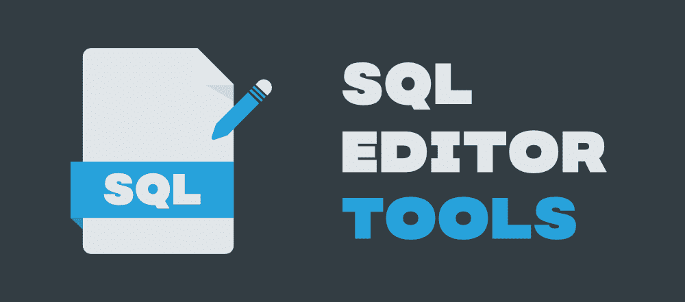

# 市场上 10 款最佳 SQL 编辑器工具

> 原文:[https://www . geesforgeks . org/10-best-SQL-editor-tools-in-the-market/](https://www.geeksforgeeks.org/10-best-sql-editor-tools-in-the-market/)

**SQL(结构化查询语言)**无疑是科技世界中最受欢迎、要求最高的技能之一。为了方便数据库管理员和 SQL 开发人员，市场上有很多**流行的 SQL 编辑器工具**。这些工具允许在数据库中执行[**【SQL】**](https://www.geeksforgeeks.org/sql-tutorial/)查询，这样我们就可以存储、提取和操作我们周围可用的实时数据。你现在一定在想，“有什么标准来决定最好的编辑器工具吗？”。是的，根据您的需求和偏好，您可以通过考虑各种参数(如跨平台功能、调试、分析和用户管理、实时协作、错误突出显示等)来做到这一点。

此外，为了您的方便，在本文中，我们为您提供了 **10 个最佳 SQL 编辑器工具**的列表，这些工具肯定会帮助您(尤其是初学者和学生)找到适合自己的编辑器。那么，让我们开始吧:

### 1.数据行 SQL 编辑器

数据平面 SQL 编辑器工具遵循 SaaS 模型，因此您可以随时随地使用它。首先，它将是有抱负或不太精通的程序员和开发人员的最佳选择，因为有了这个工具，它可以灵活地执行以及自动生成 SQL 代码。

思考这个神奇的工具是否会消耗安装它的工作站的大量内存？无需担心，因为这个编辑器工具是:

*   *完全基于浏览器。*
*   *同样，不需要按照安装说明安装工具。*

此外，它的交互式仪表板能够智能地执行数据分析的各个步骤，通过这些步骤，经理或开发人员可以相关地分析业务见解，并做出对有效管理他们正在处理的业务流程至关重要的更好的决策。

此外，该工具还有许多关键功能，如**拖放界面**、数据仓库(用于远程克隆 SQL 数据库并进一步加快高级 **SQL 查询过程**)以及与关系数据库(如 MariaDB、PostgreSQL 和 MySQL)的兼容性。所有这些都让您与数据平面 SQL 编辑器保持联系。

你现在在等什么？？检查其定价结构，因为该工具不是免费的，并提前一步满足您的所有数据可视化或报告要求，使用该工具的关键功能很容易翻译。

### 2.甲骨文 SQL 开发人员

这款令人惊叹的 Oracle SQL Developer 工具与 32 位和 64 位 Windows 操作系统、Linux RPM、Mac OSX 和其他操作系统同步良好。毫无疑问，该工具本身是完整的，因为在它的帮助下，许多数据库管理员，即**数据库管理员**和其他 Oracle 用户能够以更少的时间和精力管理他们的日常 SQL 活动。思考这个工具是开源的还是你需要购买它的定价计划？

请注意，该工具是开源的，它将消耗 400 兆字节或更多的本地驱动器，如 C 或 e。成功安装该省时工具后，您可以使用其开发环境来执行简化的工作表，而不会忽略它们的格式样式和文件历史。

尽管如此，它是灵活的:

*   *从该工具的定制报告功能中获得相关业务见解，识别并执行 40 多个图表选项和报告格式。*
*   *通过分层剖析和远程调试，简化并灵活紧固性能。*

### 3.MySQL 工作台

**MySQL Workbench** 工具以其最简单统一的建模可视化编辑器界面欢迎您，这样管理人员或数据架构师不仅可以浏览还可以设计&创建数据库模式。通过这种方式，那些数据架构师(以及管理人员)不仅可以配置服务器，还可以查看日志和进行审计，而不会影响整个 MySQL 数据库的逻辑视图。此外，这些好处也是可以获得的:

*   *使用这个工作台工具，5X 可以更快地编写和调试 SQL 语句。所有的功劳都归于它的可视化 SQL 编辑器功能，它不仅是上下文相关的，而且是自动完成的。*
*   *视觉上吸引人的仪表盘，直观地帮助许多数据库管理员、程序员和开发人员以优化的方式访问与网络数据引擎工作相关的 SQL 语句报告和提要。*
*   *用较少的努力高效地创建复杂的 er 模型，帮助很多用户了解 MySQL 数据库各种数据字段之间的关系有多有效。*

还需要什么来说服你下载 MySQL 工作台工具，该工具能够通过改变管理任务的执行顺序来管理数据库，这些管理任务实际上很耗时，并且对资源不友好？

### 4.剃刀 SQL

Razor SQL，一种组织良好的 SQL 工具，具有支持各种编程语言的各种模式和函数。这些语言是 PHP、Java 或可扩展标记语言。思考这个工具的效率是否可以免费利用？看，有一个 30 天免费试用的选项，但是要在像苹果 OSX、Solaris、视窗或 Linux 这样的操作系统上使用这个 **SQL 工具**，这对于购买它的授权版本是必不可少的，这样它就可以与各种数据库连接。

这些数据库的名称是**蒙古数据库、甲骨文、伏特数据库、Informix、**等等。除了所有这些之外，Razor SQL 在市场上还有另一个名字，那就是语法荧光笔，因为它很好地突出了已经编写好的代码，从而使这些代码更容易被读者阅读，显然也更容易理解。因此，与其与您当前的数据库提供商就连接和测试问题进行斗争，不如配备 Razor SQL 的关键功能并获得更好的结果，这将是一个更明智的决定。

### 5.管理员

考虑一个编辑器工具，它不仅在广泛的方式上对用户友好，而且有希望帮助用户**管理数据库**，像 MongoDB、SQLite、Oracle，最后还有——MySQL！！

好哇…现在没有必要再等几个小时或几个月了，因为 Adminer 在这里帮助开发人员和程序员修改与数据相关的事件和文档。但为此，需要在 admin 页面正确输入**用户名和密码**后，建立 Adminer 与父服务器的强连接。

在连接建立良好后，您可以自由地将权限分配给其他连接的用户，如增强的定制选项，或针对网络安全黑客尝试各种密码组合的攻击类型的安全性，只希望其中任何一个匹配正确的密码。此外，该工具的许可对商业、非商业工作是免费的，当与像 Nette 这样的框架捆绑在一起时，可以创造奇迹，通过该框架程序员可以编写好**基于网络的应用程序**。

### 6.Microsoft SQL Server 管理工作室快速版

微软 SQL Server Management Studio Express–这真的不会花太多时间让我们完成它的发音吗！！是的，但你也可以称之为 SSMSE，随时准备免费提供它的好处(不需要为使用它们支付任何费用)。现在，你一定在想，“这有什么好处？”。

对应这个问题，肯定的答案是:

*   *预先录制的最新教程，将教您如何将【SSMSE 连接到* ***主 SQL 服务器**，然后，加速您在编写和导航 SQL 查询方面的技术专长。*
*   *面向业务且易于安装的各种插件选项，可跨多个平台(如 Windows、iOS 或 Linux)定制其功能。*

超越界限，这个**完全集成的 SQL 编辑器工具**正在提升其分析性地大量表示和解释现实世界数据的能力，以便企业可以自信地将这个工具保留在他们的查询列表中，从而在当前的数字市场中恰当地确立自己的地位(就名气而言&金钱)。令人高兴的是，这也是为什么开发人员应该学习如何使用 SSMSE 功能的原因之一。

### 7.dbeaver

DBeaver 是一个很好的**开源 SQL 编辑器**工具，数据库管理员可以在执行日常任务时选择，例如:

*   *控制和定制开发团队的概要文件。*
*   *将 MariaDB、MongoDB、SQLite、& MySQL 数据库之间的连接组装成一个共享点(即接口)，这样两个系统可以很好地交互。*

开发人员总是致力于调整现有的 SQL 查询和部署编写良好的 SQL 补丁，现在他们对出现在这个高效开源工具的编辑器部分的简明扼要的 ER 图感到放松。此外， **SQL 分析师和程序员**在检查这个出色的工具的特性以获得更好的高级报告时毫不犹豫，通过其无错误数据可视化技术在处理多个数据集时很好地解决了数据问题。

还有什么能说服您安装数据库管理员的可定制设置呢？数据库管理员强大而简单的用户界面可以轻松地组织查询的执行，并且灵活地进行可识别的最终用户导航，不准备接受错误的数据格式，无论可能出现何种情况。

### 8.松鼠 SQL

想到一种工具，它的用户界面环境以不繁琐的方式与所有类型的 ANSI 标准数据库交互？欢呼，因为松鼠 SQL 工具及其可编辑的结果:

*   *可以在**兼容 ANSI 的数据库**上快速查看数据(也可以编辑数据)，如微软 Access、甲骨文或火鸟。*
*   *此外，它还掌握了各种数据迁移步骤，比如在开始编码项目之前创建一个粗略的计划，或者逐个传输各种类型的数据。*

此外，该工具支持以自动完成的方式绘制选项，因此开发人员可以轻松地在相应添加到其表中的图表之间的一个位置收集关系。所有这些都可以在不牺牲灵活性的情况下完成，同时还可以编写代码和提高工作效率。您现在应该做的就是在简单易用的编辑界面**上编译多个 SQL 查询，并根据您的要求生成有组织的行和列的报告。**

如果需要，您可以将这些行/列中的信息翻译成德语、汉语、英语、法语、葡萄牙语、俄语和西班牙语，从而有利于您将项目信息传递给客户，以便更好地沟通和交流想法。

### 9.瓦伦蒂娜工作室

Valentina Studio 不仅有付费版本，还有免费版本，它提供了一系列功能，您或数据库管理员可以实时使用。考虑范围？好吧，你最好从数开始:

*   *在自动完成模式下管理、编写和访问 SQL 查询，而不用担心正确语法的参数*
*   ***瓦伦蒂娜表格&报告**用于与任何数据库应用程序中的数据进行良好的交互*
*   *增强的服务器管理，用于诊断按时分配或未分配的用户权限。*

除此之外，这个普遍认可的**数据库管理工具**通过其图表编辑器选项对逆向工程图表化充满信心，可以很好地用于设计视觉上引人入胜的报告。好消息来了-*在导出或打印任何报告之前，在瓦伦蒂娜工作室*预览这些报告！！这种能力将帮助许多数据分析师，因为现在，他们确信，如果在报告时出现任何错误，那么他们将在报告以最终格式打印之前得到纠正。

### 10.dbForge Studio

**dbForge Studio** 具备强大数据库(如 MySQL、Oracle Express 和 MariaDB)的管理、管理和开发功能，在您分析分层存储在表中的数据时非常专业。此外，超过 30K 的用户信任它的性能，从定制导入和导出选项到方便地编写具有适当格式的代码片段。

好奇想知道这个工具是否足够智能，可以执行与复杂数据库相关的任务？毫无疑问，**数据库管理员和 SQL 开发人员**可以继续生成有意义的数据或在某个地方同步模式，从而在任何级别上加速数据库体验。因此，开发人员或数据库管理员不需要担心从逻辑上组织他们的数据库项目，因为 dbForge Studio 能够以在线和离线模式组织 SQL 脚本和文件的集合，将即将到来的或当前的项目与数据库进行比较，然后部署组织项目所必需的与脚本相关的更改。