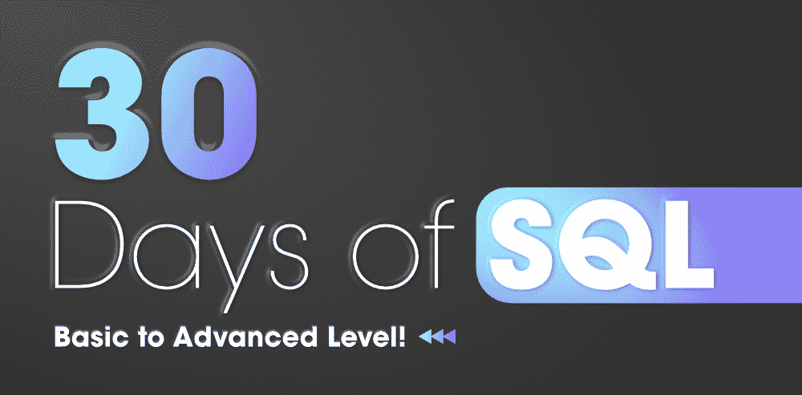

# 30 天 SQL–从基础到高级！

> 原文:[https://www . geesforgeks . org/30 天的 SQL-从基础到高级/](https://www.geeksforgeeks.org/30-days-of-sql-from-basic-to-advanced-level/)

**结构化查询语言**或 **SQL** 是一种标准的数据库语言，用于创建、维护、销毁、更新和检索关系数据库中的数据，如 MySQL、Oracle、SQL Server、PostgreSQL 等。

无论你想成为一名成功的数据科学家还是业务分析师，或者是一名全栈网络开发人员，甚至是一名软件开发人员，学习和实践 SQL 对所有领域都非常重要。几乎每一家大型科技公司都使用 SQL 来管理和组织数据，无论是优步、网飞、Airbnb、脸书、谷歌、领英还是任何其他公司，SQL 无处不在。SQL 也是数据科学家或数据工程师中最热门和最流行的语言。尽管围绕 NoSQL、Hadoop 和其他技术有很多炒作，但它是整个科技行业中使用最多的语言之一，也是各种开发人员最流行的语言之一。

既然我们知道了，学习 SQL 有多重要，或者 SQL 在当今世界的意义是什么，我们就应该知道如何系统地学习 SQL。为了帮助您实现这一点，我们在大量研究的基础上，创建了一个为期 30 天的 SQL 实用路线图。该路线图将为您提供一个完整的指南，供您参考学习和实践适用于所有类型工作角色的 SQL，无论是使用 SQL 从数据库中检索信息的全栈网络开发人员，还是使用 SQL 理解数据集并针对不同模型进行分析的数据科学家/数据分析师。你只需要一台笔记本电脑，一个工作的互联网连接，定期解决问题的决心，在 30 天内，你将能够学习和应用 SQL 来解决现实生活中的问题，并破解面试。

考虑到这个主题的深度，我们将需要 30 天的时间来学习 SQL，从开始到高级。坚持路线图，每天解决尽可能多的问题，以保持一致性。

### **第 1 天至第 6 天:**

**从基本概念开始:**对于第 1 天到第 6 天，您将了解基本的数据库和 SQL 概念，如创建数据库、SELECT 子句等。

*   [创建数据库](https://www.geeksforgeeks.org/sql-create/):这个概念会让你学会如何创建自己的数据库。
*   [创建表并添加数据](https://www.geeksforgeeks.org/sql-create/):从这个概念中，您将学习如何在数据库内部创建表并在其中插入数据。
*   [SELECT 子句](https://www.geeksforgeeks.org/sql-select-query/):从数据库中检索或获取数据。
*   [FROM 子句](https://www.geeksforgeeks.org/sql-select-query/):从数据库的哪个表中选择数据。
*   [WHERE 子句:](https://www.geeksforgeeks.org/sql-where-clause/)它形成了查询数据所依据的条件。
*   [DELETE 语句:](https://www.geeksforgeeks.org/sql-delete-statement/)用于删除任务。
*   [插入到:](https://www.geeksforgeeks.org/sql-insert-statement/)用于插入任务。
*   [与或运算符:](https://www.geeksforgeeks.org/sql-and-and-or-operators/)基于与或运算符选择数据。
*   [删除并截断:](https://www.geeksforgeeks.org/sql-drop-truncate/)它将根据条件删除或截断集合。
*   [NOT 运算符:](https://www.geeksforgeeks.org/sql-not-operator/)将根据给定条件选择**而非**的数据。

### **第 7 天至第 12 天:**

从第 7 天到第 12 天，您将向前迈出一步，学习一些高级概念，如嵌套查询、通配符运算符和其他子句。

*   [WITH 子句:](https://www.geeksforgeeks.org/sql-with-clause/)理解 WITH 子句的概念，并使用它给子查询块命名。
*   [FETCH 子句:](https://www.geeksforgeeks.org/sql-ties-clause/)它将根据某些条件获取过滤后的数据，例如只获取前 3 行。
*   [算术运算符:](https://www.geeksforgeeks.org/sql-arithmetic-operators/)使用算术运算符方便、精确地过滤数据。
*   [通配符运算符:](https://www.geeksforgeeks.org/sql-wildcard-operators/)智能选择精确的数据，如以 t 开头或结尾的名称
*   [更新语句:](https://www.geeksforgeeks.org/sql-update-statement/)根据提供的条件更新某些数据项。
*   [更改表格:](https://www.geeksforgeeks.org/sql-alter-add-drop-modify/)根据给定条件添加、删除或修改表格。
*   [LIKE 子句:](https://www.geeksforgeeks.org/sql-like/)它将遵循搜索条件中给出的模式。
*   [介于和输入运算符:](https://www.geeksforgeeks.org/sql-between-in-operator/)它将在给定条件下选择或中的数据范围**。**
*   [CASE Statement:](https://www.geeksforgeeks.org/sql-case-statement/) 它会检查条件句，并根据各自的情况查询数据。
*   [EXISTS:](https://www.geeksforgeeks.org/sql-exists/) 将形成嵌套查询，过滤掉另一个查询中存在的数据。

### **第 13 天至第 18 天:**

从第 13 天到第 18 天，您将主要学习 SQL 中的聚合函数。

*   [DISTINCT 子句:](https://www.geeksforgeeks.org/sql-distinct-clause/)只选择 DISTINCT 数据，不重复。
*   [计数功能:](https://www.geeksforgeeks.org/aggregate-functions-in-sql/)返回过滤数据的总计数。
*   [求和函数:](https://www.geeksforgeeks.org/aggregate-functions-in-sql/)返回所有被查询数据的和。
*   [平均值函数:](https://www.geeksforgeeks.org/aggregate-functions-in-sql/)返回所有被查询数据的平均值。
*   [最小函数:](https://www.geeksforgeeks.org/aggregate-functions-in-sql/)将从正在查询的全部数据中返回最小数据。
*   [最大函数:](https://www.geeksforgeeks.org/aggregate-functions-in-sql/)将从被查询的全部数据中返回最大数据。
*   [ORDER BY:](https://www.geeksforgeeks.org/sql-order-by/) 该语句将根据您的方便程度对查询到的数据进行升序或降序排序。
*   [分组依据:](https://www.geeksforgeeks.org/sql-group-by/)此语句将使用条件中给出的列对所有查询的数据进行分组。
*   [ALL 和 ANY 子句:](https://www.geeksforgeeks.org/sql-all-and-any/)它们是 SQL 中的逻辑运算符，结果返回布尔值。
*   [TOP 子句:](https://www.geeksforgeeks.org/sql-select-top-clause/)用于从数据库中获取有限数量的行。

### **第 19 天至第 24 天:**

从第 19 天到第 24 天，您将学习和练习 SQL 中的连接。它是 SQL 最重要的概念之一。

*   [Union 子句](https://www.geeksforgeeks.org/sql-union-clause/):就像数学上的 Union 运算符一样，这个子句会使给定表的并集。
*   [交集子句:](https://www.geeksforgeeks.org/sql-intersect-except-clause/)它将在两个或多个表相交的地方连接它们。
*   [别名](https://www.geeksforgeeks.org/sql-aliases/):它会给表取一个别名，我们以后可以称之为。
*   [笛卡尔连接和自连接:](https://www.geeksforgeeks.org/sql-join-cartesian-join-self-join/)有时候为了查询出一些数据，我们不得不将表自连接到自身。
*   [内连接、左连接、右连接和全连接:](https://www.geeksforgeeks.org/sql-join-set-1-inner-left-right-and-full-joins/)当我们必须将一个表与另一个表连接时，这四种类型的连接就会发挥作用。查看它们的语法并学习处理这些连接。
*   [除法子句:](https://www.geeksforgeeks.org/sql-division/)当您想要找出与一组不同类型实体的所有实体交互的实体时，通常需要除法。
*   [Using 子句:](https://www.geeksforgeeks.org/sql-using-clause/)如果几个列具有相同的名称，但数据类型不匹配，则可以使用 Using 子句修改 NATURAL JOIN 子句，以指定应用于 EQUIJOIN 的列。
*   [组合值:](https://www.geeksforgeeks.org/combining-aggregate-and-non-aggregate-values-in-sql-using-joins-and-over-clause/)使用连接和子句上的**组合 SQL 中的聚合值和非聚合值。**
*   [减运算符:](https://www.geeksforgeeks.org/sql-minus-operator/)用作“除”，表示它将连接两个相交的表，并将减去一个表，以便只覆盖交集和另一个表。
*   [连接 3 个或更多的表:](https://www.geeksforgeeks.org/joining-three-tables-sql/)虽然很少使用，但这将使您学习和理解如何连接 3 个或更多的表，然后执行查询操作。

### **第 25 天至第 30 天:**

**杂项:**由于我们已经涵盖了几乎所有的主题，现在我们将继续讨论一些杂项主题、概念和功能。这些都是数据库管理系统和 SQL 的重要组成部分，肯定会对你的大学考试和像 GATE CS 这样的竞争性考试有所帮助。

*   [视图](https://www.geeksforgeeks.org/sql-views/)
*   [创建角色](https://www.geeksforgeeks.org/sql-creating-roles/)
*   [约束](https://www.geeksforgeeks.org/sql-constraints/)
*   [交易](https://www.geeksforgeeks.org/sql-transactions/)
*   [数学函数](https://www.geeksforgeeks.org/sql-server-mathematical-functions-sqrt-pi-square-round-ceiling-floor/)
*   [日期功能](https://www.geeksforgeeks.org/sql-date-functions/)
*   [条件表达式](https://www.geeksforgeeks.org/sql-conditional-expressions/)
*   [常规功能](https://www.geeksforgeeks.org/sql-general-functions-nvl-nvl2-decode-coalesce-nullif-lnnvl-nanvl/)
*   [字符串功能](https://www.geeksforgeeks.org/sql-string-functions/)
*   [转换功能](https://www.geeksforgeeks.org/sql-conversion-function/)
*   [前 N 名查询](https://www.geeksforgeeks.org/sql-top-n-queries/)
*   [高级功能](https://www.geeksforgeeks.org/sql-advanced-functions/)

### **练习设置**

有了这些知识，我们还需要练习，所以我们在这里提供一些练习题来提高你的理解和技能。我们会遇到一些常见的面试问题，比如数据库管理系统或 SQL、主观问题和选择题。

*   [常见的 DBMS 面试问题](https://www.geeksforgeeks.org/commonly-asked-dbms-interview-questions/)
*   [一些比较常见的 DBMS 面试问题](https://www.geeksforgeeks.org/commonly-asked-dbms-interview-questions-set-2/)
*   [主观问题](https://practice.geeksforgeeks.org/topics/SQL/)
*   [SQL 面试问题](https://www.geeksforgeeks.org/sql-interview-questions/)
*   [选择题](https://www.geeksforgeeks.org/dbms-gq/sql-gq/)
*   SQL 问题
*   [练习 SQL 问题](https://www.geeksforgeeks.org/sql-interview-questions-set-2/)
*   [高级 SQL 面试问题](https://www.geeksforgeeks.org/advanced-sql-interview-questions/?ref=rp)
*   [门题(第三集)](https://www.geeksforgeeks.org/gate-gate-cs-2015-set-3-question-13/) | [门题(Q-61)](https://www.geeksforgeeks.org/gate-gate-cs-2019-question-61/)