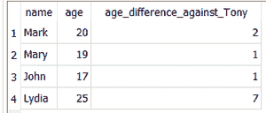

# SQlite 中的 ABS()和 AVG()功能

> 原文:[https://www . geesforgeks . org/ABS-and-avg-function-in-SQLite/](https://www.geeksforgeeks.org/abs-and-avg-function-in-sqlite/)

**1。ABS()函数:**
ABS(X)是用来得到一个数的绝对值的数学函数。

**语法–**

```sql
ABS(X)
```

ABS(X)函数接受一个数值参数 X 并返回它的大小。

```sql
SELECT ABS(-6);
```

**输出–**

```sql
6
```

如果参数 X 是一个 blob 或字符串，函数给出 0.0 作为返回值

```sql
SELECT ABS('gfg');
```

**输出–**

```sql
0.0
```

如果参数为空，函数返回空值。

```sql
SELECT ABS(NULL);
```

**输出–**

```sql
NULL
```

**2。AVG()函数:**
AVG(X)是一个聚合函数，用于计算一组行的平均值。

**语法–**

```sql
AVG(X)
```

该函数产生的浮点值等于参数组 x 中所有非空值的平均值

```sql
SELECT AVG(1,2,3,4,5,6,7)
```

**输出–**

```sql
4.0
```

如果有一个空值传递给 AVG()函数，则在计算平均值时只使用非空值。

```sql
SELECT AVG(10,20,30,NULL);
```

**输出–**

```sql
20.0
```

参数 X 中出现的字符串和斑点被计算为 0。

```sql
SELECT AVG(10,20,'word',30,);
```

**输出–**

```sql
20.0
```

如果所有输入值都为空，则函数返回空值。

```sql
SELECT AVG(NULL,NULL,NULL);
```

**输出–**

```sql
NULL
```

现在，我们将使用一个真实的数据库示例。首先，让我们创建一个名为**学生**的表，其中列有**姓名**和**年龄**，并插入一些行！

```sql
--create a table
CREATE TABLE students(
  id INTEGER PRIMARY KEY AUTOINCREMENT,
  name VARCHAR(255),
  age INT);

--insert multiple rows
INSERT INTO students(name,age) 
VALUES
    ('Mark',20),
    ('Mary',19),
    ('John',17),
    ('Lydia',25);
```

然后我们将编写一个 SELECT 语句，给出使用 AVG()函数的所有学生的平均年龄

```sql
SELECT AVG(age) FROM students;
```

**输出–**

```sql
20.25
```

接下来，我们将创建一个 SELECT 语句，返回每个学生和 18 岁的新学生 Tony 之间的年龄差。

```sql
SELECT 
    name,
    age,
    ABS(age-18) AS age_difference_against_Tony 
FROM students;
```

**输出–**



使用 ABS()函数输出 SELECT 语句