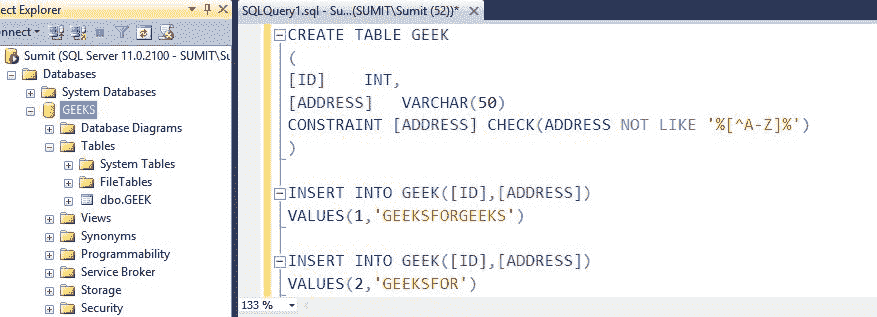
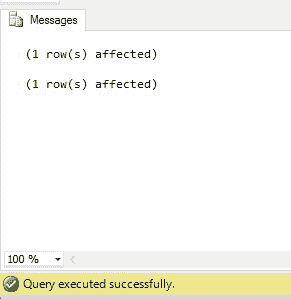
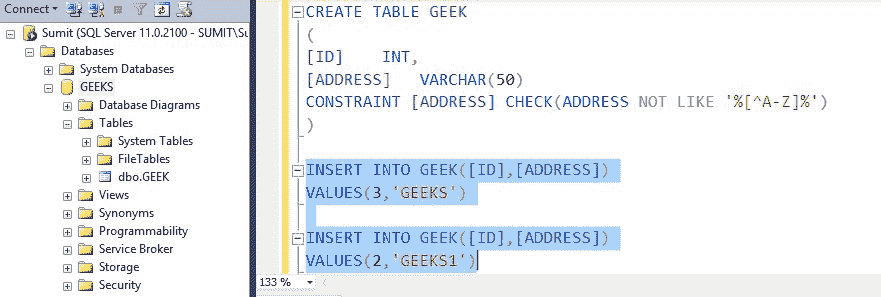
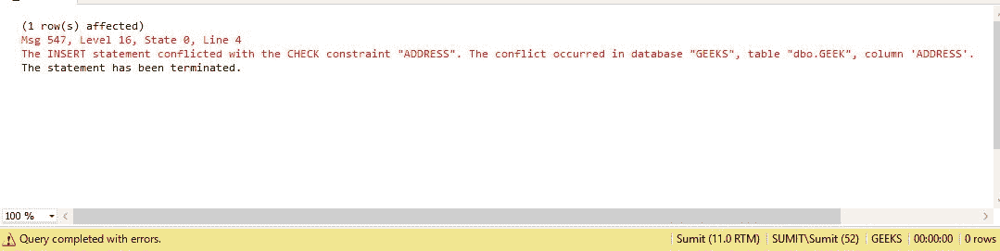

# 在 SQL Server 中只允许列中的字母

> 原文:[https://www . geesforgeks . org/allow-alphabets-column-SQL-server/](https://www.geeksforgeeks.org/allow-alphabets-column-sql-server/)

可能会出现某些情况，列中的数据只能按字母顺序排列，例如:详细信息表中的名称列。如果用户试图输入除字母以外的内容，将会出错。为了只允许列中的字母，可以对列应用检查约束。
要获取关于约束和检查约束的信息，请参考以下文章链接:

*   [SQL |约束](https://www.geeksforgeeks.org/sql-constraints/)
*   [SQL |检查约束](https://www.geeksforgeeks.org/sql-check-constraint/)

**语法:**

```sql
CONSTRAINT (Constraint_Name) 
CHECK ( BOOLEAN EXPRESSION)
```

**示例 1:** 在此示例中，对 ADDRESS 列应用约束，以检查在 ADDRESS 列中插入的值是否仅由字母组成。在 ADDRESS 列中插入的值仅由字母组成，因此它工作正常，不会显示任何错误。条件**不像%[^A-Z]%** 检查的是输入值是否是字母。



**输出:**



**示例 2:** 在此示例中，对“地址”列应用约束，以检查输入的值是否仅由字母组成。ADDRESS 列中插入的值由字母和整数组成，因此显示错误。地址“极客 1”是错误的原因。



**输出:**

