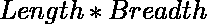
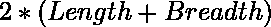

# PL/SQL 中矩形的面积和周长

> 原文:[https://www . geesforgeks . org/pl-SQL 中矩形的面积和周长/](https://www.geeksforgeeks.org/area-and-perimeter-of-rectangle-in-pl-sql/)

**先决条件**–[PL/SQL 简介](https://www.geeksforgeeks.org/plsql-introduction/)
在 PL/SQL 中，命令的代码组排列在一个块内。一组相关的声明或语句。在声明部分，我们声明变量，在开始和结束部分之间，我们执行操作。

给定长度、宽度的值，任务是计算矩形的面积和周长。

**示例:**

```
Input: l = 2, b = 2
Output: Area = 4, Perimeter = 8

Input: l = 4, b = 8
Output: Area = 32, Perimeter=24

```

**数学公式:**
矩形面积:


矩形周长:



以下是所需的实现:

```
-- Declaration statement 
DECLARE
  -- Declaration of length and assigning values 
  l NUMBER(4, 2) := 3; 
  --Declaration of breadth and assigning values 
  b NUMBER(4, 2) := 7; 
  --Declaration of a variable for Area of rectangle 
  a NUMBER(4, 2); 

  --Declaration of a variable for perimeter 
  p NUMBER(4, 2); 
BEGIN 

  -- calculate area and perimeter
  a := l * b; 
  p := 2 * (l + b); 

  --Display result 
  dbms_output.Put_line('Area of the rectangle is  ' 
  || a); 
  dbms_output.Put_line('Perimeter of the rectangle is ' 
  || p); 
END; 
--ENd program
```

**输出:**

```
Area of the rectangle is 21
Perimeter of the rectangle is 20

```