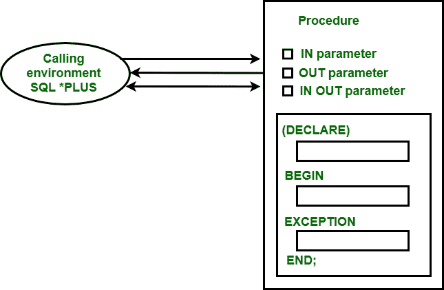

# PL/SQL 中的参数模式

> 原文:[https://www.geeksforgeeks.org/argument-modes-in-pl-sql/](https://www.geeksforgeeks.org/argument-modes-in-pl-sql/)

**参数模式**基本上用来描述**形式参数**的行为。子程序中使用了三种参数模式，如下所示

1.  正流行
2.  输出模式
3.  输入输出模式



模式如何与调用环境交互的表示

*   **IN Mode :**
    It is the default argument mode in subprogram. This mode passes a constant value from the calling environment into the subprogram.

    **示例–**
    以下示例说明了输入模式参数的工作方式–

    ```sql
    SQL> CREATE OR REPLACE PROCEDURE PR1(X IN NUMBER, Y IN NUMBER)
    S NUMBER;
    BEGIN
    S:=X+Y;
    DBMS_OUTPUT.PUT_LINE('SUM IS : '||S);
    END PR1;
    ```

    **输出–**

    ```sql
    Procedure created.
    ```

    ```sql
    SQL> DECLARE
    N1 NUMBER:=10;
    N2 NUMBER:=20;
    BEGIN
    PR1(N1, N2);
    END;
    ```

    **输出–**

    ```sql
    SUM IS : 30
    PL/SQL procedure successfully completed.
    SQL>
    ```

*   **OUT Mode :**
    This mode passes a value from the subprogram to the calling environment.

    **示例–**
    以下示例说明了输出模式参数的工作方式–

    ```sql
    SQL> CREATE OR REPLACE PROCEDURE PR2(2 OUT NUMBER) AS
    X NUMBER:=11;
    Y NUMBER:=22;
    BEGIN
    Z:=X+Y;
    END;
    ```

    **输出–**

    ```sql
    Procedure created.
    ```

    ```sql
    SQL> DECLARE
    R NUMBER;
    BEGIN
    PR2(R);
    DBMS_OUTPUT.PUT_LINE('RESULT IS: '||R);
    END;
    ```

    **输出–**

    ```sql
    RESULT IS : 33
    PL/SQL procedure successfully completed.
    SQL>
    ```

*   **IN OUT Mode :**
    This mode is a mixture of both IN n=and OUT mode. Just like IN mode it passes a value from the calling environment in subprogram and like a OUT mode it possibly pass different value from the subprogram back to the calling environment using the same parameter.

    **示例–**
    以下示例说明了输出模式参数的工作方式–

    ```sql
    SQL> CREATE OR REPLACE PROCEDURE PR3(2 OUT NUMBER) AS
    A NUMBER:=11;
    BEGIN
    B:=A+B;
    END;
    ```

    **输出–**

    ```sql
    Procedure created.
    ```

    ```sql
    SQL> DECLARE
    R NUMBER:=22;
    BEGIN
    PR3(R);
    DBMS_OUTPUT.PUT_LINE('RESULT IS: '||R);
    END;
    ```

    **输出–**

    ```sql
    RESULT IS : 33
    PL/SQL procedure successfully completed.
    SQL>
    ```