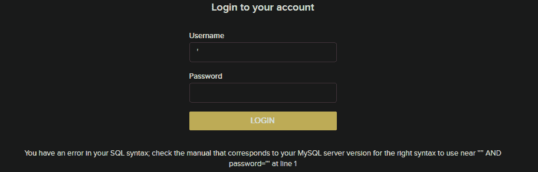
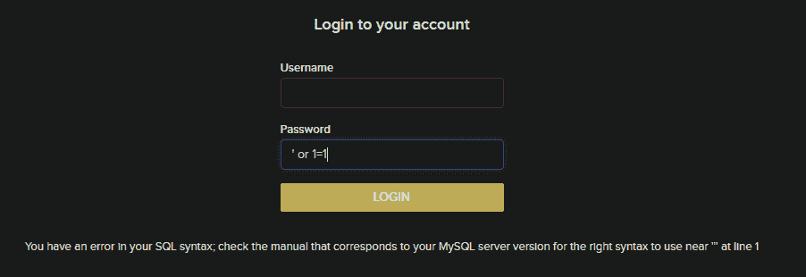

# 在登录页面使用 SQL 注入绕过身份验证

> 原文:[https://www . geesforgeks . org/authentication-bypass-use-SQL-injection-on-log in-page/](https://www.geeksforgeeks.org/authentication-bypass-using-sql-injection-on-login-page/)

SQL 注入是一种通过将 SQL 命令作为语句注入网页输入来利用用户数据的技术。基本上，这些语句可以被恶意用户用来操纵应用程序的 web 服务器。

*   SQL 注入是一种代码注入技术，可能会破坏您的数据库。
*   SQL 注入是最常见的网络黑客技术之一。
*   SQL 注入是通过网页输入在 SQL 语句中放置恶意代码。

**先决条件:** [基本 SQL 命令](https://www.geeksforgeeks.org/sql-tutorial/)。

**检查 SQL 注入表单:**

最简单的方法是在用户名或密码字段中加上“'”(不带引号)。如果服务器在响应中返回任何类型的 SQL 错误，那么网站很可能容易受到 SQL 注入攻击。



> **免责声明:**未经双方事先同意攻击目标是违法的。这篇文章是为了获取知识。

**绕过认证:**

**1。**在我们确认该网站易受 SQL 注入攻击后，下一步是在密码字段中键入适当的有效负载(输入)以访问该帐户。

**2。**在易受攻击字段中输入下面提到的命令，这将导致成功的身份验证旁路。

```
Select id from users where username=’username’ and password=’password’ or 1=1--+

```

**在上面的命令中:**

*   因为 1=1 总是真的，并且我们将 1=1 与 OR 运算符组合在一起，现在我们不必知道用户名或密码，因为无论用户名、密码是什么，我们的 1=1 将总是真的，从而使我们能够访问我们的帐户。
*   或 1 = 1 –+(在密码字段中)在 or 运算符用于终止密码的单引号之前(即-从用户名=“username”和密码=“password”的用户中选择 id)
*   因此，当我们在 OR 运算符前插入'之后，我们的 SQL 命令变成:从用户名='username '和密码= '或 1 = 1 –+的用户中选择 id
*   –+用于忽略命令的其余部分。它的主要用途是忽略密码后的'如果我们不使用它，我们将得到以下错误。
*   让我们在登录门户上尝试有效负载(不要在有效负载末尾写–+)



ie-如果我们不使用–+，那么我们的 sql 命令将是:从用户名='username '和密码= '或 1=1'
**的用户中选择 id，为什么在 1 的末尾有那个？**

这是结束单引号的密码。请记住，我们已经给出了密码的结束单引号。但是网站的 SQL 命令只是把“在我们的密码的末尾。(即-无论我们在密码字段中写什么，它都会存储在密码的“”中。假设我们的密码是 hello。对应于此的 SQL 命令将是:从用户名=“username”和密码=“hello”的用户中选择 id。这里，我们没有添加引号，但是 SQL 命令在我们的输入字段中添加了引号)。由于 SQL 命令把‘在我们的 1=1 的末尾’，我们的任务失败了。因此，为了忽略密码的结束单引号，我们使用–+。

**执行注射:**

只需在密码或易受攻击字段中插入命令，然后单击登录，身份验证将被绕过。

 

可以看到，我们终于破解了登录入口，成功登录。

**注意:**有时候，有些网站会屏蔽–+，在这种情况下使用#。两者做同样的工作。