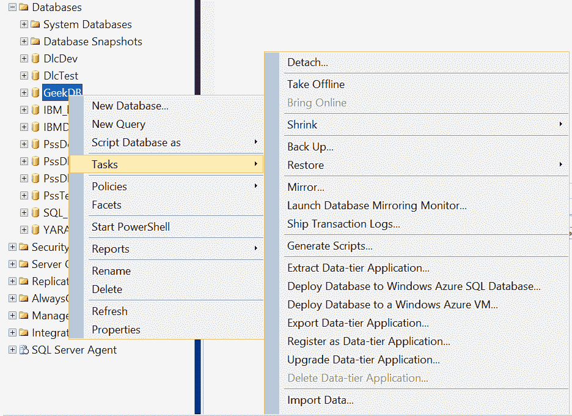
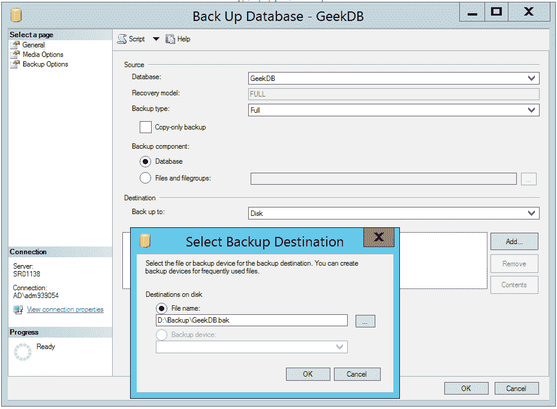
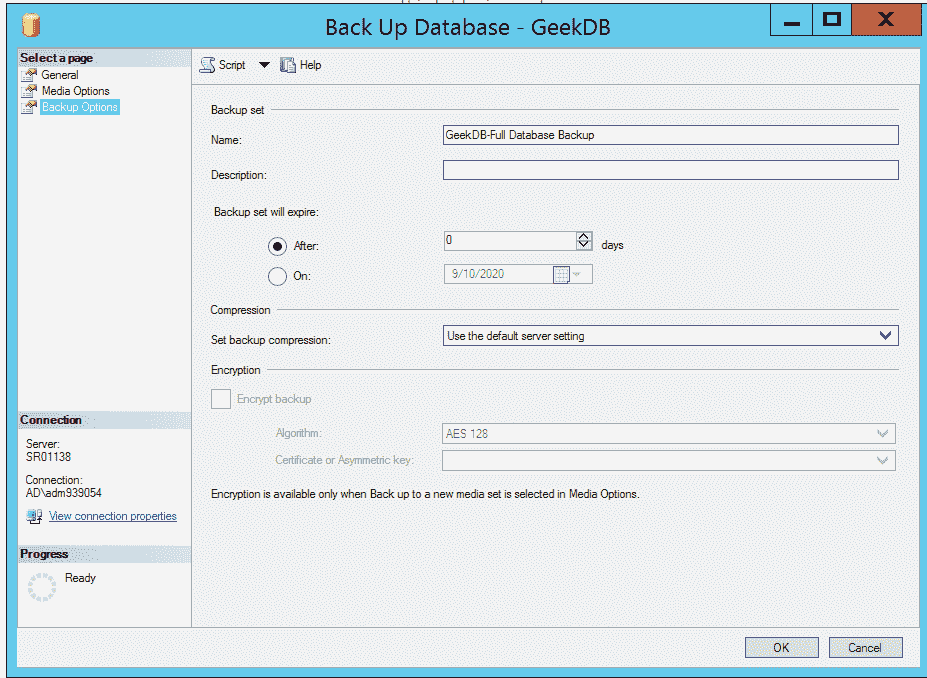
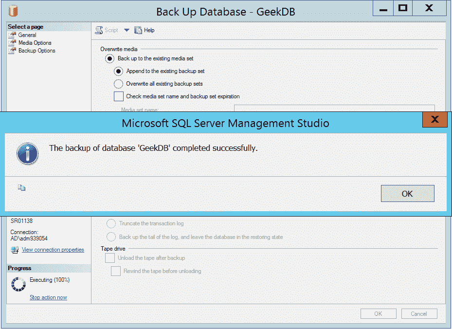

# 在 MS SQL Server 中备份数据库

> 原文:[https://www . geesforgeks . org/backup-database-in-ms-SQL-server/](https://www.geeksforgeeks.org/backup-database-in-ms-sql-server/)

**先决条件**–[在微软 SQL Server](https://www.geeksforgeeks.org/create-database-in-ms-sql-server/) 中创建数据库

要创建完整数据库备份，可以使用以下方法–

*   SQL Server 管理工作室。
*   Transact-SQL。

**限制:**
在较新版本的 SQL Server 上创建的备份无法在以前版本的 SQL Server 中恢复。

**需要了解的事实:**

*   当数据库大小增加时，完整数据库备份需要更多的时间和存储空间来完成。
*   sp_spaceused 系统存储过程可用于估计完整数据库备份的大小。
*   每次成功备份都会在 SQL Server 错误日志和系统事件日志中添加一个条目。

**权限:**

*   sysadmin 服务器角色成员以及 db_owner 和 db_backupoperator 数据库角色成员的备份数据库权限。
*   运行 SQL Server 服务的帐户必须对备份设备具有写权限，因此 SQL Server 服务必须能够读写该设备。

**使用 SQL Server 管理工作室:**

1.  在对象资源管理器中，连接到所需的 Microsoft SQL Server 数据库引擎实例，展开服务器实例。
2.  展开数据库框，选择用户数据库或系统数据库。
3.  Right-click the database that need to backup, click on **Tasks**, and then click **Back Up….**

    [](https://media.geeksforgeeks.org/wp-content/uploads/20200910161620/bkp1.PNG) 

4.  In the Back-Up Database dialog box, the database that you selected appears in the drop-down list.
    *   在备份类型下拉列表中，选择备份类型–默认为**完整**。
    *   在备份组件下，选择**数据库**。
    *   在目标部分查看备份文件的默认位置。
    *   要删除备份目标，请单击它并删除。
    *   要备份到新设备，使用**添加**更改选择并选择目的地。

    [](https://media.geeksforgeeks.org/wp-content/uploads/20200910162100/bkp2.PNG) 

5.  Review the other available settings under the Media Options and Backup Options pages.

    [](https://media.geeksforgeeks.org/wp-content/uploads/20200910162443/bkp23.PNG) 

6.  Click OK to start the backup. Click OK to close the SQL Server Management Studio dialog box once the backup completed successfully.

    [](https://media.geeksforgeeks.org/wp-content/uploads/20200910162602/bkp4.PNG) 

**使用 Transact-SQL :**

*   连接到数据库引擎。
*   打开新查询。

**语法:**

```sql
BACKUP DATABASE databasename TO backup_device [][WITH with_options[]];
```

其中，
**数据库名称**是需要备份的数据库。

**backup_device [DISK | TAPE]** 声明一个从 1 到 64 的备份设备列表，用于备份操作。

**WITH with_options []** 定义了以下一个或多个选项–

**COMPRESSION | NO _ COMPRESSION**定义是否对此备份执行备份压缩。

**描述**最多可以有 255 个字符，描述备份集。

**名称**最多可包含 128 个字符，用于描述备份集的名称。

**第一次使用介质时，可以使用[MEDIANAME][MEDIADESCRIPTION]**格式，或者覆盖所有现有数据。

**示例-1 :**
**将数据库备份到磁盘设备。**

```sql
USE GeekDB;
GO
BACKUP DATABASE GeekDB
TO DISK = 'D:\Backup\GeekDB.bak'
WITH FORMAT,
MEDIANAME = 'GeekDBBackup',
NAME = 'Full Backup of GeekDB';
GO
```

**示例-2 :**
**备份到磁带设备。**

```sql
USE GeekDB;
GO
BACKUP DATABASE GeekDB
TO TAPE = '\\.\TapeLocation'
WITH NOINIT,
NAME = 'Full Backup of GeekDB';
GO
```