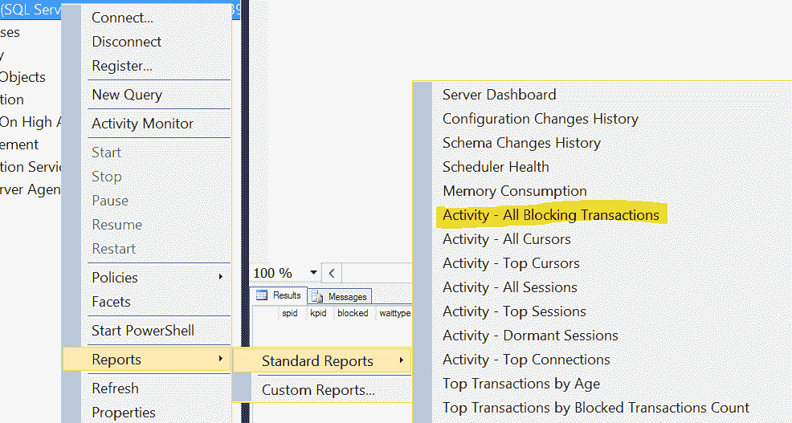
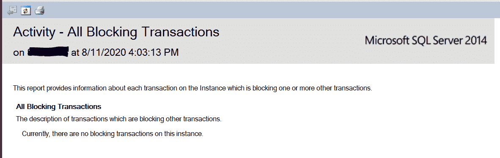

# SQL Server 中的阻塞

> 原文:[https://www.geeksforgeeks.org/blocking-in-sql-server/](https://www.geeksforgeeks.org/blocking-in-sql-server/)

**当一个到 SQL server 的连接阻塞了一个或多个查询，而另一个到 SQL server 的连接需要一个冲突的查询锁定类型，或者查询被主连接锁定时，就会在 SQL server 中阻塞**。这导致另一个连接等待，直到主连接释放它的锁。一个连接可以阻止另一个连接，无论它们是来自相同的应用程序还是不同客户端计算机上的独立应用程序。

几秒钟的阻塞是正常的，也是可以避免的。但是过多的阻塞会导致连接(应用程序或用户)占用您大量的时间，在阻塞情况下，最重要的信息是阻塞 SPID (SQL 进程 ID)以及它在做什么。

**收集封锁信息:**

下面的查询标识了阻塞链顶部的 SPID (SQL 进程标识)，因此也标识了 SQL 语句–

```
Select * 
from sysprocesses 
where blocked <> 0 ;
```

**输出:【spid、kpid、blocked、waittime、waittype、waitresource、lastwaittype、dbid、uid、cpu 等所有列都为空。**

确定阻止 SPID 后，发出后续命令来敦促内容–

```
dbcc inputbuffer (SPID)
```

要移除阻塞，请使用 KILL 命令。

```
KILL SPID_ofBlockingQuery
```

**注意:**一旦你杀死了一个进程，你就结束了它，这将导致不可预测的结果。对一个等价的 spid 使用一次 SQL KILL 命令会杀死正在重用这个 spid 的较新的处理。只使用一次 KILL 命令，除非您验证该方法没有使用以前的 KILL 命令进行更改。

**当阻塞增加到对系统性能有影响的目的时，通常是由于以下原因之一–**

*   在释放一组资源之前，SPID 会在很长一段时间内锁定它们。这种阻塞会随着时间的推移自行解决，但会导致性能下降。
*   SPID 持有一组资源的锁，并且从不释放它们。这种阻塞不会自行解决，并且会无限期地阻止对受影响资源的访问。

**使用通过 SQL Server 管理工作室提供的功能识别阻塞链的头部。**

要尝试这种方法，请使用以下步骤–

选择服务器对象，展开**报告**，展开**标准报告**，然后单击**活动**–**所有阻止交易**。



下面的报告显示了阻塞链顶部的交易(如果有)–



没有任何阻塞时的活动报告

如果展开事务，报表将显示被顶级事务阻止的事务。此报告还将显示“阻塞 SQL 语句”，因此显示“阻塞 SQL 语句”