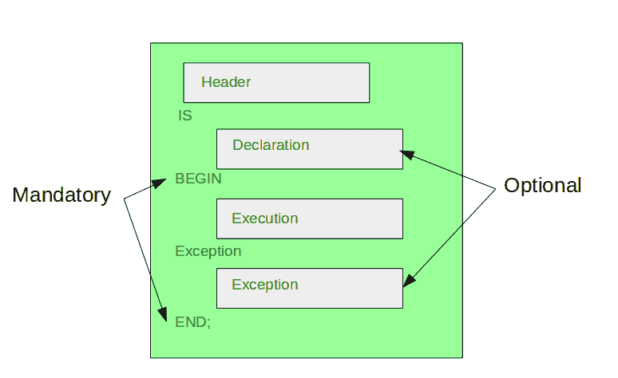

# PL/SQL 中的块

> 原文:[https://www.geeksforgeeks.org/blocks-in-pl-sql/](https://www.geeksforgeeks.org/blocks-in-pl-sql/)

在 PL/SQL 中，所有的语句都被划分为称为块的单元。PL/SQL 块可以包括变量、SQL 语句、循环、常数、条件语句和异常处理。块还可以构建函数、过程或包。



一般来说，PL/SQL 块有两种类型:匿名块和

**1。匿名块:**在 PL/SQL 中，没有头的块称为匿名块。这些块不构成函数、触发器或过程的主体。

示例:下面是一个使用匿名块查找最大数的代码示例。

```
DECLARE 
    -- declare variable a, b and c 
    -- and these three variables datatype are integer  
   a number; 
   b number; 
   c number; 
BEGIN 
   a:= 10; 
   b:= 100; 
    --find largest number
    --take it in c variable
   IF a > b THEN 
      c:= a; 
   ELSE 
      c:= b; 
   END IF;
   dbms_output.put_line(' Maximum number in 10 and 100: ' || c); 
END; 
/ 
-- Program End 
```

**输出:**

```
Maximum number in 10 and 100: 100

```

**2。命名块:**有标题或标签的 PL/SQL 块称为命名块。这些块可以是子程序，如函数、过程、包或触发器。

示例:这里有一个代码示例，使用命名块查找最大数意味着使用函数。

```
DECLARE 

    -- declare variable a, b and c 
    -- and these three variables datatype are integer  
DECLARE 
   a number; 
   b number; 
   c number; 
   --Function return largest number of  
   -- two given number
FUNCTION findMax(x IN number, y IN number)  
RETURN number 
IS 
    z number; 
BEGIN 
   IF x > y THEN 
      z:= x; 
   ELSE 
      Z:= y; 
   END IF;  
   RETURN z; 
END; 
BEGIN 
   a:= 10; 
   b:= 100;  
   c := findMax(a, b); 
   dbms_output.put_line(' Maximum number in 10 and 100 is: ' || c); 
END; 
/ 
-- Program End 
```

**输出:**

```
Maximum number in 10 and 100: 100

```