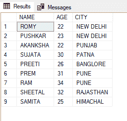

# SQL 中的布尔表达式

> 原文:[https://www.geeksforgeeks.org/boolean-expressions-in-sql/](https://www.geeksforgeeks.org/boolean-expressions-in-sql/)

布尔表达式是返回布尔数据类型作为结果的表达式。在 SQL 中，布尔数据类型有三个值，它们是:

*   真实的
*   错误的
*   未知的

与其他数据类型不同，布尔数据类型不能在表创建过程中指定。布尔表达式主要与 WHERE 子句一起使用来过滤表中的数据。它可以包括比较运算符和其他运算符，如“与”运算符、“或”运算符等。

要演示布尔表达式，请执行以下步骤:

**步骤 1:** 创建数据库

我们可以使用以下命令创建一个名为 geeks 的数据库。

**查询:**

```
CREATE DATABASE geeks;
```

**步骤 2:** 使用数据库

使用下面的 SQL 语句将数据库上下文切换到极客:

**查询:**

```
USE geeks;
```

**步骤 3:** 表格定义

我们的极客数据库中有以下演示表。

**查询:**

```
CREATE TABLE demo_table(
NAME VARCHAR(20),
AGE INT,
CITY VARCHAR(20) );
```

**步骤 4:** 将数据插入表格

**查询:**

```
INSERT INTO demo_table VALUES
('ROMY', 22, 'NEW DELHI'),
('PUSHKAR',23, 'NEW DELHI'),
('AKANKSHA',22, 'PUNJAB'),
('SUJATA', 30,'PATNA'),
('PREETI', 26,'BANGLORE'),
('PREM',31,'PUNE'),
('RAM', 34,'PUNE'),
('SHEETAL',32, 'RAJASTHAN'),
('SAMITA',25,'HIMACHAL');
```

**第五步:**查看表格数据

**查询:**

```
SELECT * FROM demo_table;
```

**输出:**



**第 6 步:**布尔表达式

**示例 1:** 包含等于(=)比较运算符的布尔表达式

**查询:**

```
SELECT * FROM demo_table
WHERE AGE = 22;                                
{Boolean expression - > (AGE =22)}
```

此查询将从年龄列中数据等于 22 的表中返回值。

**输出:**


**示例 2:** 包含大于(>)比较运算符的布尔表达式

**查询:**

```
SELECT * FROM demo_table
WHERE AGE > 22;                                      
{Boolean expression - > (AGE > 22)}
```

**输出:**


**示例 3** :包含“或”运算符的布尔表达式

当任一指定条件为真时，或运算符返回值。

**查询:**

```
SELECT * FROM demo_table
WHERE AGE = 22 OR AGE = 23;         
{Boolean expression - > (AGE = 22 OR AGE = 23)}
```

**输出:**

