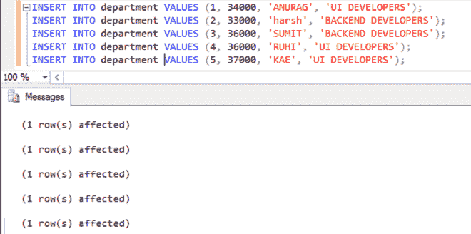
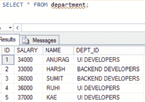
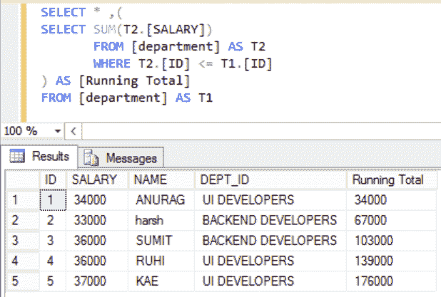
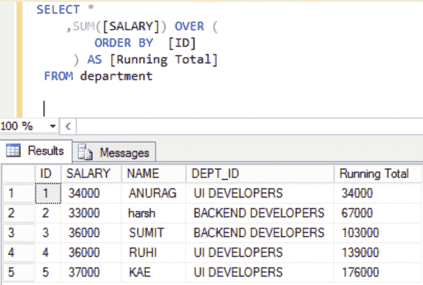
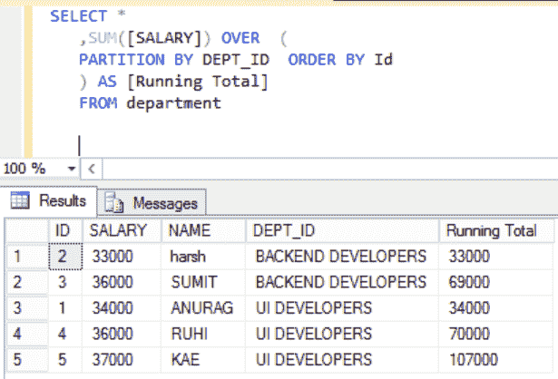

# 用 SQL 计算运行总数

> 原文:[https://www . geesforgeks . org/calculate-running-total-in-SQL/](https://www.geeksforgeeks.org/calculate-running-total-in-sql/)

结构化查询语言是一种标准的数据库语言，用于创建、维护和检索关系数据库中的数据，如 MySQL、Oracle 等。在本文中，我们将使用微软的 SQL Server。
下面我们来看看如何得到各个部门的运行工资总额。在这里，我们将首先创建一个名为“极客”的数据库，然后在该数据库中创建一个表“部门”。之后，我们将对该表执行查询。

**创建数据库:**

```sql
CREATE geeks;
```

**使用该数据库:**

```sql
USE geeks;
```

**这是我们在极客数据库中的表:**

```sql
CREATE TABLE department(
ID int,
SALARY int,
NAME Varchar(20),
DEPT_ID Varchar(255));
```

**输出:**
命令成功完成。

**在表格中添加数值:**

```sql
INSERT INTO department 
VALUES (1, 34000, 'ANURAG', 'UI DEVELOPERS');

INSERT INTO department 
VALUES (2, 33000, 'harsh', 'BACKEND DEVELOPERS');

INSERT INTO department 
VALUES (3, 36000, 'SUMIT', 'BACKEND DEVELOPERS');

INSERT INTO department 
VALUES (4, 36000, 'RUHI', 'UI DEVELOPERS');

INSERT INTO department 
VALUES (5, 37000, 'KAE', 'UI DEVELOPERS');
```

**输出:**
(1 行受影响)
(1 行受影响)
(1 行受影响)
(1 行受影响)
(1 行受影响)

**在 SQL Server 管理工作室选择:**



**这是我们表里面的数据:**

```sql
SELECT * FROM department;
```

<figure class="table">

| 身份证明 | 薪水 | 名字 | 部门标识 |
| --- | --- | --- | --- |
| one | Thirty-four thousand | 阿努格 | 用户界面开发人员 |
| Two | Thirty-three thousand | 严厉的 | 后端开发人员 |
| three | Thirty-six thousand | 苏米特 | 后端开发人员 |
| four | Thirty-six thousand | 他的灵魂 | 用户界面开发人员 |
| five | Thirty-seven thousand | KAE | 用户界面开发人员 |

</figure>

**在 SQL Server 管理工作室选择:**



**示例 1:**
**在 SQL Server 中计算运行总数的查询**

```sql
SELECT * ,(
SELECT SUM(T2.[SALARY])  
 FROM [department] AS T2
       WHERE T2.[ID] <= T1.[ID]
) AS [Running Total]
FROM [department] AS T1
```

**输出:**

<figure class="table">T32 T58】36000T60【RUHI】T61T64【139000】T65T67T70】37000T72】KAET74UI DEVELOPER

| 身份证明 | 薪水 | 名字 | 部门标识 | 总流量 |
| --- | --- | --- | --- | --- |
| one | Thirty-four thousand | ANURG | 用户界面开发人员 | Thirty-four thousand |
| four | 用户界面开发人员 |
| five | One hundred and seventy-six thousand |

</figure>

**在 SQL Server 管理工作室选择:**



**示例 2**
在这个 SQL Server 示例中，我们将使用 SUM 函数和 OVER 来查找运行总数。
**查询计算 SQL Server 中的运行总数**

```sql
SELECT *
    ,SUM([SALARY]) OVER (
           ORDER BY  [ID]
  ) AS [Running Total]
FROM department
```

**输出:**

<figure class="table">T32 T58】36000T60【RUHI】T61T64【139000】T65T67T70】37000T72】KAET74UI DEVELOPER

| 身份证明 | 薪水 | 名字 | 部门标识 | 总流量 |
| --- | --- | --- | --- | --- |
| one | Thirty-four thousand | 阿努格 | 用户界面开发人员 | Thirty-four thousand |
| four | 用户界面开发人员 |
| five | One hundred and seventy-six thousand |

</figure>

**在 SQL Server 管理工作室选择:**



**示例 3:**
在这个 SQL Server 示例中，我们将使用 PARTITION BY 和 OVER 来查找运行总数。
**查询计算 SQL Server 中的运行总数**

```sql
SELECT *
   ,SUM([SALARY]) OVER  (
PARTITION BY DEPT_ID  ORDER BY Id
) AS [Running Total]
FROM department
```

**输出:**

<figure class="table">T32 4

| 身份证明 | 薪水 | 名字 | 部门标识 | 运行 _ 总计 |
| --- | --- | --- | --- | --- |
| Two | Thirty-three thousand | 严厉的 | Backend developer | Thirty-three thousand |
| Thirty-six thousand | 他的灵魂 | 用户界面开发人员 | Seventy thousand |
| five | Thirty-seven thousand | KAE | 用户界面开发人员 | One hundred and seven thousand |

</figure>

**在 SQL Server 管理工作室选择:**

