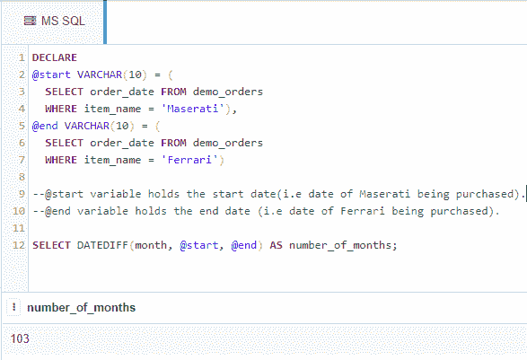

# 在 SQL 中计算两个特定日期之间的月数

> 原文:[https://www . geeksforgeeks . org/计算两个特定日期之间的月数/SQL/](https://www.geeksforgeeks.org/calculate-the-number-of-months-between-two-specific-dates-in-sql/)

在本文中，我们将讨论计算两个特定日期之间的月数的 SQL 查询的概述，并将借助一个示例来实现，以便更好地理解。我们一步一步来讨论。

**概述:**
下面我们就来看看，如何借助 SQL 查询使用 DATEDIFF()函数计算两个给定日期之间的月数。为了演示，我们将在名为“极客”**的数据库中创建一个 demo_orders 表。**实现 SQL 查询计算两个特定日期之间的月数有以下步骤。

**第一步:创建数据库:**
使用下面的 SQL 语句创建一个名为 geeks 的数据库，如下所示。

```
CREATE DATABASE geeks;
```

**步骤 2:使用数据库:**
使用下面的 SQL 语句将数据库上下文切换到极客，如下所示。

```
USE geeks;
```

**步骤-3:表定义:**
我们的极客数据库中有以下演示表。

```
CREATE TABLE demo_orders 
(
ORDER_ID INT IDENTITY(1,1) PRIMARY KEY, 
--IDENTITY(1,1) is same as AUTO_INCREMENT in MySQL.
--Starts from 1 and increases by 1 with each inserted row.
ITEM_NAME VARCHAR(30) NOT NULL,
ORDER_DATE DATE
);
```

**第 4 步:验证:**
可以使用下面的语句查询创建的表的描述:

```
EXEC SP_COLUMNS demo_orders;
```

**输出:**

<figure class="table">demo _ orders

| 表名 | 列名 | 数据类型 | 类型名 | 精确 | 长度 | remarks |
| --- | --- | --- | --- | --- | --- | --- |
| 演示订单 | 订单标识 | four | 整数标识 | 订单 _ 日期 | -9 | 日期 | Ten | Twenty | 空 |

</figure>

**第 5 步:向表中添加数据:**
使用下面的语句向 demo_orders 表中添加数据，如下所示。

```
INSERT INTO demo_orders 
--no need to mention columns explicitly as we are inserting into all columns and ID gets
--automatically incremented.
VALUES
('Maserati', '2007-10-03'),
('BMW', '2010-07-23'),
('Mercedes Benz', '2012-11-12'),
('Ferrari', '2016-05-09'),
('Lamborghini', '2020-10-20');
```

**第 6 步:验证:**
要验证表格的内容，请使用如下语句。

```
SELECT * FROM demo_orders;
```

**输出:**

<figure class="table">

|  | 【订单 _ id】 | 【项目名称】 | 【订单 _ 日期】 |
| --- | --- | --- | --- |

</figure>

**第 7 步:计算两个特定日期之间的月数的 SQL 查询:**
现在，让我们使用 DATEDIFF()函数在表格中查找“玛莎拉蒂”和“法拉利”订单日期之间的月数。下面是 DATEDIFF()函数的语法。

```
DATEDIFF(day/month/year, <start_date>, <end_date>);
```

**示例–**

```
DECLARE 
@start VARCHAR(10) = (
  SELECT order_date FROM demo_orders
  WHERE item_name = 'Maserati'),
@end VARCHAR(10) = (
  SELECT order_date FROM demo_orders
  WHERE item_name = 'Ferrari')

--@start variable holds the start date(i.e date of Maserati being purchased).

--@end variable holds the end date (i.e date of Ferrari being purchased).

SELECT DATEDIFF(month, @start, @end) AS number_of_months;

--In place of *month* we could use *year* or *day* and that would give the respective no. of years and 
--days in between those dates.
```

**输出:**

