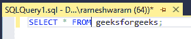
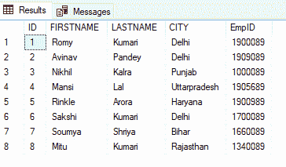
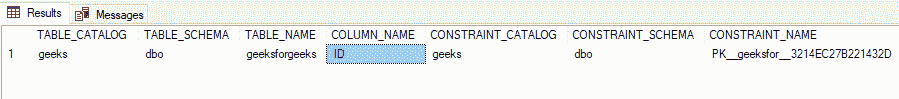
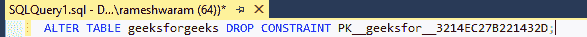
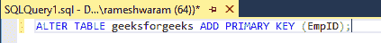
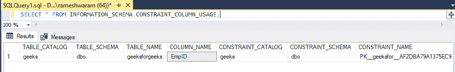

# 更改 SQL Server 中的主键列

> 原文:[https://www . geesforgeks . org/change-primary-key-column-in-SQL-server/](https://www.geeksforgeeks.org/change-primary-key-column-in-sql-server/)

主键是指表中唯一标识表中行的列。它包含唯一值，不能包含空值。为了演示的目的，我们将在名为“极客”的数据库中为极客创建极客表。

**步骤 1:** 创建数据库

使用以下命令在 SQL Server 中创建数据库

**查询:**

```
CREATE DATABASE geeks;
```

**步骤 2:** 使用数据库

使用下面的 SQL 语句将数据库上下文切换到极客:

**查询:**

```
USE geeks;
```

在 SQL Server 中，主键约束由以下语法定义:

**语法:**

```
CREATE TABLE tablename (
column_name datatype NOT
NULL PRIMARY KEY);
```

我们也可以在创建表之后定义主键，但是要确保该列上有 NOT NULL 约束。定义表后声明主键的语法:

**语法:**

```
Alter table table_name add  primary key (column_name);
```

要更改 SQL Server 中的主键列，请执行以下步骤:

*   删除已经定义的主键。
*   添加新列作为主键。

**步骤 1:** 表格创建

极客数据库中有以下极客表

**查询:**

```
CREATE TABLE geeksforgeeks(
ID int PRIMARY KEY,
FIRSTNAME varchar(30),
LASTNAME varchar(30),
CITY varchar(18),
EmpID int NOT NULL
);
```

**步骤 2:** 将数据插入表格

**查询:**

```
INSERT INTO geeksforgeeks VALUES 
(1,'Romy', 'Kumari', 'Delhi',1900089),
(2,'Avinav', 'Pandey', 'Delhi',1909089),
(3,'Nikhil', 'Kalra', 'Punjab',1000089),
(4,'Mansi', 'Lal', 'Uttarpradesh',1905689),
(5,'Rinkle', 'Arora', 'Haryana',1900989),
(6,'Sakshi', 'Kumari', 'Delhi',1700089),
(7,'Soumya', 'Shriya', 'Bihar',1660089),
(8,'Mitu', 'Kumari', 'Rajasthan',1340089);
```

**第三步:**检查表格内容

**查询:**

```
SELECT * FROM geeksforgeeks;
```



**输出:**



### **检查哪一列设置为主键，我们可以使用以下命令:**

**查询:**

```
SELECT * FROM INFORMATION_SCHEMA.CONSTRAINT_COLUMN_USAGE  ;
```


**输出:**



在上图中，可以看到 ID 列是主键。我们可以通过使用图像中提到的 CONSTRAINT_NAME 来删除这个主键。从这里复制 CONSTRAINT_NAME 来删除主键。

### **删除主键的命令:**

**查询:**

```
ALTER TABLE geeksforgeeks DROP CONSTRAINT PK__geeksfor__3214EC275032BA6D;
```



将 EmpID 添加为新的主键(始终检查是否指定了非空约束，否则将引发错误)

**查询:**

```
ALTER TABLE geeksforgeeks ADD PRIMARY KEY (EmpID);
```



现在使用 **'** 从信息模式中选择*来检查表的主键。' CONSTRAINT_COLUMN_USAGE '命令

**输出:**



在上图中，可以看到 EMPID 是主键。