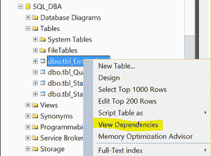
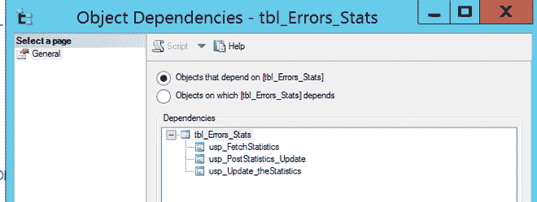

# 检查 SQL Server 中某个表的依赖关系

> 原文:[https://www . geeksforgeeks . org/check-the-dependencies-of-a-table-in-SQL-server/](https://www.geeksforgeeks.org/check-the-dependencies-of-a-table-in-sql-server/)

作为一名数据库管理员，您可能需要使用 SQL Server 管理工作室或 SQL Query 在 SQL Server 中查找表的依赖关系。在更改或删除任何表时，有关于依赖关系的信息将是有用的。

**使用 SQL Server 管理工作室在 SQL Server 中查找表依赖项:**
**步骤-1 :**
展开数据库，展开表，右键单击表名。


**第 2 步:**
点击查看依赖关系。



使用 SQL Quires 在 SQL Server 中查找表依赖项。
**方法-1 :**
使用 SP _ DEPENDS 存储过程。它将返回指定对象的所有依赖项，包括表、视图、存储过程、约束等。
**查询–**

```sql
Use DatabaseName ;
EXEC sp_depends @objname = N'ObjectName' ;
```

**示例-1 :**

```sql
Use SQL_DBA ;
EXEC sp_depends @objname = N'[dbo].[tbl_Errors_Stats]' ;
```

**输出:**

| 名字 | 类型 |
| --- | --- |
| dbo.usp_FetchStatistics | 存储过程 |
| dbo.usp_PostStatistics_Update | 存储过程 |
| dbo.usp _ Update _ 统计信息 | 存储过程 |

**进场-2 :**
**查询–**

```sql
Use DatabaseName ;
SELECT * FROM sys.dm_sql_referencing_entities('ObjectName', 
                      'OBJECT') ;
```

**示例-1 :**

```sql
use SQL_DBA ;
SELECT * FROM sys.dm_sql_referencing_entities('[dbo].[tbl_Errors_Stats]',
                                   'OBJECT') ;
```

**输出:**

| 引用
_schema_name | 引用
_ 实体名称 | 引用
_id | 引用
_ 类 | 引用
_class_desc | 是 _ 呼叫者
_ 依赖的吗 |
| --- | --- | --- | --- | --- | --- |
| dbo | usp_FetchStatistics | Five hundred and ninety-seven million five hundred and seventy-seven thousand one hundred and sixty-seven | one | 对象或列 | Zero |
| dbo | USP _ post statistics
_ 更新 | Five hundred and eighty-one million five hundred and seventy-seven thousand one hundred and ten | one | 对象或列 | Zero |
| dbo | USP _ Update
_ 统计 | Five hundred and sixty-five million five hundred and seventy-seven thousand and fifty-three | one | 对象 _ 或
_ 列 | Zero |

**进场-3 :**
**查询–**

```sql
SELECT ROUTINE_SCHEMA,
      ROUTINE_NAME,  
      ROUTINE_TYPE,
      ROUTINE_DEFINITION  
FROM INFORMATION_SCHEMA.ROUTINES  
WHERE ROUTINE_DEFINITION LIKE '%ObjectName%'
```

**示例-1 :**

```sql
use SQL_DBA

SELECT ROUTINE_SCHEMA,
ROUTINE_NAME, 
ROUTINE_TYPE
FROM INFORMATION_SCHEMA.ROUTINES
WHERE ROUTINE_DEFINITION LIKE '%tbl_Errors_Stats%'
```

**输出:**

| 例程 _ 架构 | 例程名 | 例程类型 |
| --- | --- | --- |
| dbo | usp _ Update _ 统计信息 | 程序 |
| dbo | usp_PostStatistics_Update | 程序 |
| dbo | usp_FetchStatistics | 程序 |

**进场-4 :**
**查询–**

```sql
SELECT *
FROM sys.sql_expression_dependencies A, sys.objects B
WHERE referenced_id = OBJECT_ID(N'ObjectName') AND  
 A.referencing_id = B.object_id  

GO
```

**示例-1 :**

```sql
use SQL_DBA

SELECT referenced_id, referenced_database_name, referenced_schema_name, name
FROM sys.sql_expression_dependencies A, sys.objects B
WHERE referenced_id = OBJECT_ID(N'tbl_Errors_Stats') AND
A.referencing_id = B.object_id 

GO
```

**输出:**

| 引用的 id | 引用的数据库名 | 引用的 _ 架构 _ 名称 | 名字 |
| --- | --- | --- | --- |
| Six hundred and thirteen million five hundred and seventy-seven thousand two hundred and twenty-four | SQL_DBA | dbo | usp _ Update _ 统计信息 |
| Six hundred and thirteen million five hundred and seventy-seven thousand two hundred and twenty-four | SQL_DBA | dbo | usp_PostStatistics_Update |
| Six hundred and thirteen million five hundred and seventy-seven thousand two hundred and twenty-four | SQL_DBA | dbo | usp_FetchStatistics |