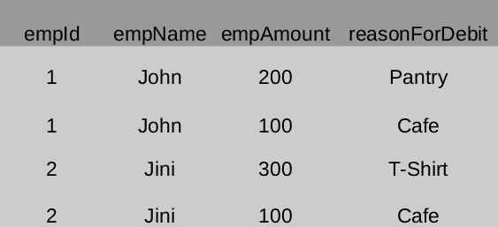

# 按

分组的常见错误

> 原文:[https://www.geeksforgeeks.org/common-error-in-group-by/](https://www.geeksforgeeks.org/common-error-in-group-by/)

**先决条件:** [SQL |分组依据](https://www.geeksforgeeks.org/sql-group-by/)

**错误:**
列“col”在选择列表中无效，因为它不包含在聚合函数或 GROUP BY 子句中。

<center>Emp Sample Table:</center>



**示例:**

```
Input: 
select empId, empName, empAmount from emp group by empId, empName

Output: Error 
```

**解释:**
empAmount 不在 group by list 中，也不是聚合函数，查询会给出以上错误。对于 empId 和 empName 有多个 empAmount，数据库引擎无法选择一个 empAmount。

```
Input: 
select empId, sum(empAmount) as debit from emp group by empId

Output:
empId | debit
1     | 300
2     | 400 
```

**[GROUP BY](https://www.geeksforgeeks.org/sql-group-by/) :**
从上面的例子可以清楚地看出，我们只能在 select 子句中拥有 GROUP BY 中的那些列或聚合函数的参数。但这并不完全正确。

“1999 年和 2003 年版本的 SQL 标准要求出现在 SELECT 列表中的列在功能上依赖于 GROUP BY 子句定义的组。换句话说，如果我们知道在 GROUP BY 子句中出现的列中，对于任何给定的值组合，一个列只包含一个值，那么即使该列没有出现在聚合表达式中，我们也可以引用 SELECT 列表中的该列

通俗地说:

> 如果分组依据中的列具有主键或唯一键，则该组合对于其他列只有一个值。

但是按唯一的列分组没有意义，但是当涉及到其他表时，它将变得有用。

**少数例外:**
MySQL 允许您在分组依据查询中选择任何内容。它会以随机的顺序进行选择，首先选择的东西会返回给你。

**示例:**

```
Input:
select empId, empName, empAmount from emp group by empId, empName 
```

上面的查询不会给出任何错误。它将从列表中随机选择 empAmount，并将其与 empID 和 empName 配对。

可以通过添加一个标志(即 ONLY_FULL_GROUP_BY)或使用 MySQL 5 . 7 . 5 或更高版本来启用正确的行为。在这种情况下，查询会引发上述错误。