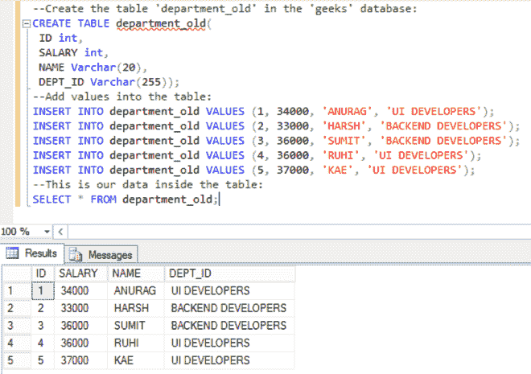
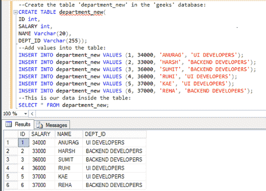
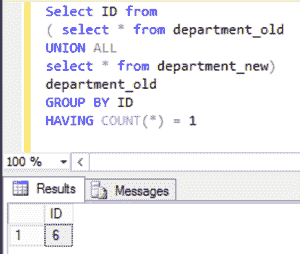

# 比较并找出 SQL 中两个表之间的差异

> 原文:[https://www . geeksforgeeks . org/比较和查找 sql 中两个表之间的差异/](https://www.geeksforgeeks.org/compare-and-find-differences-between-two-tables-in-sql/)

结构化查询语言是一种标准的数据库语言，用于创建、维护和检索关系数据库中的数据，如 MySQL、Oracle 等。在这里，我们将看到如何在 SQL 中比较和查找两个表之间的差异

在这里，我们将首先创建一个名为“极客”的数据库，然后我们将在该数据库中创建两个表“ *department_old* ”和“ *department_new* ”。之后，我们将对该表执行查询。

### **创建数据库:。**

使用下面的 SQL 语句创建一个名为*极客*的数据库:

```
CREATE geeks;
```

### 使用数据库:

```
USE geeks;
```

### *部门的表格定义 _ 旧的*表格:

```
CREATE TABLE department_old(
 ID int,
 SALARY int,
 NAME Varchar(20),
 DEPT_ID Varchar(255));
```

### **在表格中添加数值:**

使用以下查询向表中添加数据:

```
INSERT INTO department_old VALUES (1, 34000, 'ANURAG', 'UI DEVELOPERS');
INSERT INTO department_old VALUES (2, 33000, 'HARSH', 'BACKEND DEVELOPERS');
INSERT INTO department_old VALUES (3, 36000, 'SUMIT', 'BACKEND DEVELOPERS');
INSERT INTO department_old VALUES (4, 36000, 'RUHI', 'UI DEVELOPERS');
INSERT INTO department_old VALUES (5, 37000, 'KAE', 'UI DEVELOPERS');
```

要验证表格的内容，请使用以下语句:

```
SELECT * FROM department_old;
```

<figure class="table">

| 身份证明 | 薪水 | 名字 | 部门标识 |
| --- | --- | --- | --- |
| one | Thirty-four thousand | 阿努格 | 用户界面开发者 |
| Two | Thirty-three thousand | 严厉的 | 后端开发人员 |
| three | Thirty-six thousand | 苏米特 | 后端开发人员 |
| four | Thirty-six thousand | 他的灵魂 | 用户界面开发者 |
| five | Thirty-seven thousand | KAE | 用户界面开发者 |

</figure>

来自 SQL Server 管理工作室的结果:



### *部门的表格定义 _ 新建*表格:

```
CREATE TABLE department_new(
ID int,
SALARY int,
NAME Varchar(20),
DEPT_ID Varchar(255));
```

### **在表格中添加数值:**

使用以下查询向表中添加数据:

```
INSERT INTO department_new VALUES (1, 34000, 'ANURAG', 'UI DEVELOPERS');
INSERT INTO department_new VALUES (2, 33000, 'HARSH', 'BACKEND DEVELOPERS');
INSERT INTO department_new VALUES (3, 36000, 'SUMIT', 'BACKEND DEVELOPERS');
INSERT INTO department_new VALUES (4, 36000, 'RUHI', 'UI DEVELOPERS');
INSERT INTO department_new VALUES (5, 37000, 'KAE', 'UI DEVELOPERS');
INSERT INTO department_new VALUES (6, 37000, 'REHA', 'BACKEND DEVELOPERS');
```

要验证表格的内容，请使用以下语句:

```
SELECT * FROM department_new;
```

<figure class="table">

| 身份证明 | 薪水 | 名字 | 部门标识 |
| --- | --- | --- | --- |
| one | Thirty-four thousand | 阿努格 | 用户界面开发者 |
| Two | Thirty-three thousand | 严厉的 | 后端开发人员 |
| three | Thirty-six thousand | 苏米特 | 后端开发人员 |
| four | Thirty-six thousand | 他的灵魂 | 用户界面开发者 |
| five | Thirty-seven thousand | KAE | 用户界面开发者 |
| six | Thirty-seven thousand | 修复 | 后端开发人员 |

</figure>

**输出:**



### **比较两次查询的结果**

假设我们有两张表:*表 1* 和*表 2* 。在这里，我们将使用 UNION ALL 基于需要比较的列来组合记录。如果需要比较的列中的值相同，则 COUNT(*)返回 2，否则 COUNT(*)返回 1。

**语法:**

```
SELECT column1, column2.... columnN
FROM
( SELECT table1.column1, table1.column2
 FROM table1
 UNION ALL
 SELECT table2.column1, table2.column2
 FROM table2
)  table1
GROUP BY column1
HAVING COUNT(*) = 1
```

**示例:**

```
Select ID from
( select * from department_old
UNION ALL
select * from department_new)
department_old
GROUP BY ID
HAVING COUNT(*) = 1
```

**输出:**



如果比较中涉及的列中的值相同，则不返回任何行。