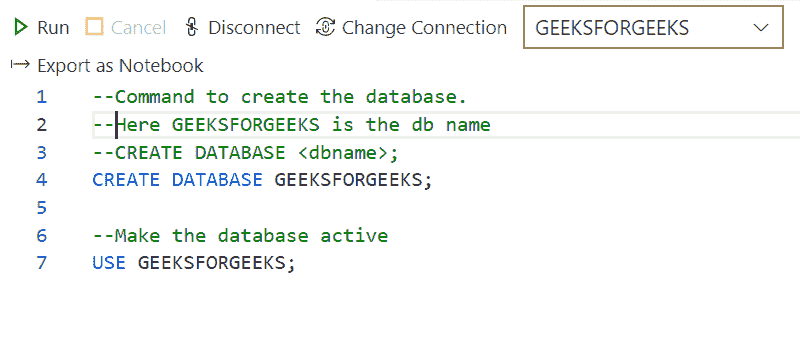
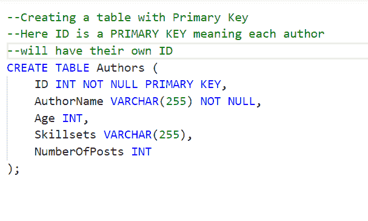
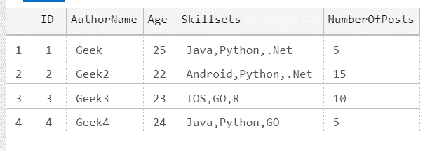
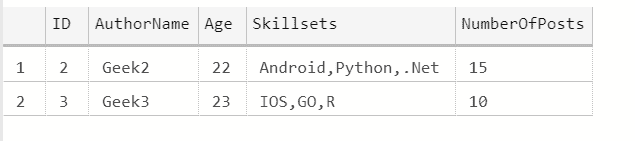
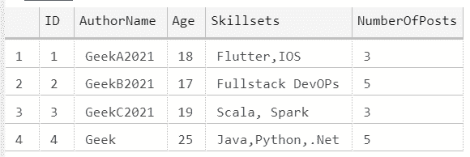
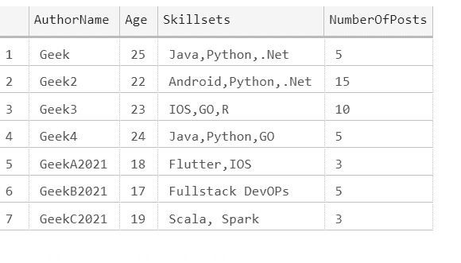
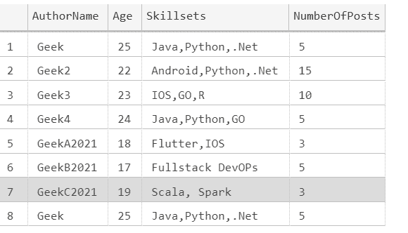
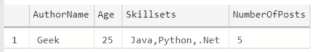

# 比较两个查询的 SQL Server 结果

> 原文:[https://www . geesforgeks . org/compare-SQL-server-两次查询的结果/](https://www.geeksforgeeks.org/compare-sql-server-results-of-two-queries/)

SQL Server 是一个通用的数据库，它是许多软件行业中使用最多的关系数据库。在本文中，让我们简单地看看两个查询的 SQL Server 结果的比较。通过使用 Azure Data Studio，让我们从创建数据库、创建表、锁等开始了解概念。，Azure Data Studio 适用于 Windows 10、Mac 和 Linux 环境。它可以从安装

### **数据库创建:**

命令来创建数据库。这里 GEEKSFORGEEKS 是数据库的名字

```sql
CREATE DATABASE GEEKSFORGEEKS;
```

使数据库处于活动状态

```sql
USE GEEKSFORGEEKS;
```



### **将表添加到数据库:**

使用主键创建表。这里 ID 是一个主键，意味着每个作者都有自己的 ID

```sql
CREATE TABLE Authors (
  ID INT NOT NULL PRIMARY KEY,
  <other column name1> <datatype> <null/not null>,
  ..........
);
```

如果明确指定“非空”，则该列应该有值。如果未指定，则默认为“空”。



让我们在表中插入一些记录，并检查表的结果内容。



作者目录

对于 SQL 查询的比较，我们可以使用“UNION，INTERSECT，EXCEPT”构造。我们可以逐个检查

### **除外:**

SQL EXCEPT 的工作方式类似于数学中的“-”运算符。也就是说，它从左查询返回右查询记录中不存在的记录。

**例 1 :**

```sql
 SELECT * from Authors 
 EXCEPT
 SELECT * from Authors WHERE Skillsets like 'java%' 
```

**输出:**



除了构造结果

**说明:**

左查询生成该表的所有 4 条记录，而右查询只生成第 1 条和第 4 条记录。由于使用了“EXCEPT”构造，上述查询的结果将只产生第二条和第三条记录(第二条查询中没有)。

“EXCEPT”结构相当于甲骨文中的“减”结构。

**例 2 :**

```sql
SELECT * from Authors WHERE Skillsets like 'java%'  
 EXCEPT
 SELECT * from Authors 
```

你能确认这可能是什么输出吗？

是的，完全正确，没有输出，因为左查询只包含第 1 行和第 4 行，右查询包含所有行，当应用“EXCEPT”时，我们只看到空白数据。

通常，“EXCEPT”用于找出应该相同或不相同的查询结果，当结果显示没有数据手段时，查询结果是相同的。

**注意:**只有当两个查询的结果输出相同时，才可以在查询之间放置 EXCEPT。如果它们不同，我们不能使用“例外”

### **UNION :**

每当有需要时，比如组合多个表中的数据，或者组合从不同查询演化而来的单个表的数据，我们都可以选择 UNION。这相当于数学中的“联合”。

假设有另一个名为“Authors2021”的表，并且记录很少，如下所示:



Author2021 目录

**例 3 :**

```sql
SELECT AuthorName,Age,Skillsets,NumberOfPosts from Authors   
UNION
SELECT AuthorName,Age,Skillsets,NumberOfPosts from Authors2021
```

**输出:**



两个表结果集的联合，这里公共记录只显示一次，从而避免重复

**说明:**

如果您查看输出，两个表中的数据将被合并，因此我们可以看到上面的输出。

当应用 Union 时，如果两个表中都有公共记录，它将从一个表中获取数据，从而避免重复。所以联合的结果将是两个表中所有记录的组合。即由第一个查询产生的结果集与由第二个查询产生的结果集相结合。

如果我们检查输出，我们没有重复的记录。

**用法:**每当我们需要通过避免重复来显示累计输出时，我们可以选择 UNION。

### **联合所有:**

这类似于 UNION，但包括重复的记录，因此可以看到记录的重复

**例 4 :**

```sql
SELECT AuthorName,Age,Skillsets,NumberOfPosts from Authors    
UNION ALL
SELECT AuthorName,Age,Skillsets,NumberOfPosts from Authors2021
```

**输出:**



如果检查输出，在第一行和第八行中，检索到的列值是相同的。由于我们使用了“联合所有”，结果来自两个表，包括重复的

应用“联合”和“全部联合”时需要考虑的重要注意事项

1.  应该有相同数量的列，并且在 select 语句中也应该保持它们的顺序
2.  每个选择查询都可以使用 Group By 和 Having 子句，但不能在整个结果集中使用
3.  Order By 不能用于每个单独的语句，但可以用于整个结果集。

### **INTERSECT:**

这种结构提供了两个选择查询之间常见的记录。这是 UNION 的反义词。 **UNION 删除重复记录并显示所有记录，但 INTERSECT 只显示公共记录。**所以，只要有显示公共记录的场景，我们就可以使用 INTERSECT

**例 5 :**

```sql
SELECT AuthorName,Age,Skillsets,NumberOfPosts from Authors    
INTERSECT
SELECT AuthorName,Age,Skillsets,NumberOfPosts from Authors2021
```

**输出:**



**说明:**

在比较作者和 Author2021 表格内容时，对于像 *AuthorName* 、 *Age* 、*skillset*、 *NumberOfPosts* 这样的*字段名*，只有上面显示的数据是常见的，因此在输出中，我们看到了这一点。

**结论:**

通过使用 UNION、UNION ALL、EXCEPT 和 INTERSECT，我们可以比较两个查询，并根据我们的要求获得必要的输出。给出的例子很容易理解，我们可以有复杂的查询，可以在其中应用所提到的结构，并且可以进行比较。