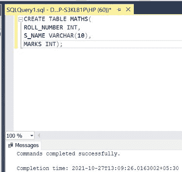
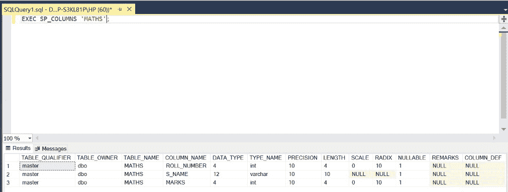
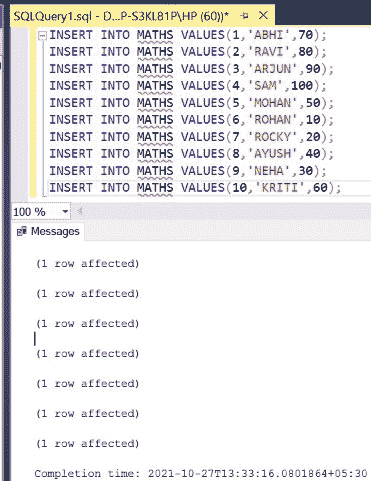
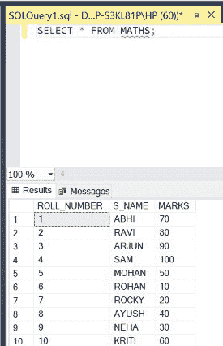
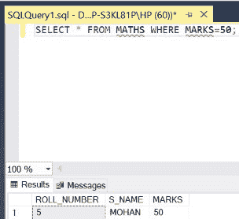
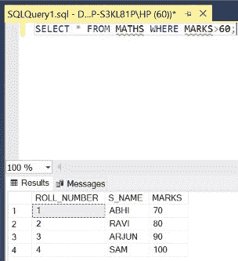
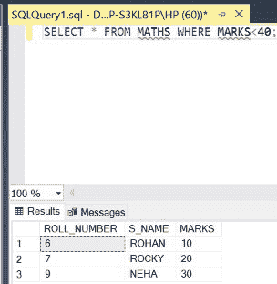
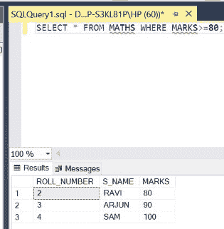
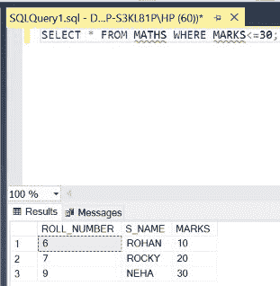
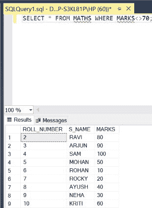

# SQL 中的比较运算符

> 原文:[https://www.geeksforgeeks.org/comparison-operators-in-sql/](https://www.geeksforgeeks.org/comparison-operators-in-sql/)

在 SQL 中，有六种比较运算符可以帮助我们运行查询来执行各种操作。我们将使用 [WHERE](https://www.geeksforgeeks.org/sql-where-clause/) 命令和[条件](https://www.geeksforgeeks.org/sql-server-conditional-statements/) [运算符](https://www.geeksforgeeks.org/sql-operators/)来实现这一点。在本文中，我们将使用微软的 SQL Server 作为我们的数据库。

**语法:**

```sql
SELECT * FROM TABLE_NAME WHERE 
ATTRIBUTE CONDITION_OPERATOR GIVEN_VALUE;
```

**步骤 1:** 创建数据库。为此，使用下面的命令创建一个名为 GeeksForGeeks 的数据库。

**查询:**

```sql
CREATE DATABASE GeeksForGeeks
```

**输出:**


**步骤 2:** 使用 GeeksForGeeks 数据库。为此，请使用以下命令。

**查询:**

```sql
USE GeeksForGeeks
```

**输出:**


**步骤 3:** 在数据库 GeeksForGeeks 中创建一个数学表。该表有三列，即卷号、名字和分数，包含卷号、学生姓名和不同学生在数学科目中获得的分数。

**查询:**

```sql
CREATE TABLE MATHS(
ROLL_NUMBER INT,
S_NAME VARCHAR(10),
MARKS INT);
```

**输出:**



**第 4 步:**显示数学表的结构。

**查询:**

```sql
EXEC SP_COLUMNS 'MATHS';
```

**输出:**



**第 5 步:**在数学表中插入 10 行。

**查询:**

```sql
INSERT INTO MATHS VALUES(1,'ABHI',70);
INSERT INTO MATHS VALUES(2,'RAVI',80);
INSERT INTO MATHS VALUES(3,'ARJUN',90);
INSERT INTO MATHS VALUES(4,'SAM',100);
INSERT INTO MATHS VALUES(5,'MOHAN',50);
INSERT INTO MATHS VALUES(6,'ROHAN',10);
INSERT INTO MATHS VALUES(7,'ROCKY',20);
INSERT INTO MATHS VALUES(8,'AYUSH',40);
INSERT INTO MATHS VALUES(9,'NEHA',30);
INSERT INTO MATHS VALUES(10,'KRITI',60);
```

**输出:**



**第 6 步:**显示数学表的所有行。

**查询:**

```sql
SELECT * FROM MATHS;
```

**输出:**



**SQL 中各种比较运算符的演示:**

*   **等于(=)运算符**:返回属性值等于给定值的行/元组。

**查询:**

```sql
SELECT * FROM MATHS WHERE MARKS=50;
```

**输出:**



*   **大于(>)运算符:**返回属性值大于给定值的行/元组。

**查询:**

```sql
SELECT * FROM MATHS WHERE MARKS>60;
```

**输出:**



*   **小于(<)运算符:**返回属性值小于给定值的行/元组。

**查询:**

```sql
SELECT * FROM MATHS WHERE MARKS<40;
```

**输出:**



*   **大于或等于(> =)运算符:**返回属性值大于或等于给定值的行/元组。

**查询:**

```sql
SELECT * FROM MATHS WHERE MARKS>=80;
```

**输出:**



*   **小于等于(< =)运算符**:返回属性值小于等于给定值的行/元组。

**查询:**

```sql
SELECT * FROM MATHS WHERE MARKS<=30;
```

**输出:**



*   **不等于(< >)运算符:**返回属性值不等于给定值的行/元组。

**查询:**

```sql
SELECT * FROM MATHS WHERE MARKS<>70;
```

**输出:**

