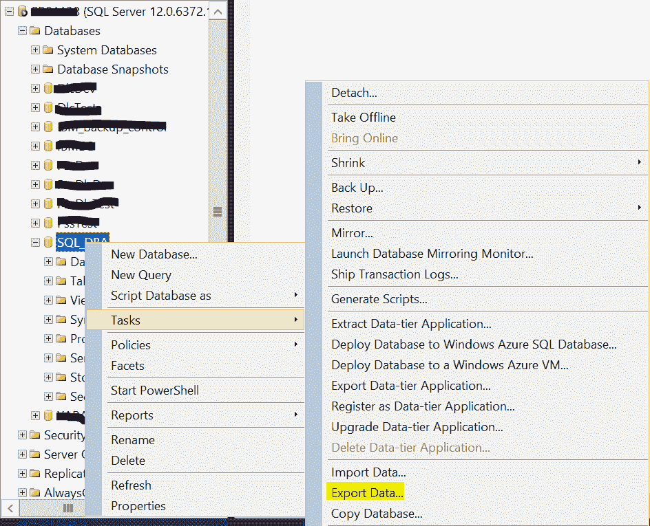
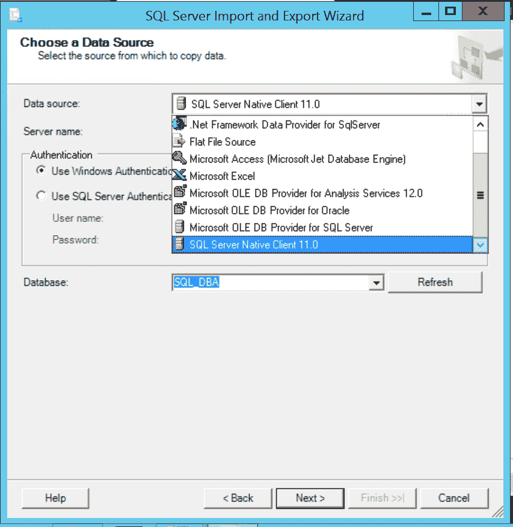
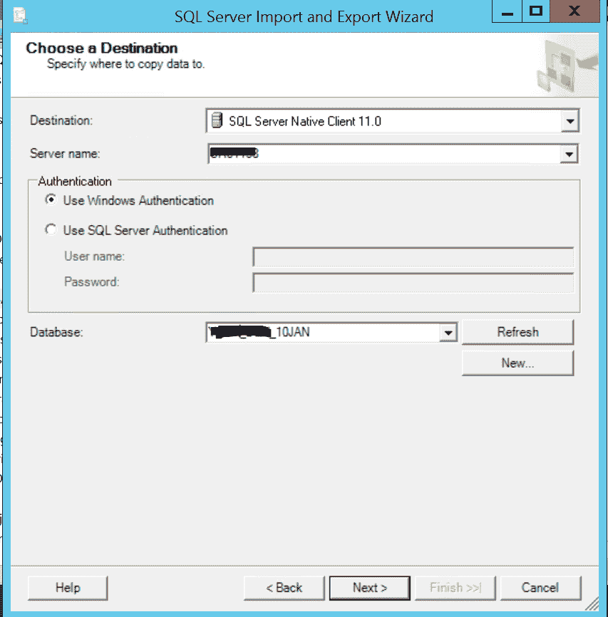
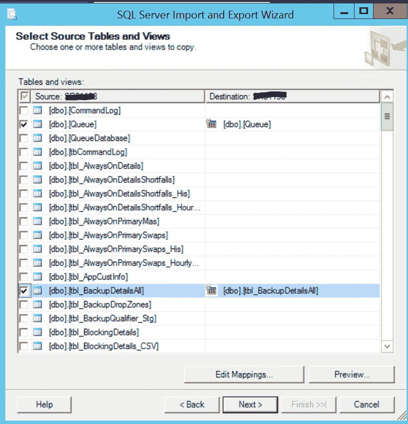
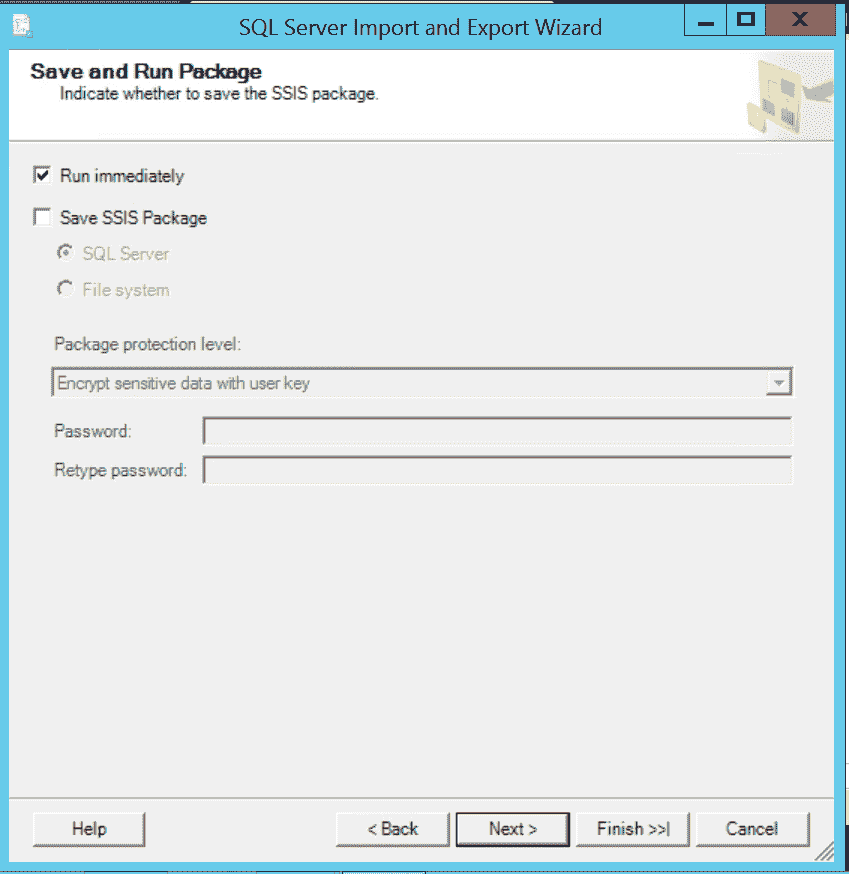
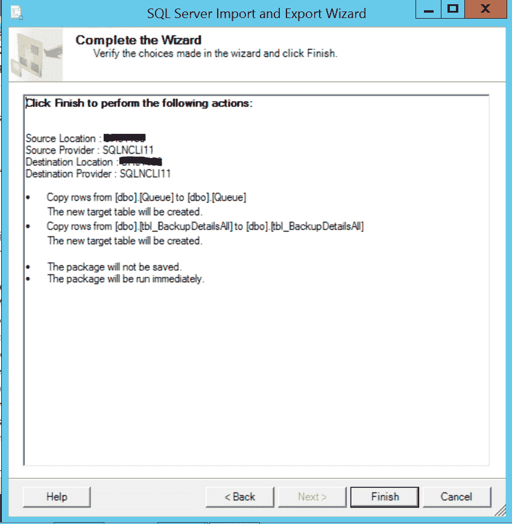

# 使用导入和导出向导

在 SQL Server 中的数据库之间复制表

> 原文:[https://www . geesforgeks . org/copy-tables-in-SQL-server-使用导入和导出向导/](https://www.geeksforgeeks.org/copy-tables-between-databases-in-sql-server-using-import-and-export-wizard/)

**导入导出向导简介:**
该向导允许简单地完成一个过程，并且只需编写很少或不编写代码就可以执行数据复制过程。但是，要将数据从一个源导入和导出到另一个源，可以遵循以下步骤–

1.  Open the Object Explorer, select the database, right-click on the database name, and select Tasks and choose Export Data… option.

     

2.  Now choose the data source, there are different sources that can be used. i.e., SQL Native Client 11.0, Select Server name and database name.

     

3.  Now choose a destination Server name and Database and click Next.

     

4.  Select the objects to copy data from table\view to the destination or write a query to data transfer and Click Next.

     

5.  Choose Run immediately or Save SSIS Package and Click Next.

     

6.  Summary of the actions that will be performed using the wizard will appear. Click Finish to execute the job steps.

     

    向导成功完成后，表将在目的数据库中可见。

**使用导入导出向导的好处:**
将特定表的对象和内容从一个数据库复制到同一实例或不同 SQL 实例中的另一个数据库，例如:将特定表从生产数据库复制到开发数据库，用于测试或排除问题。

**使用导入导出向导的限制:**
副本取决于表的数量、大小和数据库中的当前可用空间等因素。如果表的总大小超过数据库总大小的 50%，则导入和导出向导会很耗时。