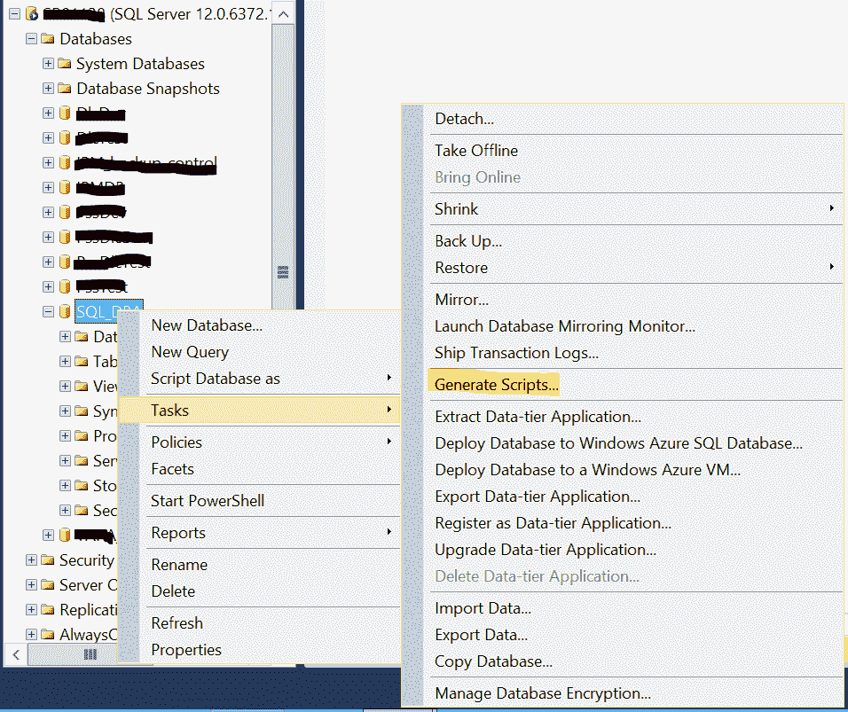
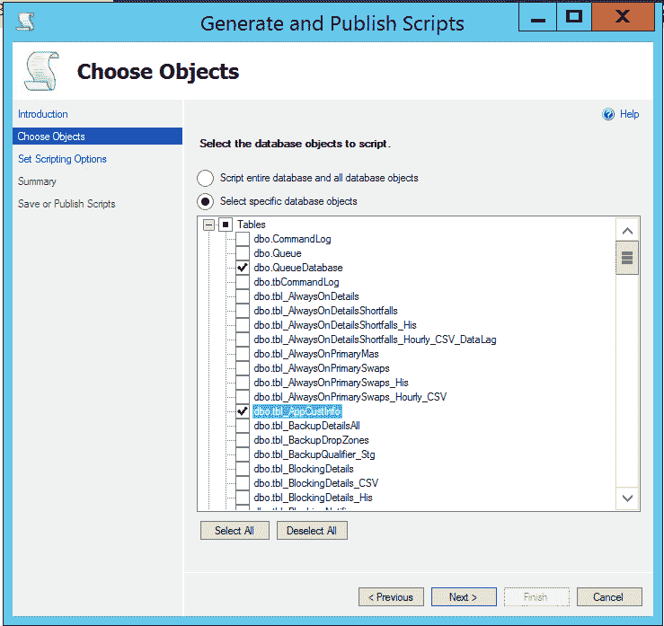
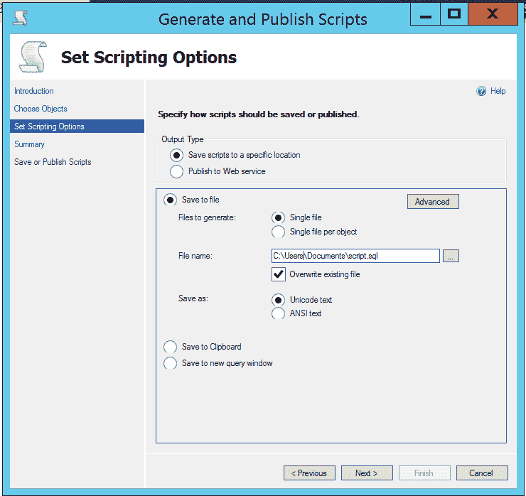
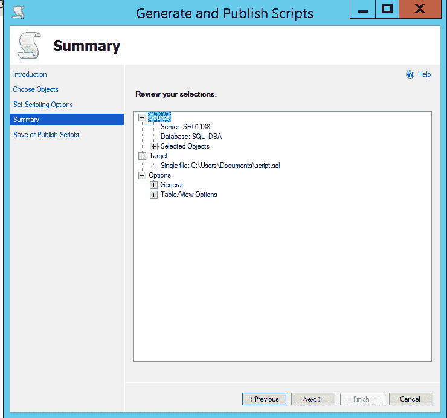
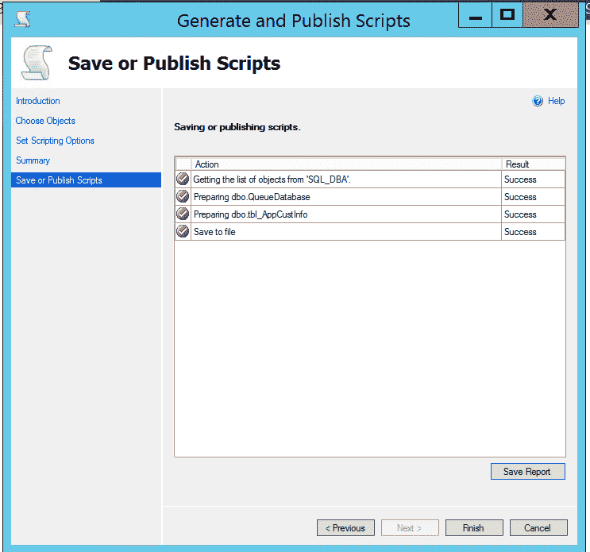

# 在 SQL Server 中的数据库之间复制表

> 原文:[https://www . geesforgeks . org/copy-tables-in-SQL-server/](https://www.geeksforgeeks.org/copy-tables-between-databases-in-sql-server/)

作为数据库管理员，您可能需要将特定表的对象和内容从一个数据库复制到同一实例或任何不同的 SQL 实例中的另一个数据库。您可能会想到在 MS SQL Server 中使用 [Insert Into Select 语句，但是它在一些场景中没有用，例如将几个表从生产数据库转移到开发数据库进行测试或故障排除。此外，这取决于数据库中的表的数量、大小和可用空间。如果表的总大小超过数据库总大小的 50%，建议使用的方法是备份和恢复数据库。](https://www.geeksforgeeks.org/insert-into-select-statement-in-ms-sql-server/)

**要通过使用 SQL Server 管理工作室生成脚本在 SQL Server 中的数据库之间复制表，请遵循以下步骤–**

1.  连接 SQL Server 实例，打开对象资源管理器并选择数据库。
2.  Right-click the database, select Tasks, and then click on Generate Scripts, Click on “Next”.

     

3.  On the Choose Object page, choose Script entire database and all database objects or Select specific database objects option and Click Next.

     

4.  For Set Scripting Options, Select the Output Type, choose the file destination and name an click Next.

     

5.  Now the Summary page details will appear for the entire process. Click Next.

     

6.  Now, the Save or Publish Scripts page shows the progress of the entire process as shown below, click Finish.

     

    该脚本将在所选位置可用并在所需的数据库中执行。