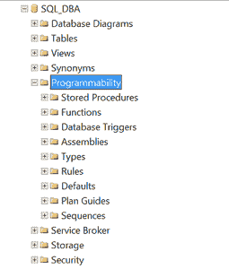
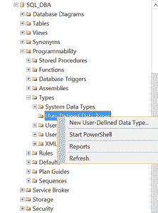
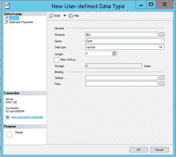

# 在 SQL Server 中创建用户定义的数据类型别名

> 原文:[https://www . geesforgeks . org/create-a-user-defined-data-type-alias-in-SQL-server/](https://www.geeksforgeeks.org/create-a-user-defined-data-type-alias-in-sql-server/)

[SQL Server](https://www.geeksforgeeks.org/introduction-of-ms-sql-server/) 有整数、char、varchar、doubles、strings 等多种数据类型。用于保存特定值。虽然内置数据类型可以存储特定的值，但有时 SQL DBA 可能需要存储更特定的值并创建定制的数据类型。

我们可以使用以下两种方法创建用户定义的数据类型–

*   使用 T-SQL
*   使用 SQL Server 管理工作室

**使用 T-SQL 创建用户定义的数据类型:**

**语法–**

```sql
use DatabaseName
Create Type UserDefineDataTypeName    
from datatype NOT NULL
```

**示例–**
创建一个名为“代码”的用户定义数据类型，它只存储 4 个字母。

```sql
use Database name
Create Type Code    
from varchar(4) NOT NULL
```

**使用 SQL Server 管理工作室创建用户定义的数据类型:**

*   连接到 SQL 服务器
*   展开**数据库**
*   扩展**可编程性**



*   展开**类型**
*   选择**用户定义的数据类型**
*   右键单击并选择“**新的用户定义数据类型**



填写所需信息创建数据类型，点击**确定**。



**在表或 SQL 查询中使用自定义数据类型–**

**注意:**独立的用户定义数据类型没有内置的优势。但是如果创建规则将它们与您最近创建的自定义数据类型绑定。

**1。创建规则–**

**语法–**

```sql
Create Rule RuleName  
as @UserDefineDataTypeName not like ruletype
```

**示例–**

```sql
Create Rule Code_Rule  
as @Code not like '%D%'
```

在上面的例子中，一个规则接受除了带有“D”字母的单词之外的所有输入。

**2。绑定规则和用户定义的数据类型–**
要组合或绑定规则和用户定义的数据类型:我们可以使用存储过程“sp_bindrule”:

**语法–**

```sql
sp_bindrule RuleName,'UserDefineDataTypeName'
```

**示例–**

```sql
sp_bindrule Code_Rule,'Code'
```

在上面的示例中，Code_Rule 将规则绑定到用户定义的数据类型“Code”。

**3。从用户定义的数据类型中取消规则绑定–**

要解除规则与用户定义数据类型的绑定，请使用“sp _ unbindrule”。

**语法–**

```sql
sp_unbindrule 'UserDefineDataTypeName'
```

**示例–**

```sql
sp_unbindrule 'Code'
```