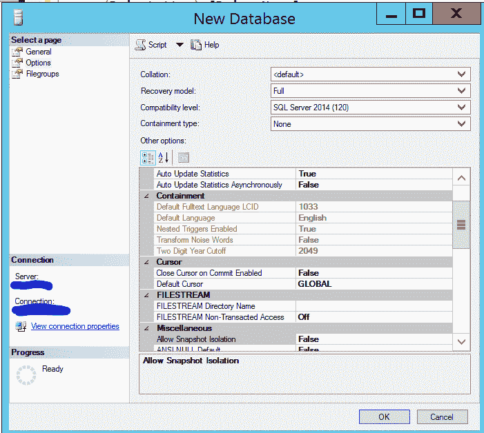

# 在 MS SQL Server 中创建数据库

> 原文:[https://www . geesforgeks . org/create-database-in-ms-SQL-server/](https://www.geeksforgeeks.org/create-database-in-ms-sql-server/)

先决条件–[MS SQL Server 简介](https://www.geeksforgeeks.org/introduction-of-ms-sql-server/)

数据库是像表、视图、存储过程、函数等对象的集合。在微软的 SQL Server 中，有两种数据库可用。

*   系统数据库
*   用户数据库

**系统数据库:**
一旦我们安装了 MS SQL Server，系统数据库就会自动创建。以下是系统数据库列表–

*   掌握
*   模型
*   msdn
*   Tempdb

**用户数据库:**
用户数据库是由用户(数据库管理员和有权限创建数据库的测试人员)创建的。要创建数据库，可以使用以下方法–

*   SQL Server 管理工作室。
*   Transact-SQL。

1.  **Using SQL Server Management Studio :**
    *   连接到 SQL Server 数据库引擎的一个 SQL 实例，然后展开该实例。
    *   右键单击数据库，然后单击新建数据库。
    *   输入数据库名称。
    *   要使用默认值创建数据库，请单击“确定”。

    创建新数据库

    *   否则，继续以下可选步骤。
    *   要更改所有者名称，请单击(…)选择另一个所有者。
    *   要更改第一个数据和事务日志文件的默认值，请在数据库文件网格中，单击可编辑单元格并输入新值。
    *   要更改数据库的排序规则，请选择“选项”页，然后从列表中选择排序规则。

    数据库选项

    *   要更改恢复模式，请选择“选项”页面，并从列表中选择一种恢复模式。
    *   要添加更多文件组，请单击文件组选项。单击添加，然后输入文件组的值。

    数据库文件组

    *   要创建数据库，请单击“确定”。
2.  **Using Transact-SQL :**
    *   连接到数据库引擎。
    *   打开新查询。

    **语法–**

    ```
    CREATE DATABASE databasename
    [ ON
         [ PRIMARY ] <filespec> [...n ]
         [, <filegroup> [...n ] ]
         [ LOG ON <filespec> [...n ] ]
    ]
    [ COLLATE collation_name ]
    [ WITH <option> [...n ] ]
    [;]
    ```

    **示例–**

    **使用默认设置创建数据库–**

    ```
    CREATE DATABASE test;
    ```

    **使用选项–**创建数据库

    ```
    CREATE DATABASE test  
    ON (NAME = test_dat, *--logical datafile name*
        FILENAME = 'D:\DATA\testdat.mdf',  *--physical datafile name*
        SIZE = 10,  MAXSIZE = 50,  FILEGROWTH = 5)  
    LOG ON  (NAME = test_log, *--logical logfile name*
             FILENAME = 'L:\DATA\testlog.ldf',  *--physical logfile name*
             SIZE = 5MB,  MAXSIZE = 25MB,  FILEGROWTH = 5MB ) ;  
    GO
    ```