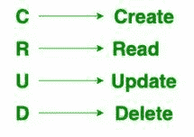

# MySQL 中的 CRUD 操作

> 原文:[https://www.geeksforgeeks.org/crud-operations-in-mysql/](https://www.geeksforgeeks.org/crud-operations-in-mysql/)

众所周知，我们可以使用 [MySQL](https://www.geeksforgeeks.org/sql-tutorial/#mysql) 使用[结构查询语言](https://www.geeksforgeeks.org/sql-tutorial/)以[关系数据库](https://www.geeksforgeeks.org/rdbms-architecture/)的形式存储数据。SQL 是在数据库中添加、访问和管理内容的最流行的语言。它以处理速度快、可靠性高、使用方便和灵活著称。该应用程序用于多种用途，包括数据仓库、电子商务和日志应用程序。然而，MySQL 最常见的用途是用于网络数据库。

**MySQL** 提供了一组基本但最基本的操作，将帮助您轻松地与 MySQL 数据库进行交互，这些操作被称为 CRUD 操作。



**1。创建表格命令:**

**语法:**

```
CREATE TABLE table_name (column_name column_type constraints);
```

**参数:**

1.  **列名–**
    带有任意空格的特定列的名称。
2.  **列类型–**
    列的数据类型。数据类型取决于引用列的数据。数据类型可以是–char()、varchar()、int()、float()等。
3.  **约束–**
    为了给特定的列赋予限制，使用了约束。约束可以是–非空、主键、外键等。这些是给特定列一组限制的关键字。

**数据库–**GFG
T3】表格–学生
T6】学生–T8】

*   名称 Varchar(30)不为空
*   整数标记

**示例:**
**使用<数据库>** 命令必须在对表进行任何操作之前使用。

```
use gfg;
Create table student(name Varchar(30) NOT NULL, marks Integer);
```

**输出:**

<figure class="table">

| 田 | 类型 | 空 | 默认 |
| 名字 | varchar(30) | 不 | 空 |
| 记号 | int(11) | 是 | 空 |

</figure>

**2。读取操作:**
读取操作用于从特定数据库中检索表的内容。读取操作由 DDL 命令完成。

**例:**

```
use gfg;
select * from student;
```

| 【 name 】 | [mark] |
| 【拉维】 |

**3。更新操作:**
在更新操作的帮助下，改变表格的内容或表格的结构。两个命令主要用于更新操作–

1.  **Alter Table Command –** 
    This is the DDL command (Data Definition Language) used to change the structure of the table. 
2.  **Update Table Command –** 
    This is the DML command(Data Manipulating Language) used to alter the records. 

将学生表的名称列大小从 varchar(40)更改为 varchar(50)的 Alter Table 命令:

```
Alter table student 
modify name varchar(50) not null;
```

**原表–**

```
desc student;
```

<figure class="table">Null
Null

| field | type | 空 | default |
| Name
mark
 | varchar(40)
int(11)
 | 是
是
 |

</figure>

**更改表格后–**

```
desc student;
```

<figure class="table">

| 田 | 类型 | 空 | 默认 |
| 名称
标记
 | varchar(50)
int(11)
 | 是
是
 | 零
零
 |

</figure>

使用更新命令将姓名为 ravi 的学生的分数从 23 更新为 100 的更新命令:

```
Update student set marks = 100 
where name = "ravi";
```

**原表–**

```
select * from student;
```

| 【 name 】 | [mark] |
| 【拉维】 |

**更新表格后–**

```
select * from student;
```

| 【 name 】 | [mark] |
| 【拉维】 | One hundred |

**4。删除操作:**
两个命令主要用于删除操作–

1.  **Delete Command –** 
    (DML command) works on the records of the table. 
2.  **Drop Command–**
    (DDL 命令)处理表格的结构。

删除命令，删除分数等于 100 的学生记录:

```
delete from student 
where marks = 100;
```

**原表–**

```
select * from student;
```

| 【 name 】 | [mark] |
| 【拉维】 | One hundred |

**删除学生记录后–**

```
select * from student;
```

<figure class="table">16【克兰提T21

| name | sign |
| Swati | Thirty-three |
| Twelve |

</figure>

删除学生表的删除命令:

```
drop table student;
```

**原始结构–**

```
use gfg;
show tables;
```

<figure class="table">

| 表格 _ in _ gfg |
| student |

</figure>

**放下学生桌后–**

```
use gfg;
show tables;
```

<figure class="table">

| 表格 _ in _ gfg |
|  |

</figure>