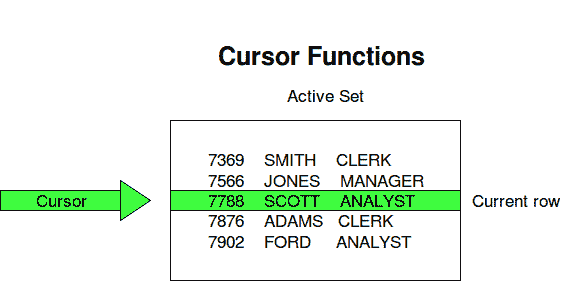

# PL/SQL 中的光标

> 原文:[https://www.geeksforgeeks.org/cursors-in-pl-sql/](https://www.geeksforgeeks.org/cursors-in-pl-sql/)

**游标在 SQL 中**
要执行 SQL 语句，Oracle 引擎使用工作区进行内部处理和存储信息。这个工作区是 SQL 操作的私有区域。“光标”是一种 PL/SQL 构造，允许用户命名工作区域并访问其中存储的信息。

**使用游标**
游标的主要功能是从结果集中一次一行地检索数据，这与一次对结果集中的所有行进行操作的 SQL 命令不同。当用户需要以单例方式或逐行方式更新数据库表中的记录时，使用游标。
存储在光标中的数据称为*活动数据集*。Oracle 数据库管理系统在主内存集中有另一个预定义的区域，在该区域中可以打开游标。因此，光标的大小受限于这个预定义区域的大小。


**光标动作**

*   **声明游标:**通过定义返回结果集的 SQL 语句来声明游标。
*   **打开:**通过执行游标定义的 SQL 语句来打开和填充游标。
*   **取数:**当光标打开时，可以从光标中一行一行或分块取数，进行数据操作。
*   **关闭:**数据操作后，明确关闭光标。
*   **解除分配:**最后，删除光标定义，释放与光标关联的所有系统资源。

**光标类型**
光标根据其打开的环境进行分类。

*   **隐式游标:**如果 Oracle 引擎为其内部处理打开了一个游标，它被称为隐式游标。它是由 Oracle 在执行查询时为用户“自动”创建的，并且代码更简单。
*   **显式游标:**也可以根据需要通过 PL/SQL 块打开游标来处理数据。这种用户定义的游标称为显式游标。

**显式游标**
显式游标在 PL/SQL 块的声明部分定义。它是在返回多行的 SELECT 语句上创建的。光标的合适名称。

创建光标的一般语法:

```
CURSOR cursor_name IS select_statement;

cursor_name – A suitable name for the cursor.
select_statement – A select query which returns multiple rows
```

**如何使用显式光标？**

使用显式光标有四个步骤。

1.  在“声明”部分声明光标。
2.  在执行部分打开光标。
3.  将光标中的数据提取到执行部分的 PL/SQL 变量或记录中。
4.  在结束 PL/SQL 块之前，关闭执行部分中的光标。

**语法:**

```
DECLARE variables;
 records;
 create a cursor;
 BEGIN 
OPEN cursor; 
FETCH cursor;
 process the records;
 CLOSE cursor; 
END;

```

**参考:**
[https://docs . Oracle . com/CD/a 97630 _ 01/app dev . 920/a 96624/01 _ oview . htm # 740](https://docs.oracle.com/cd/A97630_01/appdev.920/a96624/01_oview.htm#740)