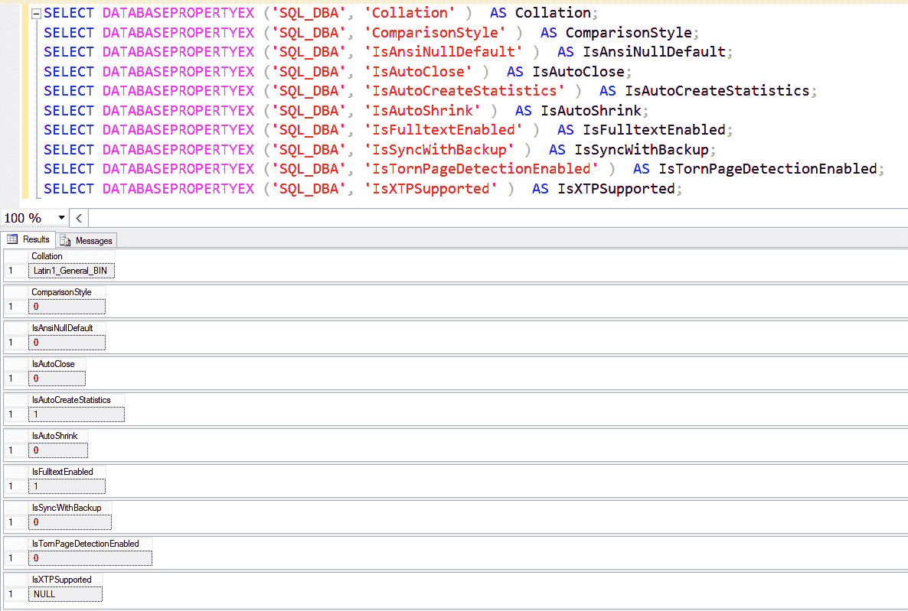

# SQL Server 中的 DATABASEPROPERTYEX()

> 原文:[https://www . geesforgeks . org/database propertyex-in-SQL-server/](https://www.geeksforgeeks.org/databasepropertyex-in-sql-server/)

**DATABASEPROPERTYEX()**
是返回指定数据库选项或属性当前设置的不同信息的函数。

**语法:**

```
DATABASEPROPERTYEX ( 'databasename', 'propertyname' )  

```

现在，您将看到如下的属性描述。

*   **数据库名称:**
    它是数据库的名称，数据库属性将产生属性名称信息，**数据库名称**具有 nvarchar(128)数据类型。

*   **propertyname :**
    It is an expression that defines the name of the database property to have resulted, **propertyname** has varchar(128) data type.

    以下是 DATABASEPROPERTYEX()函数提供的一些属性名称。

    1.  **排序规则:**
        该属性定义数据库的默认排序规则名称。
    2.  **ComparisonStyle :**
        该属性定义了排序规则的窗口比较种类。
    3.  **版本:**
        该属性定义数据库版本或服务层。
    4.  **IsansionAllDefault:**
        此属性定义数据库是否遵循允许空值的国际标准化组织规则。
    5.  **isansinollsenabled:**
        该属性定义了与未知的空评估的所有比较。
    6.  **IsAnsiPaddingEnabled:**
        此属性定义在比较或插入前将字符串填充到相同的长度。
    7.  **is siwarnings enabled:**
        此属性定义一旦发生常见错误情况，SQL Server 将发出错误或警告消息。

    *   **IsalymeticalBortenabled:**
    此属性定义了在整个查询执行过程中一旦发生溢出或被零除错误时要完成的查询。*   **isaautoclose:**
    这个属性定义了当最后一个用户退出时，数据库干净地关闭并释放资源。*   **isaautocreatestatistics:**
    此属性定义查询优化器根据需要创建单列统计信息，以提高查询性能。*   **isaautocreatestatisticsincremental:**
    此属性定义了自动创建的单列统计数据在可能的情况下是增量的。*   **isautochrophing:**
    这个属性定义了数据库文件是自动周期性收缩的候选者。*   **isaautoupdatestatistics:**
    此属性定义当查询使用可能过期的现有统计信息时，查询优化器会更新这些统计信息。*   **IsClone :**
    这个属性定义了一个数据库可能是一个模式，并且是用 DBCC CLONE DATABASE 创建的用户数据库的统计副本。*   **isclosequersoncommitenabled:**
    该属性定义当事务提交时，所有打开的游标都将关闭。*   **IsFulltextEnabled :**
    此属性定义数据库是否启用全文和语言学索引。*   【This 待机:
    该属性将数据库在线定义为只读，允许还原日志。

    *   **IsLocalCursDefault:**
    该属性定义了默认为本机的指针声明。*   **IsNullConcat :**
    该属性定义空连接操作数产生空值。*   **IsNumericRoundAbortEnabled:**
    此属性定义一旦表达式中出现精度损失，就会生成错误。*   **isquoted identifier senabled:**
    此属性定义标识符上允许双引号。*   **是发布:**
    这个属性定义了如果有复制，SQL Server 是否支持数据库表发布进行复制。*   **IsRecursiveTriggersEnabled:**
    该属性定义触发器的递归触发是否被启用。*   **发布订阅:**
    此属性定义数据库订阅的发布。*   **issyncwithsbackup:**
    该属性定义了数据库是广播数据库还是分布式数据库，并且它支持能够不中断跨国复制的恢复。*   **istonpagedetectenabled:**
    此属性定义了 SQL Server 数据库引擎检测由电源故障或不同系统中断导致的不完整 I/O 操作。*   **IsXTPSupported :**
    This property indicates whether the database supports In-Memory OLTP.

    **示例–**
    下面是截图。

    