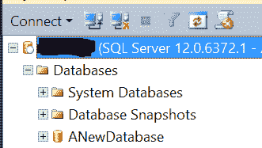
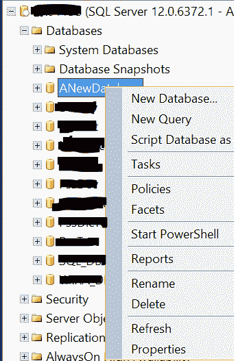
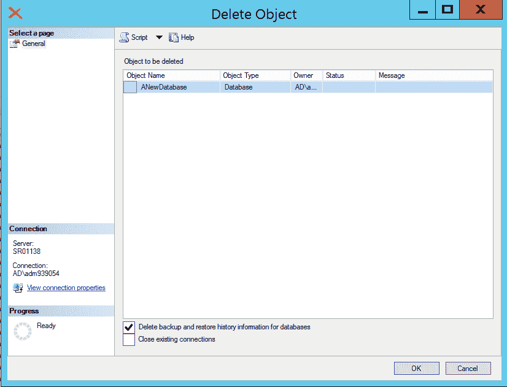

# 删除 MS SQL Server 中的数据库

> 原文:[https://www . geesforgeks . org/delete-database-in-ms-SQL-server/](https://www.geeksforgeeks.org/delete-database-in-ms-sql-server/)

先决条件–[MS SQL Server 简介](https://www.geeksforgeeks.org/introduction-of-ms-sql-server/)和[在 MS SQL Server 中创建数据库](https://www.geeksforgeeks.org/create-database-in-ms-sql-server/)

不能删除系统数据库，只能删除用户数据库。随着数据库的删除，数据和日志文件将自动从磁盘上删除。

要删除数据库，可以使用以下方法

1.  SQL Server 管理工作室。
2.  Transact-SQL。

这些解释如下。

**1。使用 SQL Server 管理工作室:**
要删除数据库，请连接到 SQL Server 实例，然后展开该实例。



展开**数据库**，选择需要删除的数据库。



右键点击需要删除的数据库，然后点击**删除**。



如果需要，选中删除备份和恢复历史或关闭现有连接，然后单击**确定**。

**2。使用 Transact-SQL :**
要执行 DROP DATABASE 语句，用户必须对数据库具有 CONTROL 权限。

*   **删除数据库:**

    ```
    USE master ;  
    GO  
    DROP DATABASE Databasename;  
    GO  
    ```

*   **删除多个数据库:**

    ```
    USE master ;  
    GO  
    DROP DATABASE database1, database2, ...;  
    GO
    ```

**示例:**
让我们假设已经创建了一个不再需要的数据库“Geekstest”，要删除数据库:

```
USE master ;
GO
DROP DATABASE Geekstest;
GO 
```