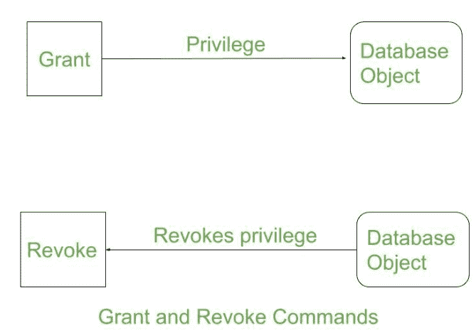

# 授予和撤销的区别

> 原文:[https://www . geesforgeks . org/授予和撤销的区别/](https://www.geeksforgeeks.org/difference-between-grant-and-revoke/)

数据控制语言(DCL)通过一些特定的查询帮助用户检索和修改存储在数据库中的数据。授予和撤销属于数据控制语言的这些命令类型。DCL 是 [SQL 命令](https://www.geeksforgeeks.org/sql-ddl-dql-dml-dcl-tcl-commands/)的组成部分。

**1。授予:**
SQL Grant 命令专门用于为用户提供[数据库对象](https://www.geeksforgeeks.org/database-objects-in-dbms/)的权限。该命令还允许用户向其他用户授予权限。

**语法:**

```sql
grant privilege_name on object_name
to {user_name | public | role_name} 
```

这里 privilege_name 是必须授予的权限，object_name 是数据库对象的名称，user_name 是应该提供访问权限的用户，public 用于允许所有用户访问。

**2。撤销:**
撤销命令撤销用户对数据库对象的权限(如果有)。它执行与格兰特命令相反的操作。当特定用户 U 的权限被撤销时，用户 U 授予所有其他用户的权限也将被撤销。

**语法:**

```sql
revoke privilege_name on object_name
from {user_name | public | role_name}
```

**示例:**

```sql
grant insert, 
select on accounts to Ram
```

通过上面的命令，用户 ram 已经授予了对帐户数据库对象的权限，就像他可以查询或插入帐户一样。

```sql
revoke insert, 
select on accounts from Ram
```

通过上面的命令，用户 ram 对帐户数据库对象的查询或插入等权限已被删除。



要了解确切的语法以及它们是如何使用的，请单击此处的。

**授予和撤销命令的区别:**

<figure class="table">

| s。不 | award | cancel |
| --- | --- | --- |
| one | This DCL command grants users permission to database objects. | This DCL command deletes any permissions granted to users on database objects. |
| Two | It assigns access rights to users. | Revoke the user's user access rights. |
| three | You need to specify permissions for each user. | If a user's access is deleted; All specific permissions provided by this user to other users will be deleted. |
| four | It is easy to grant permissions when access is decentralized. | If access is decentralized, it is difficult to remove the granted permissions. |

</figure>