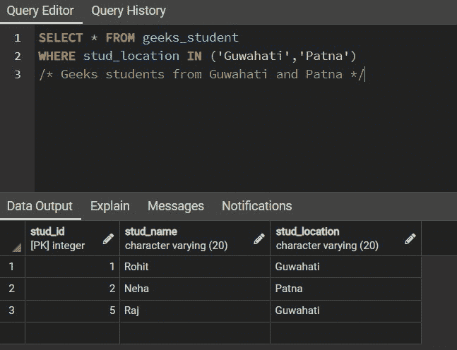
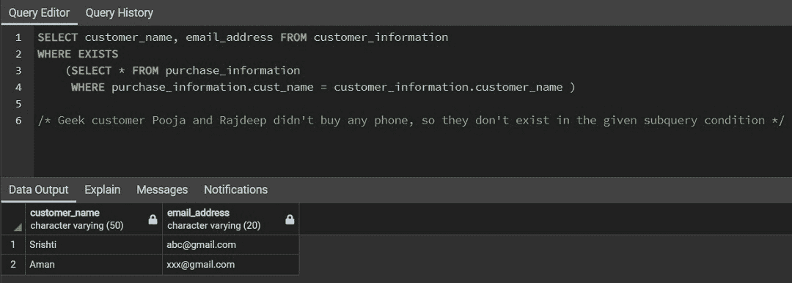
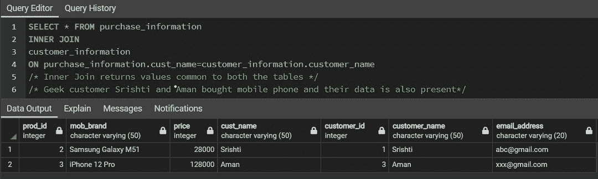
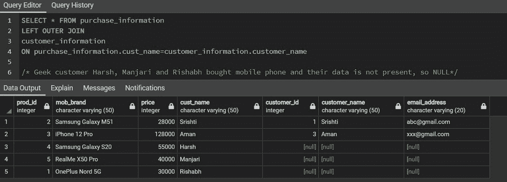
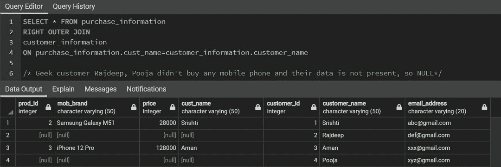
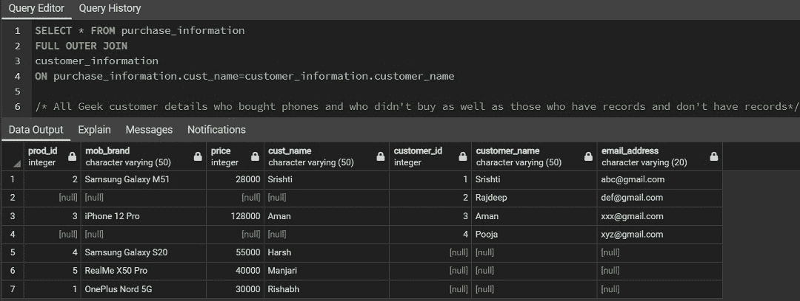

# SQL 中 JOIN、IN 和 EXISTS 子句的区别

> 原文:[https://www . geeksforgeeks . org/in-SQL 联接-in-exists-子句的区别/](https://www.geeksforgeeks.org/difference-between-join-in-and-exists-clause-in-sql/)

SEQUEL 广为人知的 SQL，**结构化查询语言**是最流行的数据库标准语言。我们可以使用 SQL 执行大量操作，包括创建数据库、以表格形式存储数据、修改、提取等等。有不同版本的 SQL，如 MYSQL、PostgreSQL、Oracle、SQL lite 等。SQL 中有一些重要的命令，大致可以分为 DDL、DML、DCL、TCL、DQL。

在本文中，我们将区分 SQL 中三种不同的常用命令:

*   在…里
*   存在
*   加入

**1。IN OPERATOR:** It 通常与 WHERE 子句一起使用，以测试给定的表达式或记录是否与一组值中的特定值相匹配。它的工作原理类似于多重或运算符。IN 运算符的否定不是 IN，这有助于执行与值集不匹配的行。

**语法:**

> 选择列名
> 
> 从表名
> 
> 其中 col_name IN(val1，val2，val3，…..)

其中 col_name 是列的名称，val 是一组值

**例:**

<figure class="table">

|  |
| 【螺柱 _ id】 |

</figure>

要获取来自古瓦哈蒂和帕特纳的学生的详细信息:

**2。**[**EXISTS OPERATOR**](https://www.geeksforgeeks.org/sql-exists/)**:**主要用于嵌套查询(一个查询里面的查询)。它用于检查子查询中提供的记录是否存在。如果一个或多个记录匹配，则返回布尔值“真”，否则返回“假”，如果没有行匹配，则返回“假”。类似地，像 IN 运算符一样，这里我们也可以使用 EXISTS 的否定，称为“NOT EXISTS”运算符。

**语法:**

> 选择列名
> 
> 从表名
> 
> 哪里存在
> 
> (选择列名)
> 
> 从表名
> 
> WHERE 条件)；

*其中条件:*如果使用两个或两个以上的表，条件还应包含具有公共属性的 column_matching 信息。

**示例:**

采购表:

客户表:

获取从电子商务网站购买手机的客户的姓名和电子邮件地址的详细信息。

**3。**[**【JOIN】**](https://www.geeksforgeeks.org/sql-join-set-1-inner-left-right-and-full-joins/)**:**It**用于在一些匹配列的基础上串联两个或多个表的元组或行。如果两个表中有任何条目不匹配，它将返回空值。SQL 中基本上有四种类型的联接:**

1.  **内部连接:返回两个表中匹配的值。**
2.  **左连接:左表中的所有记录(表 1)和右表中匹配的行(表 2)。**
3.  **右连接:右表中的所有记录(表 2)和左表中匹配的行(表 1)。**
4.  **完全外部连接:表 1 或表 2 中匹配的所有记录。**

****语法:****

> **从表 1 中选择***
> 
> **(连接类型)表 2**
> 
> **开表 1 .列 _ 匹配=表 2 .列 _ 匹配**

**其中，JOIN_TYPE 是要执行的连接类型，无论是内部连接、左侧连接、右侧连接还是完全连接。col_match 是两个表中匹配的列。**

**对于以上相同的表格**【购买信息】****【客户信息】**让我们看看不同的 JOIN 运算符执行什么操作:**

*   **使用 INNER JOIN:**

****

*   **使用左连接:**

****

*   **使用右连接:**

****

*   **使用完全连接:**

****

****SQL 中 JOIN、IN 和 EXISTS 子句的区别****

<figure class="table">

| 

IN

 |  | 

JOINS

 |
| --- | --- | --- |
| It works like multiple OR operators. Therefore, it saves us from writing OR multiple times in a query. | If a match is found, a true value is returned. | Used to join two or more tables into one table. |
| Will scan all the values INside the in operator and then make a decision. | If we get the TRUE value of a single condition, it will stop executing. | First check whether there is a match, and then join two tables based on the matching columns of the two tables. |
| It returns true, false and null values. | Returns true or false. | If there is no match, an empty entry in the join table is returned. |
| It can be used for both nested queries and the values we saw in the above example. | Used for nested queries only. | JOIN can also be used with nested queries. |
| When IN is used with subquery, it is inefficient, because the whole subquery will be executed by relational database first, and then finally executed according to the specified conditions. However, for larger relational tables, IN may work faster than EXISTS and JOIN in subquery. | In the case of EXISTS, we know that it will return TRUE or FALSE according to the conditions specified by the user. Therefore, for a small table entry in the subquery, EXISTS is more effective than in. | Similar to EXISTS operator. If the data of subquery table is relatively small, the execution efficiency will be higher than that of input. |

</figure>