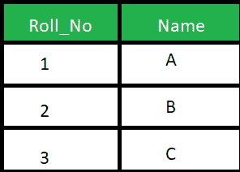
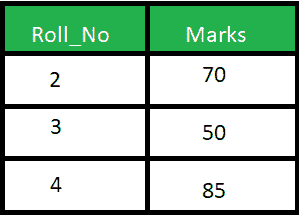

# SQL 中自然连接和内部连接的区别

> 原文:[https://www . geeksforgeeks . org/自然连接和内部连接在 sql 中的区别/](https://www.geeksforgeeks.org/difference-between-natural-join-and-inner-join-in-sql/)

先决条件–[连接(内部、左侧、右侧和完全连接)](https://www.geeksforgeeks.org/sql-join-set-1-inner-left-right-and-full-joins/)
**1。自然连接:**
自然连接基于相同的属性名和数据类型连接两个表。生成的表将包含两个表的所有属性，但只保留每个公共列的一个副本。

**示例:**
考虑下面给出的两个表格:

学生表



标记表



考虑给定的查询

```sql
SELECT * 
FROM Student NATURAL JOIN Marks;
```

**输出:**


**2。内部连接:**
内部连接基于 on 子句中明确指定的列连接两个表。结果表将包含两个表的所有属性，包括公共列。

**示例:**
考虑以上两个表，查询如下:

```sql
SELECT * 
FROM student S INNER JOIN Marks M ON S.Roll_No = M.Roll_No; 
```

**输出:**


**SQL 中 Natural JOIN 和 INNER JOIN 的区别:**

<figure class="table">

| SR number | Natural JOIN | 内部连接 |
| --- | --- | --- |
| 1。 | Natural join connects two tables based on the same attribute name and data type. | Inner join joins two tables according to the columns explicitly specified in the on clause. |
| 2。 | In a natural join, the result table will contain all the attributes of the two tables, but only one copy will be kept for each common column. | In the inner join, the result table will contain all the attributes of the two tables, including duplicate columns. |
| 3。 | In a natural join, if no condition is specified, rows based on common columns are returned. | In an inner join, only exists in two tables. |
| 4 will be returned. | Syntax:
Select *
from Table 1 Natural Connection Table 2;
 | Syntax:
Select *
Table 2 internal connection in Table 1\. Column name = Table 2\. Column name;
 |

</figure>

[SQL Server 管理工作室](https://www.google.com/search?q=ssms&rlz=1C1GCEB_enIN963IN963&oq=ssms&aqs=chrome..69i57j69i59j0i271l2j69i60l2j69i61j69i60.556j0j7&sourceid=chrome&ie=UTF-8)不支持自然连接，也称为微软 SQL Server。