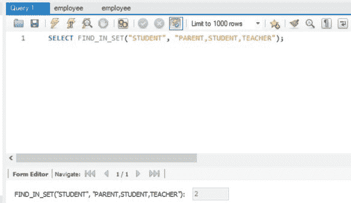
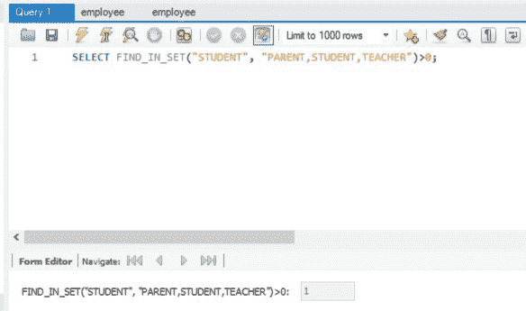
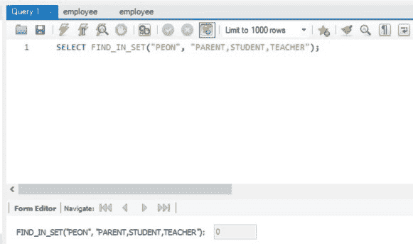
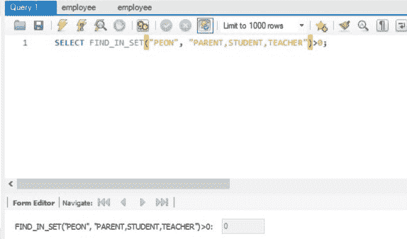

# SQL 中 WHERE FIND_IN_SET(…) > 0 和 WHERE FIND_IN_SET(…)的区别

> 原文:[https://www . geesforgeks . org/where-find _ in _ set 0 和 where-find_in_set-in-sql 之间的区别/](https://www.geeksforgeeks.org/difference-between-where-find_in_set0-and-where-find_in_set-in-sql/)

**FIND_IN_SET(…):** 此[函数](https://www.geeksforgeeks.org/find_in_set-function-in-mysql/)返回给定字符串列表中所需字符串的索引(从 1 开始),如果它存在于列表中的话。如果给定的字符串列表中缺少所需的字符串，则返回 0。

**语法:**

```sql
SELECT FIND_IN_SET(REQUIRED_STRING, 
LIST_OF_STRINGS);
```

**FIND_IN_SET(…) > 0:** 此函数只返回 2 个值，即 1 或 0。如果给定的字符串列表中存在所需的字符串，则返回 1；如果给定的字符串列表中不存在所需的字符串，则返回 0。

**语法:**

```sql
SELECT FIND_IN_SET(REQUIRED_STRING, 
LIST_OF_STRINGS)>0;
```

出现以下情况:

*   当所需字符串出现在给定的字符串列表中时。

**查询:**

```sql
SELECT FIND_IN_SET("STUDENT", 
"PARENT,STUDENT,TEACHER");
```

**输出:**



**查询:**

```sql
SELECT FIND_IN_SET("STUDENT", 
"PARENT,STUDENT,TEACHER")>0;
```

**输出:**



*   当给定的字符串列表中缺少必需的字符串时。

**查询:**

```sql
SELECT FIND_IN_SET("PEON", 
"PARENT,STUDENT,TEACHER");
```

**输出:**



**查询:**

```sql
SELECT FIND_IN_SET("PEON", 
"PARENT,STUDENT,TEACHER")>0;
```

**输出:**



当所需的字符串或给定的字符串列表为空，即等于“”时，两个函数都返回 0。同样，当所需的字符串或给定的字符串列表为空时，两个函数都会返回空值

因此，我们可以观察到 FIND_IN_SET(…)和 FIND_IN_SET(…)>0 之间的主要区别出现在给定的字符串列表中存在所需的字符串时。在这种情况下，FIND_IN_SET(…)函数返回所需字符串的索引(从 1 开始)，而 FIND_IN_SET(…)>0 函数返回 1，与所需字符串的位置无关。