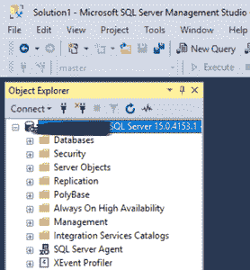
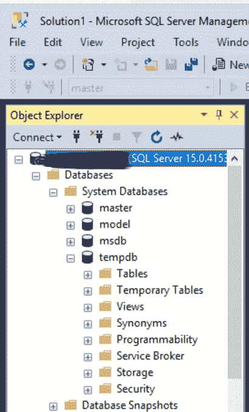
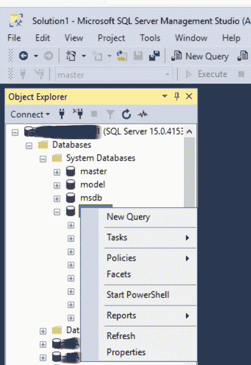
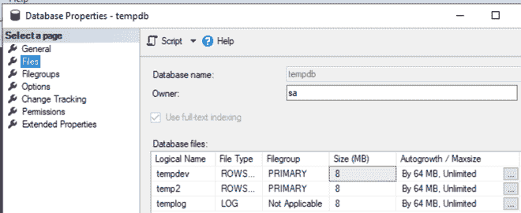
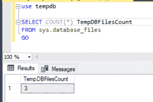
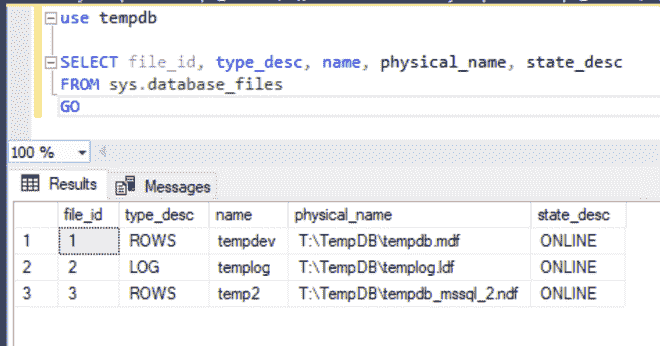
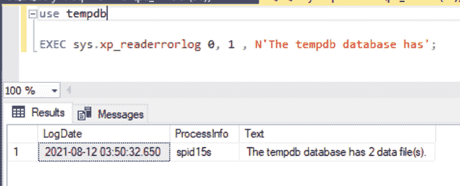

# 了解 SQL Server 中 TempDB 数据文件数量的不同方法

> 原文:[https://www . geeksforgeeks . org/不同的方式了解 SQL server 中的 tempdb 数据文件计数/](https://www.geeksforgeeks.org/different-ways-to-know-count-of-tempdb-data-files-in-sql-server/)

**TempDB** 数据库是最重要的 SQL Server 系统数据库之一，用于存储临时用户对象，如用户定义的临时表、临时存储过程、表变量和索引，以及临时存储过程、表变量和索引。

为了允许事务回滚，尽量少记录 tempdb 中的操作。每次启动 SQL Server 时，都会重新创建 tempdb，确保系统总是以数据库的新副本启动。当系统关闭时，所有临时表和存储过程都会被自动丢弃，并且没有任何连接处于活动状态。在临时数据库中，从一个 SQL Server 会话到下一个会话不会存储任何内容。在 tempdb 上，不允许进行备份和还原操作。

## **限制:**

*   在 tempdb 数据库上，不允许执行以下操作。
*   无法添加文件组。
*   无法备份或还原数据库。
*   无法更改排序规则。默认情况下使用服务器排序规则。
*   不可能更改数据库的所有者。
*   不可能备份数据库。
*   无法删除数据库。
*   无法参与数据库镜像
*   无法删除主文件组、主体数据文件或日志文件。
*   不可能更改数据库或主体文件组的名称。
*   不可能保持数据库脱机。

## **访问:**

在 tempdb 中，任何用户都可以创建临时项目。除非用户被授予额外的权限，否则他们只能访问自己的项目。为了防止用户访问 tempdb，可以撤销对 tempdb 的连接权限。

## **了解 SQL Server 中 TempDB 数据文件数量的方法:**

### **方法一:SQL Server 管理工作室(SSMS)**

**步骤 1:** 转到 SQL Server 管理工作室(SSMS)的对象资源管理器。



**步骤 2:** 展开数据库(系统数据库)下的 TempDB。



**第三步:**右键点击查看其属性。



它将带我们进入下一个屏幕，在那里我们可以看到数据库文件的数量。



### **方法二:sys . database _ file**

另一种常见的方法是在 TempDB 的 sys 中查找 tempDB 文件的数量。数据库文件。

**查询:**

```sql
use tempdb
SELECT COUNT(*) TempDBFilesCount
FROM sys.database_files
GO
```

**输出:**



另一种常见的方法是在 TempDB 的 sys 中查找 tempDB 文件的**细节。数据库文件。**

```sql
use tempdb
SELECT file_id, type_desc, name, physical_name, state_desc
FROM sys.database_files
GO
```

**输出:**



**方法 3:错误日志查找 TempDB 数据文件**

在错误日志中也可以找到 TempDB 文件的数量，但这是一种不太常见的方法。

```sql
use tempdb
EXEC sys.xp_readerrorlog 0, 1, N'The tempdb database has';
```

**输出:**

注意:上面的查询将只显示数据文件的数量。

