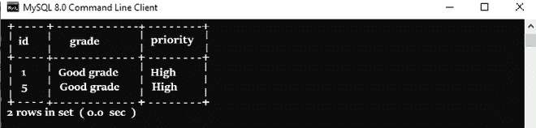
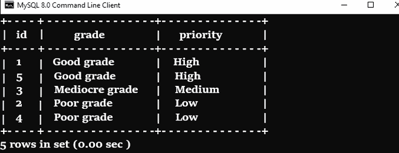

# MySQL 中的枚举器(枚举)

> 原文:[https://www.geeksforgeeks.org/enumerator-enum-in-mysql/](https://www.geeksforgeeks.org/enumerator-enum-in-mysql/)

ENUM 是一个字符串对象，它的值由一组在创建列时显式定义的允许文字(值)决定。

**枚举数据类型的优势–**

*   将数据存储在有限大小的列中所需的简洁数据存储。传递给枚举数据类型的字符串隐式获得数字编号。

*   它还提供了易读的查询和输出，因为数字可以转换回相应字符串的结果。

**列的枚举语法:**

```
CREATE TABLE table_name (
  col...
  col ENUM ('value_1','value_2','value_3', ....),
  col...
);
```

**MySQL 允许我们用以下三个属性定义 ENUM 数据类型–**

*   **非空–**
    如果我们不想要空值，需要在 ENUM 列中使用非空属性。
*   **NULL–**
    是 DEFAULT NULL 的同义词，其索引值始终为 NULL。
*   **DEFAULT–**
    默认情况下，ENUM 数据类型为 NULL，如果用户不想向其传递任何值。

**示例:**
假设我们要将学生数据存储在表 **Student_grade** 中，以便将学生的成绩存储在相应的列**(高、中、低)中。**我们使用优先级语句为**枚举**列分配优先级。

```
CREATE TABLE Student_grade(
id INT PRIMARY KEY AUTO_INCREMENT, Grade VARCHAR(250) NOT NULL,
priority ENUM('Low', 'Medium', 'High') NOT NULL
);
```

优先列将只接受三列。这里，编号顺序为**低- > 1，中- > 2，高- > 3。**

**将数据插入表格–**

*   在名为 **Student_grade** 的表格中插入新的一行，语句如下–

```
INSERT INTO Student_grade(Grade, priority)
VALUES('Good grades', 'High');
```

*   除了使用枚举值，您还可以使用数字索引，以便将值插入表的**枚举**列–

```
INSERT INTO Student_grade(Grade, priority)
VALUES('Poor grades', 1);
// Here we use 1 instead of using 'Low' enumeration value, 
since 1 is mapped to 'Low' implicitly.
```

*   让我们在表格中添加更多行**学生 _ 年级–**

```
INSERT INTO Student_grade(Grade, priority)
VALUES('Mediocre grade', 'Medium');

INSERT INTO Student_grade(Grade)
VALUES('Poor grades',1);

INSERT INTO Student_grade(Grade)
VALUES('Good grades','High');
```

**注意:** ENUM 列如果被定义为可空列，也可以存储空值。

**输出:**

*   以下陈述带来了所有高分学生的成绩–

```
SELECT * FROM Student_grade
WHERE priority = 'High';
```

*   您可以通过这个我的 SQL 查询得到相同的结果–

```
SELECT * FROM Student_grade
WHERE priority = 3;
```



*   下面的查询选择 Student_grade，并按优先级从高到低排序–

```
SELECT Grade, priority FROM Student_grade
ORDER BY priority DESC;
```



**排序 _ 数据**

**MySQL ENUM 劣势:**

*   如果您正在考虑修改枚举成员，那么您需要使用 ALTER TABLE 命令重建整个表，这在使用的资源和时间方面有相当大的开销。

*   获取完整的枚举列表非常复杂，因为在这种情况下，您需要访问 inform_schema 数据库–

```
SELECT colmn_type FROM inform_schema 
WHERE TABLE_NAME = 'Student_grade' AND COLUMN_NAME = 'priority';
```

*   将其移植到其他[关系数据库管理系统](https://www.geeksforgeeks.org/rdbms-full-form/)可能是一项艰巨的任务，因为 ENUM 不是 SQL 的标准数据类型，也没有多少数据库系统为其提供支持。

*   不可能向枚举列插入更多的值。假设，您有兴趣为每个优先级 e.x .插入一个基于服务的协议，高(48 小时)、中(4-3 天)、低(1 周)，但它并不像 ENUM 数据类型看起来那么简单和实用。

*   枚举列表不可重用。因为如果，你想创建一个名为“Emp-List”的新表，并且有兴趣重用它的优先级列表，那么这是不可能的。