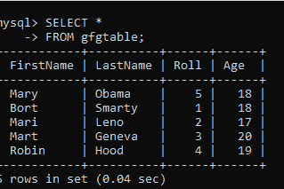
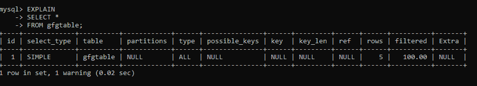
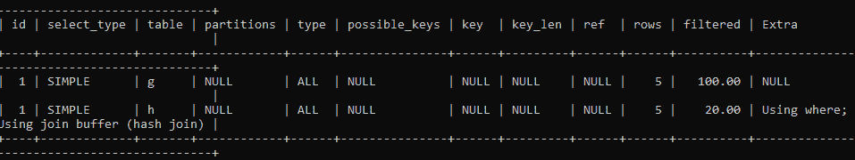

# 用 SQL 解释

> 原文:[https://www.geeksforgeeks.org/explain-in-sql/](https://www.geeksforgeeks.org/explain-in-sql/)

任何一个 SQL 查询基本上都与性能无关，但是当它被用在大的领域并且数量非常多的时候，关于性能的问题总是存在的。为了解决这些问题，唯一可能的方法是查询本身必须告诉它正在做什么，以及完成这项任务需要花费多少时间。当任何数据分析师知道它的工作原理时，他们可能会对查询进行大量优化。

在 SQL 中，**解释**关键字提供了数据库如何执行 SQL 查询的描述。这些描述包括优化器日志、表是如何连接的以及连接的顺序等。

因此，它将是查询优化和逐步了解其执行细节的有益工具。**解释**还注意到一个事实，即没有任何访问特定数据库的权限的用户将不会被提供关于其如何执行查询的详细信息。因此，它保持安全性。

关于 **EXPLAIN** 要注意的主要一点是，它将在查询的开始使用，即在 SELECT、INSERT、UPDATE 等之前。

**语法:**

```sql
EXPLAIN (QUERY Statement) ; /* ONLY TAKES COMMAND AS PARAMETER */
```

**示例:**

让我们首先创建一个名为***【GFG】*****u**的数据库，唱出下面的命令:

```sql
CREATE DATABASE GFG;
```

现在向其中添加表格。

```sql
SELECT * FROM gfgtable;
```

我们向其中添加了一些数据，现在看起来如下:



现在让我们使用**解释**从一个更简单的查询开始得到任何查询的解释。

```sql
 QUERY1: EXPLAIN SELECT * FROM gfgtable;
```



执行的所有细节都在一些指定的列名下给出。

**解释关键字输出中的列:**

使用如上所示的一些列名解释输出中的关键字结果。它们解释如下:

1.  **id:** 表示要解释的查询的 id。
2.  **SELECT _ TYPE:**SELECT 子句中的复杂性显示在这里。在上面的情况下，很简单。
3.  **表格:**这里显示使用的表格名称。
4.  **分区:**这显示了查询中连接的表的分区数量。
5.  **类型:**指定连接类型。
6.  **可能的键:**哪些键可能被使用过。
7.  **键:**使用哪些键。
8.  **密钥 _len:** 所用密钥的长度。
9.  **引用:**在比较列或不比较列时，提到查询中使用的任何类型的引用。
10.  **行数:**查询操作的行数。
11.  **筛选:**使用 WHERE 子句中的条件筛选的行。
12.  **额外:**关于执行的查询的一些附加细节。

这样， **EXPLAIN** 关键字用于获取所有关于查询的信息，并将其制成表格，以便存储在**数据库**中，供进一步参考。

```sql
 QUERY 2:

 EXPLAIN
 SELECT CONCAT(g.FirstName,g.LastName) AS FULLNAME
 FROM gfgtable AS g, gfgtable AS h
 WHERE g.Roll=h.Roll;
```

**输出:**



这里我们可以看到 JOIN 的类型是如何被提及的。 **SHOW WARNINGS** 也与 **EXPLAIN** 关键字一起使用，以显示查询中错误起源的最后一行的详细信息。