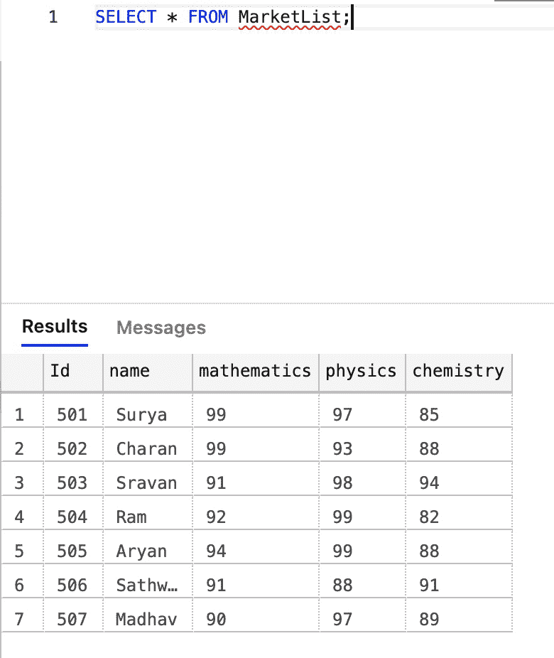
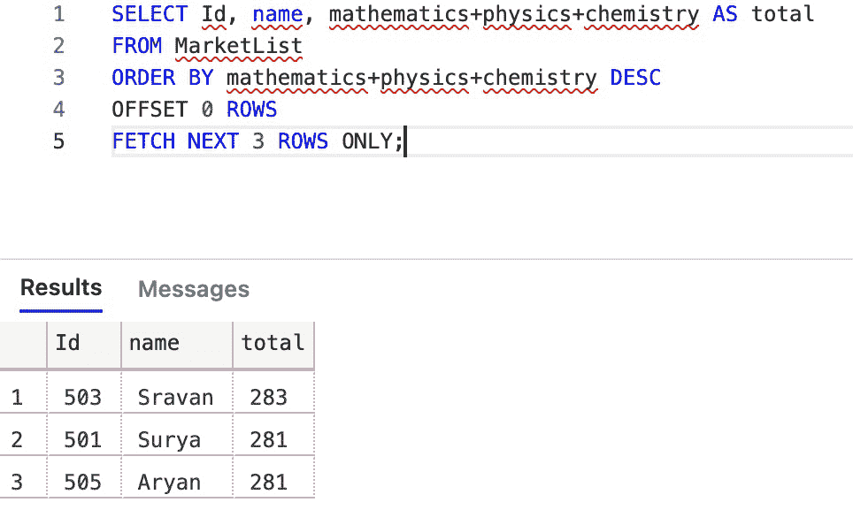

# 在 SQL 中提取

> 原文:[https://www.geeksforgeeks.org/fetch-in-sql/](https://www.geeksforgeeks.org/fetch-in-sql/)

FETCH 是一个 SQL 命令，它与带有 OFFSET(起点)的 ORDER BY 子句一起使用，使用一个游标按顺序检索或提取选定的行，该游标一次移动并处理一行，直到显示查询中提到的行数。

*   对于 FETCH，OFFSET 子句是强制的。您不允许使用，按…取订单。
*   不允许将 TOP 与 OFFSET 和 FETCH 组合在一起。
*   OFFSET/FETCH 行计数表达式只能是任何将返回整数值的算术、常量或参数表达式。
*   对于 OFFSET 和 FETCH 子句，必须使用 ORDER BY。

**语法:**

> 选择*
> 
> 从表名
> 
> 按列名排序
> 
> 偏移起点
> 
> 仅获取下一个 k(常数)行；

**实现 FETCH 的步骤:**

在这里，我们将讨论在 SQL 中实现 FETCH 命令的步骤。

**第一步:**参考表:

让我们考虑一个基于班级学生分数创建的表，它包含下面显示的数据。

<figure class="table">85T39】50276T80

| 身份证明 | 名字 | 数学 | 物理学 | 化学 |
| --- | --- | --- | --- | --- |
| Five hundred and one | 苏利耶 | Ninety-nine | Ninety-seven |
| Sravan【T33 92 | Ninety-nine | Ninety-two |
| Five hundred and five | Aryan | Ninety-four | Ninety-nine | Eighty-eight |
| Five hundred and six | Satvik | Ninety-two |

</figure>

**步骤 2:** 创建数据库:

```
CREATE DATABASE gfg;
```

**步骤 3:** 使用数据库:

```
USE gfg;
```

**步骤 4:** 创建表格:

使用以下 SQL 查询创建包含 5 列的表市场列表:

```
CREATE TABLE MarkList
(
    id int,
    name varchar(20),
    mathematics int, 
    physics int,
    chemistry int
);
```

**步骤 5:** 将数据插入表中:

```
INSERT INTO MarkList VALUES(501,'Surya',99,97,85);
INSERT INTO MarkList VALUES(502,'Charan',99,93,88);
INSERT INTO MarkList VALUES(503,'Sravan',91,98,94);
INSERT INTO MarkList VALUES(504,'Ram',92,99,82);
INSERT INTO MarkList VALUES(505,'Aryan',94,99,88);
INSERT INTO MarkList VALUES(506,'Sathwik',91,88,91);
INSERT INTO MarkList VALUES(507,'Madhav',90,97,89);
```

**第六步:**插入后，表格会是这样的。



**步骤 7:** 现在使用提取命令提取数据:

要检索前 3 名学生的姓名、id 和总分，fetch 命令的用法如下:

```
SELECT Id, name, mathematics+physics+chemistry AS total
FROM MarketList
ORDER BY mathematics+physics+chemistry DESC
OFFSET 0 ROWS
FETCH NEXT 3 ROWS ONLY;
```



因此，SQL FETCH 命令用于按顺序从表中检索选定的行。当您想从有序集中选择有限数量的行时，例如前 3 行、前 10 行或后 3 行等，使用起来很方便。