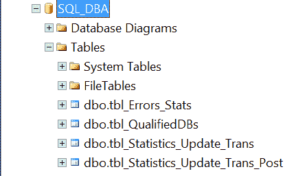

# 在 SQL Server 中查找所有包含特定列名的表

> 原文:[https://www . geesforgeks . org/find-all-tables-包含特定列名的 sql-server/](https://www.geeksforgeeks.org/find-all-tables-that-contain-a-specific-column-name-in-sql-server/)

作为一名 SQL 数据库管理员，我们可能需要编写一个 SQL 查询来查找包含特定列名的所有表。
下面的截图会给大家展示数据库里面的表' **SQL_DBA**

[](https://media.geeksforgeeks.org/wp-content/uploads/20201106162842/finde.PNG) 

*   **Find all tables that contain a specific column name in SQL Database :**
    In the below example, we are using INFORMATION_SCHEMA.COLUMNS to get the table names where the column name is like ‘%Err%’.

    **查询–**

    ```
    SELECT TABLE_CATALOG, TABLE_SCHEMA, TABLE_NAME, COLUMN_NAME, 
    ORDINAL_POSITION as org_pos, DATA_TYPE, CHARACTER_MAXIMUM_LENGTH as CML
    FROM INFORMATION_SCHEMA.COLUMNS
    WHERE COLUMN_NAME like '%Err%'
    ORDER BY TABLE_NAME
    ```

    **输出–**

    <center>

    | 表 _ 目录 | 表 _ 架构 | 表名 | 列名 | 组织位置 | 数据类型 | currentmodelogic 电流型逻辑的 |
    | --- | --- | --- | --- | --- | --- | --- |
    | SQL_DBA | dbo | 错误统计 | 错误日期 | six | 日期时间 | 空 |
    | SQL_DBA | dbo | 错误统计 | 恐怖毒气 | five | 可变长字符串 | -1 |

    </center>

*   **查找包含特定列名的所有表:**
    在本例中，我们使用 sys.column 获取列信息，sys.tables 获取数据库表名。

**查询–**

```
SELECT col.name AS [Column Name], tab.name AS [Table Name]
FROM sys.columns col
INNER JOIN sys.tables tab
ON col.object_id = tab.object_id
WHERE col.name LIKE '%Name%'
ORDER BY [Table Name], [Column Name]
```

**输出–**

| 列名 | 表名 |
| --- | --- |
| 数据库名 | 错误统计 |
| SQLInstanceName | 错误统计 |
| 统计时间 | 错误统计 |
| 数据库名 | tbl_QualifiedDBs |
| 数据库名 | 统计数据更新传输 |
| SQLInstanceName | 统计数据更新传输 |
| 统计时间 | 统计数据更新传输 |
| 表名 | 统计数据更新传输 |
| 数据库名 | 待定 _ 统计 _ 更新 _ 传输 _ 发布 |
| SQLInstanceName | 待定 _ 统计 _ 更新 _ 传输 _ 发布 |
| 统计时间 | 待定 _ 统计 _ 更新 _ 传输 _ 发布 |
| 表名 | 待定 _ 统计 _ 更新 _ 传输 _ 发布 |