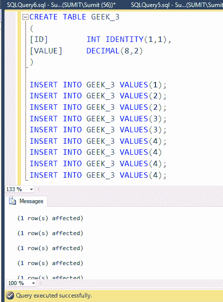
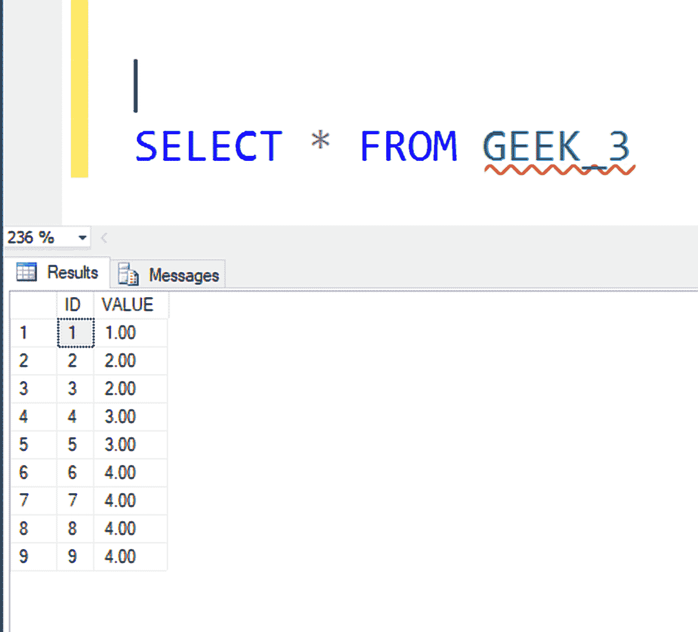
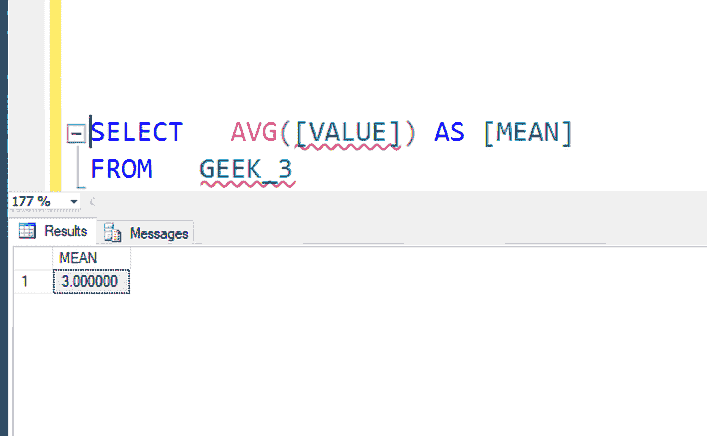
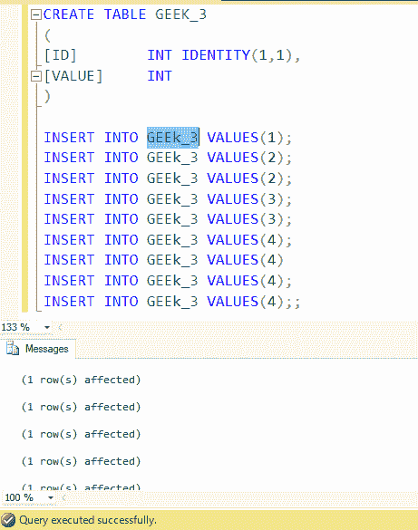
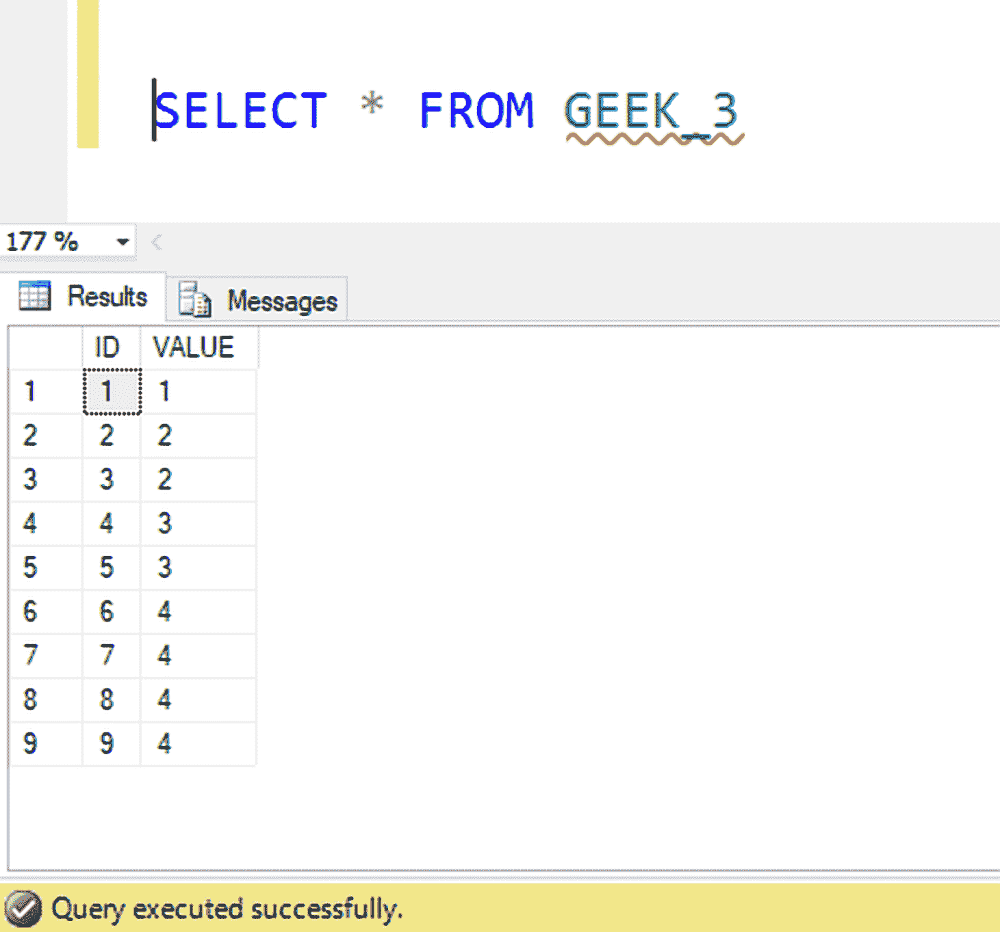
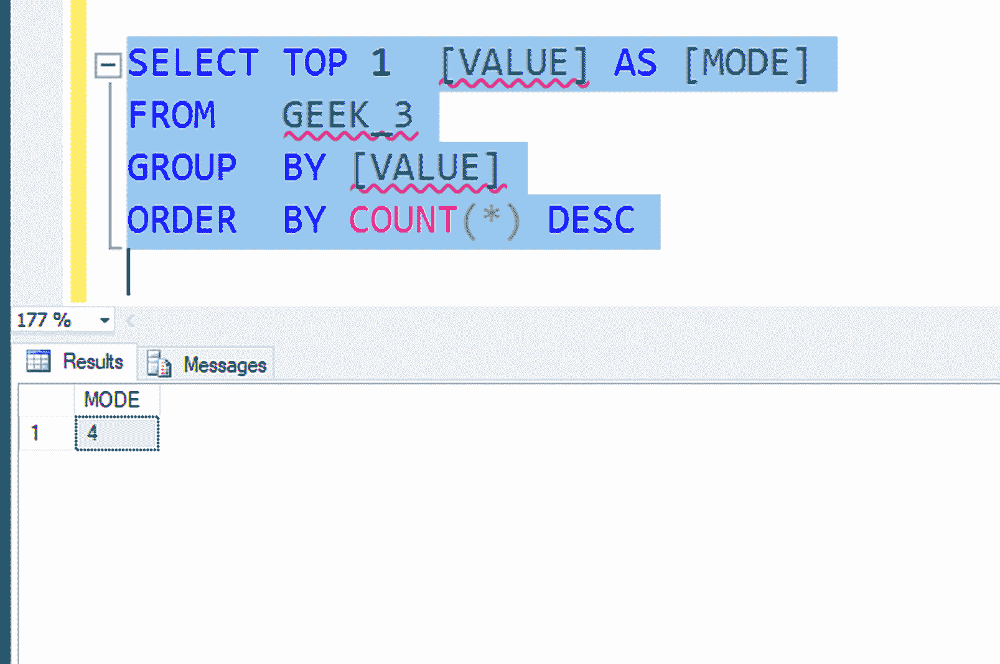

# SQL Server 中的平均值和模式

> 原文:[https://www.geeksforgeeks.org/find-mean-mode-sql-server/](https://www.geeksforgeeks.org/find-mean-mode-sql-server/)

**均值**是给定数据集的平均值，计算方法是将总和除以数据集中的数值数。

示例:

```sql
Input:  1, 2, 3, 4, 5 
Output: 3
Explanation: 
sum = 1 + 2 + 3 + 4 + 5 = 15
number of values = 5
mean = 15 / 5 = 3

```

**查询查找表中的平均值**

```sql
SELECT Avg(Column_Name) 
FROM  Table_Name

```

**示例:**

**创建表格:**


**表格内容:**


**查询找到均值:**


**数据集的模式**是一系列数据中出现频率最高的值。

示例:

```sql
Input:  1, 2, 2, 3, 4, 4, 4, 5, 5, 6
Output: 4
Explanation:
2 occurs 2 times, 5 occurs 2 times
4 occurs 3 times and rest other 
occurs 1 time
So, 4 occurs most frequently and 
is thus the output.

```

**查询查找表中的模式**

```sql
SELECT TOP 1 Column_Name
FROM   Table_name
GROUP  BY [Column_Name]
ORDER  BY COUNT(*) DESC

```

**示例:**

**创建表格:**


**表格内容:**


**查询查找方式:**
