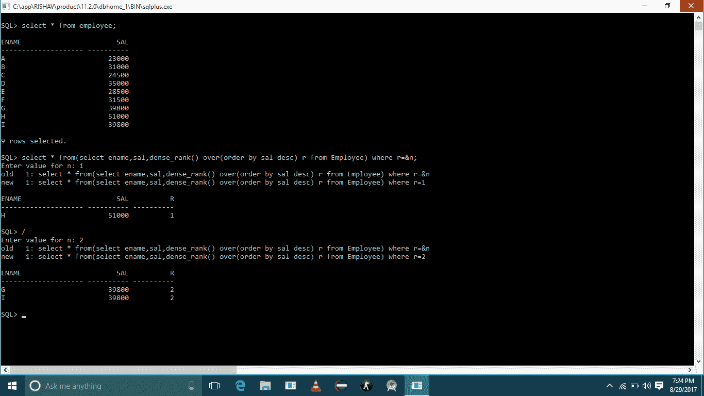

# 如何从表格中找到第 n 个最高工资

> 原文:[https://www . geesforgeks . org/find-n th-最高工资-表/](https://www.geeksforgeeks.org/find-nth-highest-salary-table/)

在表格中找到第 n 个最高工资是面试中最常见的问题。这里有一种方法可以使用 dense_rank()函数来完成这个任务。

考虑下表:
**员工**

| **Name** | **[salt]** |
| --- | --- |

**查询:**

```
select * from(
select ename, sal, dense_rank() 
over(order by sal desc)r from Employee) 
where r=&n;

To find to the 2nd highest sal set n = 2
To find 3rd highest sal set n = 3 and so on.
```

**输出:**



**DENSE_RANK :**

1.  密集等级计算一组有序行中的一行的等级，并以数字形式返回等级。等级是从 1 开始的连续整数。
2.  该函数接受任何数值数据类型的参数，并返回 NUMBER。
3.  作为一个分析函数，DENSE _ RANK 根据 order_by 子句中 value_exprs 的值，计算查询返回的每一行相对于其他行的排名。
4.  在上面的查询中，排名是基于雇员表的 sal 返回的。在平局的情况下，它给所有的行分配相同的等级。

**备选方案:**
—————————————

```
CREATE TABLE `Employee` ( 
`ENAME` varchar(225) COLLATE utf8_unicode_ci NOT NULL, 
`SAL` bigint(20) unsigned NOT NULL, 
PRIMARY KEY (`ENAME`) 
) ENGINE=InnoDB DEFAULT CHARSET=utf8 COLLATE=utf8_unicode_ci; 
```

————————————————————————————————————————————————————-

```
6th highest
mysql> select * from ((select * from Employee 
       ORDER BY `sal` DESC limit 6 ) AS T) 
       ORDER BY T.`sal` ASC limit 1;
Alternate use of Limit:
select * from Employee ORDER BY `sal` DESC limit 5,1; // will return 6th highest 

+-------+-----+
| ENAME | SAL |
+-------+-----+
| B     | 300 |
+-------+-----+
1 row in set (0.00 sec) 
```

——————————————————————————————————————————————————–

```
mysql> select * from Employee;
+-------+-----+
| ENAME | SAL |
+-------+-----+
| A     | 100 |
| B     | 300 |
| C     | 200 |
| D     | 500 |
| F     | 400 |
| G     | 600 |
| H     | 700 |
| I     | 800 |
+-------+-----+
8 rows in set (0.00 sec) 
```

感谢**维贾伊**提出这个替代方案。

**备选方案–**
假设任务是从上表中找到第 n 个工资最高的员工。我们可以这样做:

1.  找到薪水最高的员工。
2.  在上面查询获取的工资中找到最低的工资，这将为我们提供第 n 个最高的工资。
3.  查找工资为上述查询获取的最低工资的员工的详细信息。

**查询**:

```
SELECT * FROM Employee WHERE sal = 
         (
            SELECT MIN(sal) FROM Employee 
            WHERE  sal IN (
                                 SELECT DISTINCT TOP *N*
                                     sal FROM Employee 
                                         ORDER BY sal DESC
                             )
        )
```

上面的查询将获取第 n 个工资最高的员工的详细信息。让我们看看如何:

*   考虑 N = 4。
*   从最内部的查询开始，查询:“*选择 DISTINCT TOP**4**sal FROM Employee ORDER BY sal desc*”将产生以下结果:

```
51000
39800
35000
31500
```

*   下一个外部查询是:“*从员工处选择最小(sal)sal IN(Result _ Set _ of _ Previous _ Query)*”。这将返回以下结果:

```
31500
```

*   可以看到上面返回的结果是要求的第四高工资。
*   接下来是最外层的查询，即:“*SELECT * FROM Employee WHERE sal = Result _ of _ Previous _ Query*”。该查询将返回薪资第四高的员工的详细信息。

```
________________________
ename             sal
________________________
  F        |     31500
           |
________________________
```

**另一种解决方案–**
这里 N =第 N 个最高工资，例如第 3 个最高工资:N=3。

```
SELECT ename,sal from Employee e1 where 
        N-1 = (SELECT COUNT(DISTINCT sal)from Employee e2 where e2.sal > e1.sal) 
```

**使用极限的解决方案:**

```
 Select Salary from table_name order by Salary DESC limit n-1,1;
```

在这里，我们按降序排列我们的工资，这样我们将首先获得最高的工资，然后获得较低的工资。

Limit 子句有两个组件，第一个组件是从顶部跳过行数，第二个组件是显示我们想要的行数。

让我们看一个例子:

要查找第四高工资，查询将是:

```
 Select Salary from table_name order by Salary DESC limit 3,1;
```

这里我们从 Top 跳过 3 行，跳过后只返回 1 行。

您还可以找到工资最高的员工姓名

```
Select Emp_name from table_name where Salary =( Select Salary from table_name order by Salary DESC limit n-1,1);
```

可以有另一个问题，比如找到第 n 个最低工资。为了做到这一点，只需使用 ASC 颠倒顺序(如果您没有指定默认情况下列将按升序排序)。

```
 Select Salary from table_name order by Salary limit n-1,1;
```

&t=176s

本文由**里沙夫·山地亚**供稿。如果你喜欢极客博客并想投稿，你也可以用 write.geeksforgeeks.org 写一篇文章或者把你的文章邮寄到 review-team@geeksforgeeks.org。看到你的文章出现在极客博客主页上，帮助其他极客。