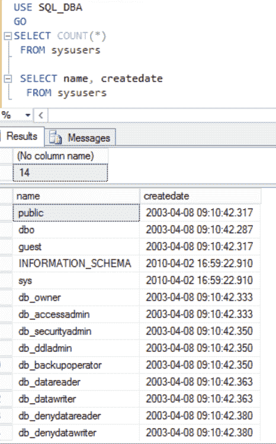

# 在 SQL Server 中查找登录次数和创建日期

> 原文:[https://www . geesforgeks . org/find-log in-counts-and-creation-date-in-SQL-server/](https://www.geeksforgeeks.org/finding-login-counts-and-creation-dates-in-sql-server/)

一个 **SQL** **登录**是另一个允许你访问 SQL Server 的凭证。例如，当您登录到 Windows 甚至您的电子邮件帐户时，您需要输入您的用户名和密码。登录是由这样的用户名和密码组成的。因此，SQL 登录只是一个用户名和密码。

SQL 登录是适用于整个 SQL Server 实例的安全主体，该实例可以包含许多数据库。Windows 身份验证登录和 SQL Server 身份验证登录是登录的两种基本形式。

一旦加入了 SQL Server，我们通常需要访问特定的数据库。此登录必须映射到数据库用户，才能访问数据库。使用 SQL Server 中的安全标识符(SID)将登录名映射并标识给用户。

SQL Server 中有四种不同类型的登录:

*   Windows 凭据用于登录。
*   特定于 SQL Server 的登录。
*   与证书关联的登录名。
*   对称密钥映射到登录。

参考[在 SQL Server](https://www.geeksforgeeks.org/create-login-in-sql-server/) 中创建登录，了解如何创建登录。

**怎样才能知道在一个 SQL Server 数据库中建立了多少次登录以及登录时间？**
下面提到了几个返回登录信息的 SQL Server 查询。您可以使用以下问题来确定您的 SQL Server 上的登录次数:

```
SELECT COUNT(*)
  FROM master..syslogins
GO
```

**在 SQL Server 管理工作室运行上述查询:**


要获取服务器上的登录列表及其创建日期，请运行以下查询:

```
SELECT name, createdate
  FROM master..syslogins
GO
```

**在 SQL Server 管理工作室运行上述查询:**


同样，您可以使用以下 SQL 查询来获取数据库中的用户数量、用户名列表以及用户的创建日期:

```
USE <database_name>
GO
SELECT COUNT(*)
  FROM sysusers
GO
SELECT name, createdate
  FROM sysusers
GO
```

上述查询应该为您提供所需的用户名和用户详细信息。

**示例–**

```
USE SQL_DBA
GO
SELECT COUNT(*)
FROM sysusers
SELECT name, createdate
FROM sysusers
```

**在 SQL Server 管理工作室运行上述查询:**

