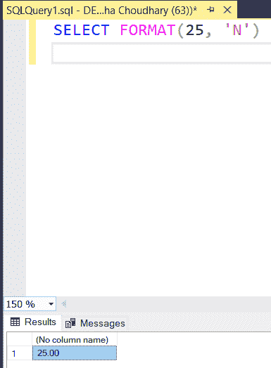
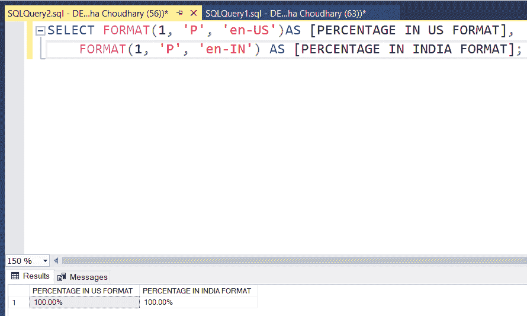
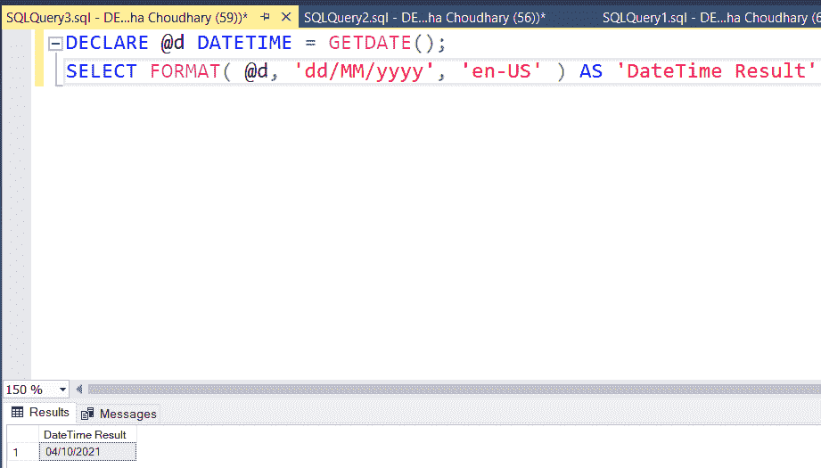
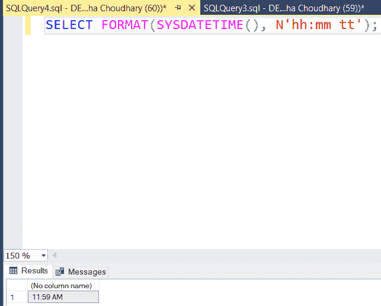
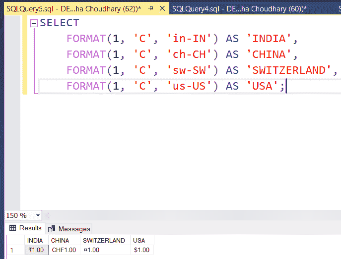

# SQL Server 中的 FORMAT()函数

> 原文:[https://www . geesforgeks . org/format-function-in-SQL-server/](https://www.geeksforgeeks.org/format-function-in-sql-server/)

**FORMAT()** 函数是字符串函数之一，用于将指定的值格式化为给定的格式。

**语法:**

> FORMAT(值、格式、区域性)

**参数:**

该方法接受三个参数，如上所述，如下所述:

*   **值**:是做格式化的值。它应该支持数据类型格式。
*   **格式**:是我们要求输出的要求格式。
*   **文化**:可选参数。默认情况下，SQL Server 使用当前会话语言作为默认区域性。我们可以在这里提供特定的文化，但是。Net 框架应该支持它。如果区域性无效，我们会收到一条错误消息

**返回:**返回用指定格式和可选区域性格式化的值。

如果我们想格式化一个数字。然后我们用下面的查询:
**查询:**

```
SELECT FORMAT(25, 'N')
```

**输出:**



再举一个 PERCENTAGE 格式的例子。
**查询:**

```
SELECT FORMAT(1, 'P', 'en-US')AS [PERCENTAGE IN US FORMAT], 
    FORMAT(1, 'P', 'en-IN') AS [PERCENTAGE IN INDIA FORMAT];
```

**输出:**



DATE 格式示例。
**查询:**

```
DECLARE @d DATETIME = GETDATE();  
SELECT FORMAT( @d, 'dd/MM/yyyy', 'en-US' ) AS 'DateTime Result'
```

**输出:**



在本例中，我们将使用上午或下午格式化当前时间。
**查询:**

```
SELECT FORMAT(SYSDATETIME(), N'hh:mm tt');
```

**输出:**



在本例中，我们更改了 CURRENCY 格式。
**查询:**

```
SELECT 
    FORMAT(1, 'C', 'in-IN') AS 'INDIA', 
    FORMAT(1, 'C', 'ch-CH') AS 'CHINA', 
    FORMAT(1, 'C', 'sw-SW') AS 'SWITZERLAND', 
    FORMAT(1, 'C', 'us-US') AS 'USA';
```

**输出:**

