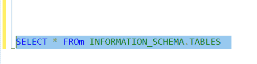
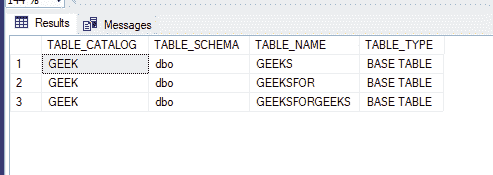

# 如何在 SQL 中获取表的名称

> 原文:[https://www.geeksforgeeks.org/get-names-table-sql/](https://www.geeksforgeeks.org/get-names-table-sql/)

本文提供的语法仅适用于 SQL Server 和 MySQL。

如果您想知道数据库中有多少表，以及表的详细信息，如 TABLE_SCHEMA、TABLE_TYPE 等。

**语法(当我们只有一个数据库时):**

```sql
Select * from schema_name.table_name
```

**语法(当我们有多个数据库时):**

```sql
Select * from database_name.schema_name.table_name
```

**示例:**

```sql
SELECT * FROM INFORMATION_SCHEMA.TABLES 
```

**哪里**

**1。信息模式**视图允许您检索数据库中对象的元数据。这些视图可以在视图/系统视图下的主数据库中找到，并且可以从 SQL Server 实例中的任何数据库调用。

**2。信息模式。信息模式。TABLES 视图允许您获取数据库中所有表和视图的信息。**



**输出:**

