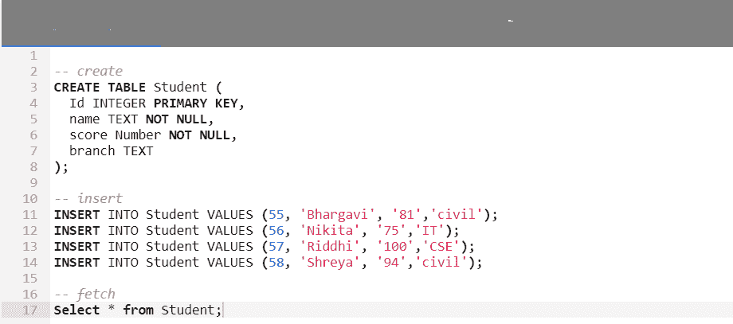
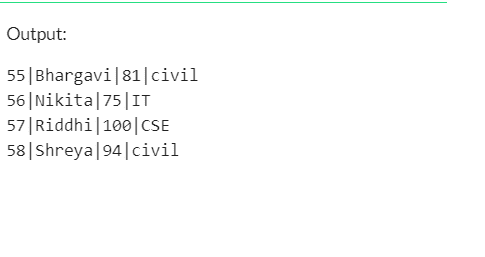
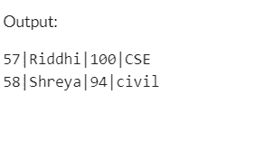
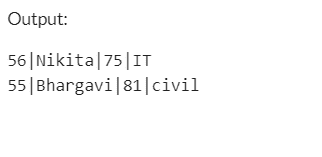

# 【MySQL 如何处理查询中的排序和限制？

> 原文:[https://www . geesforgeks . org/how-do-MySQL-按订单和限额处理查询/](https://www.geeksforgeeks.org/how-does-mysql-process-order-by-and-limit-in-a-query/)

在 MySQL 中， **LIMIT** 子句与 SELECT 语句一起使用，以限制结果集中的行数。Limit 子句接受一个或两个偏移量和计数的参数。这两个参数的值可以是零或正整数。

### **限制条款:**

**语法:**

> 选择列 1，列 2，…
> 
> 从表名
> 
> 极限偏移量，计数；

Limit 子句接受一个或两个参数，每当指定两个参数时，第一个参数是偏移量，第二个参数表示计数，而每当只指定一个参数时，它表示从结果集开始返回的行数。

*   **偏移量:**用于指定要返回的第一行的偏移量。
*   **计数:**用于指定要返回的最大行数。

### 使用 MySQL 中的 LIMIT 和 ORDER BY 语句进行选择:

**语法:**

> 选择表达式
> 
> 来自表格
> 
> [哪里的条件]
> 
> [按表达式排序[美国汽车工程师协会| DESC ]]
> 
> 限制行数；

*   **表达式:**要检索的列或计算。
*   **表:**您希望从中检索记录的表。FROM 子句中必须至少列出一个表。
*   **WHERE 条件:**这些是要选择的记录必须满足的可选条件。
*   **ORDER BY 表达式:**这些是可选语句，用于以升序或降序返回结果。
*   **LIMIT row_count_number:** 根据 row_count_number 指定要返回的行数。

让我们用一个例子来理解这个语法。假设我们有关系，学生。

**在 MySQL 中创建数据库:**

**查询:**

```sql
-- create
CREATE TABLE Student (
  Id INTEGER PRIMARY KEY,
  name TEXT NOT NULL,
  score Number NOT NULL,
  branch TEXT 
);
```

**将数据插入表格:**

**查询:**

```sql
-- insert
INSERT INTO Student VALUES (55, 'Bhargavi', '81','civil');
INSERT INTO Student VALUES (56, 'Nikita', '75','IT');
INSERT INTO Student VALUES (57, 'Riddhi', '100','CSE');
INSERT INTO Student VALUES (58, 'Shreya', '94','civil');
```



**输出:**



**查询:**

```sql
SELECT * FROM Student ORDER BY Score DESC LIMIT 2;
```

**输出:**



LIMIT 运算符可用于上述情况，我们需要找到得分最高的前 2 名学生，并且不想使用任何条件语句。ORDER BY Score DESC 以降序对记录进行了排序，使用 LIMIT 2，我们获得了排序结果的前 2 行。

在上面的例子中，我们也可以使用 WHERE 子句包括一些情况。假设我们不希望结果集中有 Civil 分支，希望前 2 名学生的分数较低。

我们可以编写如下查询:

**查询:**

```sql
SELECT * FROM Student WHERE Branch != 'Civil' ORDER BY Score  LIMIT 2;
```

**输出:**

上面的查询将根据强加的条件选择所有学生(即，除了土木工程系学生之外的所有学生都将被选择)，然后结果将按分数升序排序(默认情况下，ORDER BY 关键字按升序排序记录)。最后，上面的查询将返回前 2 行。

