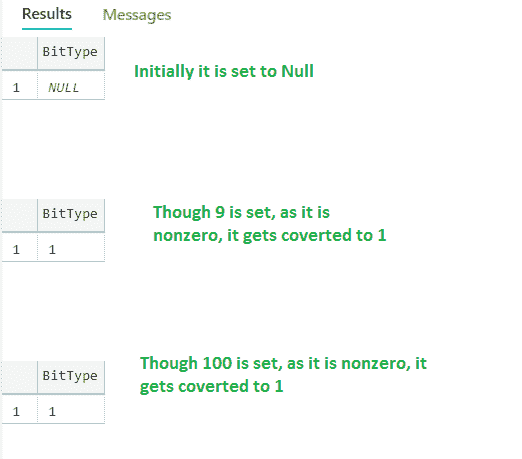

# 如何在 SQL 中将布尔数据类型列添加到现有表中？

> 原文:[https://www . geesforgeks . org/如何将布尔数据类型列添加到 sql 中的现有表/](https://www.geeksforgeeks.org/how-to-add-a-boolean-datatype-column-to-an-existing-table-in-sql/)

在 SQL Server 中，可以通过保留位数据类型来创建布尔数据类型。虽然它是一个数字数据类型，但它只能接受 0 或 1 或空值。因此，我们可以很容易地将假值赋给 0，将真值赋给 1。这将为数据类型提供布尔特性。

关于存储，如果表中的位数据少于 9 列，则存储为 1 字节。对于 9 到 16 位的列，它们的消耗是 2 字节，以此类推，它将保持不变。在本文中，让我们来看看如何向 SQL SERVER 中的现有表添加布尔数据类型，即 BIT 数据类型。

让我们假设有一个数据库“GEEKSFORGEEKS”可用，并且有一个名为“作者”的表可用，其中包含以下数据。

**查询:**

```
USE GEEKSFORGEEKS
SELECT * FROM Authors;
```

**输出:**


让我们向“作者”表中添加一个 BIT 数据类型。位数据类型有助于表示真(1)或假(0)的布尔性质，它们是位数据类型唯一允许的值。

```
-- Add a column named "isActiveAuthor" 
with BIT datatype for "Authors" table
ALTER TABLE Authors  ADD isActiveAuthor BIT;
```

由于表中已经没有几行可用了，我们可以添加一个新的列“isActiveAuthor”作为空模式。之后，我们可以更新数据。添加该列后，

**查询:**

```
SELECT * FROM Authors;
```

**输出:**


因此，当一个位数据类型列被添加到一个现有的表中时，它的值将被填充为“空”值。

现在，让我们尝试用一个条件来更新该列，如果“NumberOfPosts”> 5，则将“isActiveAuthor”设置为值 1 或 0。

```
-- Let us assume that if "NumberOfPosts" 
   is more than 5, author is active enough to write articles
-- Hence for this condition , set "isActiveAuthor"
   column to have value 1
UPDATE Authors SET isActiveAuthor = 1 WHERE NumberOfPosts > 5;

-- On the other hand, if "NumberOfPosts"
   is less  than and equal to 5, 
-- author is not active in the recent days
   and hence set "isActiveAuthor" column to have value 0
UPDATE Authors SET isActiveAuthor = 0 WHERE NumberOfPosts <= 5;

SELECT * FROM Authors;
```

**输出:**


由于位列只支持 0 或 1 作为值，我们如上所述进行了填充。

让我们尝试更新 0 或 1 以外的值

```
-- Trying to update the "isActiveAuthor"
   with value 2, though errors are not 
   produced, output is different
UPDATE Authors SET isActiveAuthor = 
2 WHERE NumberOfPosts = 5;

SELECT * FROM Authors;
```

**输出:**


**第三行更新值为 1 的原因:**

虽然给出了一个更新来获取值 2，但是由于“isActiveAuthor”列的“BIT”数据类型，它的值仅被转换为 1，因为“BIT”数据类型仅支持 0 或 1。即除 0 以外的值被转换为 1 并在表中更新。

我们可以用不同的例子来验证这一点

```
DECLARE @isValid BIT

-- Initially it will have "NULL" value 
SELECT @isValid AS BitType

--Assigning any nonzero value converts it to 1
-- i.e. other than 0, if any
   value is provided , it is converted to 1
SET @isValid=9

SELECT @isValid AS BitType

--Assigning any nonzero value converts it to 1
SET @isValid=-100

SELECT @isValid AS BitType
```

**输出:**



这证明了“位”数据类型只接受“布尔值”，即只接受 0 或 1。如果给定一个非零值，它只被转换为 1。

**优势:**

*   如果预期值为 0 或 1 加空，这是一种很好的方法，可以在代码变得合乎逻辑时将列保持为“位”数据类型
*   关于存储，使用起来很经济，因为与其他数据类型相比，它占用了一点空间。

考虑到这些优点，位数据类型是存储布尔数据的正确方法