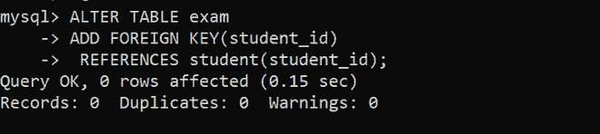

# 如何在 MySQL

中使用 ALTER 添加外键

> 原文:[https://www . geesforgeks . org/how-add-a-foreign-key-use-alter-in-MySQL/](https://www.geeksforgeeks.org/how-to-add-a-foreign-key-using-alter-in-mysql/)

在本文中，我们将讨论外键的概述，并逐步讨论如何在 MySQL 中使用 ALTER 添加外键。我们一个一个来讨论。

**外键** :
如果一个属性在一个表中是 [**主键**](https://www.geeksforgeeks.org/difference-between-primary-key-and-foreign-key/) ，但在另一个表中没有用作主键，那么在另一个表中不是主键的属性称为外键。如果在任何表中进行了更改或操作了任何数据，则在外键约束的帮助下，更改会反映在这两个表中。

**使用 MySQL 中的 ALTER 添加外键的步骤:**
下面我们来看看如何在另一个表考试中，将学生表中的主键 student 的一个属性添加为外键，如下所示。

**步骤-1:创建数据库大学:**
在这里，您将看到如何在 MySQL 中创建数据库，如下所示。

```sql
CREATE DATABASE university;
```

**输出:**


**第二步:使用数据库大学:**
在这里，您将看到如何使用您已经创建的现有数据库，如下所示。

```sql
USE university;
```

**输出:**


**步骤-3:创建表学生:**
在这里，您将看到如何在 MySQL 中创建表，如下所示。

```sql
 CREATE TABLE student
 (
     student_id INT PRIMARY KEY,
     student_name varchar,
     student_branch varchar
 );
```

**输出:**


**步骤-4:查看表的描述:**
在这里，您将看到如何验证表，如下所示。

```sql
DESCRIBE student;
```

**输出:**
在这里，正如你在描述中看到的，student_id 的键列是 **PRI** ，这意味着它是那个表 student 中的主键。

<figure class="table">T39

| field | type | 空 | key | default | 额外的 |
| --- | --- | --- | --- | --- | --- |
| Student _ id | （同 Internationalorganizations）国际组织 | 不 | 优先（priority 的缩写） | 空 | T36 |

</figure>

**第五步:创建另一个表考试:**
在这一步，你会看到多一个表供参考。

```sql
CREATE TABLE exam
 (
    exam_id INT PRIMARY KEY,
    exam_name varchar(20)
 );
```

**输出:**


**第 6 步:查看表的描述:**
在这一步，你可以验证你创建的表。

```sql
DESCRIBE exam;
```

**输出:**

<figure class="table">T22】考试 _ idT26】NOT30】空T34

| field | type | empty | key | default | extra |
| --- | --- | --- | --- | --- | --- |
| （同 Internationalorganizations）国际组织 | 优先（priority 的缩写） |  |

</figure>

**步骤-7:在考试表中添加另一列 student_id:**
在这里，您将看到如何在考试表中添加另一列 student _ id，如下所示。

```sql
 ALTER TABLE exam
 ADD COLUMN student_id INT;
```

**输出:**


**步骤-8:制作外键:**
在这里，您将看到如何制作考试表中的 student_id 属性外键，它是学生表中的主键，如下所示。

**语法–**

```sql
ALTER TABLE table_name
ADD FOREIGN KEY (column_name)
REFERENCE table_name(Referencing column_name in table_name);
```

**查询–**

```sql
ALTER TABLE exam
ADD FOREIGN KEY(student_id)
REFERENCES student(student_id);
```

**输出:**



**第九步:验证考试表:**
在这里，你会看到考试表的描述如下。

```sql
DESCRIBE exam;
```

**输出:**
现在可以看到在表考的描述中又增加了一列 student_id，在描述的 Key 列中，student_id 有 **MUL** 表示是外键。

<figure class="table">T39

| field | type | 空 | key | default | 额外的 |
| --- | --- | --- | --- | --- | --- |
| Exam _ id | （同 Internationalorganizations）国际组织 | 不 | 优先（priority 的缩写） | 空 | T36 |

</figure>