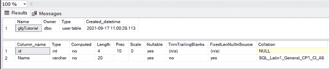
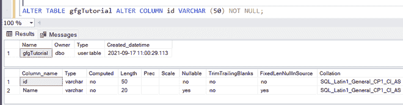

# 如何在 SQL Server 中将一列从空改为非空？

> 原文:[https://www . geesforgeks . org/如何在 SQL server 中将列从 null 更改为非 null/](https://www.geeksforgeeks.org/how-to-alter-a-column-from-null-to-not-null-in-sql-server/)

通过这篇文章，我们将学习如何在 SQL Server 中将一个列从接受空值更改为非空值。本文的前提是您的计算机上应该有一个 [MSSQL](https://www.microsoft.com/en-in/sql-server/sql-server-downloads) 服务器。

#### 什么是查询？

查询是为执行特定任务而编写的一条或一组语句，如检索数据、将数据保存到数据库。

因此，我们将首先创建一个数据库:

#### 步骤 1:创建数据库

```sql
CREATE DATABASE GFG
```

#### 步骤 2:使用数据库

```sql
USE GFG
```

#### 步骤 3:创建一个带有空列的表

```sql
CREATE TABLE gfgTutorial(
id integer,
Name varchar(20)
)
```

#### 描述表格

```sql
sp_help 'dbo.gfgTutorial'
```



#### 步骤 4:将 id 列更改为非空

```sql
ALTER TABLE gfgTutorial ALTER COLUMN id VARCHAR (50) NOT NULL;
```

所以现在我们的表 id 列被更改为非空



将空 id 更改为非空

因此，我们已经成功地将 gfgTutorial 表中的 id 列更改为 not null。