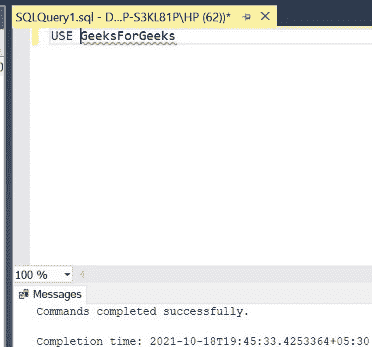

# 如何在 SQL Server 中一次改变多列？

> 原文:[https://www . geesforgeks . org/如何在 SQL server 中一次更改多个列/](https://www.geeksforgeeks.org/how-to-alter-multiple-columns-at-once-in-sql-server/)

在 SQL 中，有时我们需要编写一个查询来更新表中所有列的值。我们将使用 [UPDATE](https://www.geeksforgeeks.org/sql-update-statement/) 关键字来实现这一点。为此，我们使用一种特定的查询，如下面的演示所示。在本文中，我们将使用微软的 SQL Server 作为我们的数据库和选择关键字。

**步骤 1:** 创建数据库。为此，使用下面的命令创建一个名为 GeeksForGeeks 的数据库。

**查询:**

```
CREATE DATABASE GeeksForGeeks
```

**输出:**


**步骤 2:** 使用 GeeksForGeeks 数据库。为此，请使用以下命令。

**查询:**

```
USE GeeksForGeeks
```

**输出:**



**步骤 3:** 在数据库 GeeksForGeeks 中创建一个公司表。该表有 4 列，即名字、姓氏、薪水和奖金，包含公司成员的名字、姓氏、薪水和奖金。

**查询:**

```
CREATE TABLE FIRM(
FIRST_NAME VARCHAR(20),
LAST_NAME VARCHAR(20),
SALARY INT,
BONUS INT
);
```

**输出:**


**第 4 步:**描述表格的结构。

**查询:**

```
EXEC SP_COLUMNS FIRM;
```

**输出:**


**第 5 步:**在 FIRM 表中插入 5 行。

**查询:**

```
INSERT INTO FIRM VALUES('ALEX','STONE',10000,1000);
INSERT INTO FIRM VALUES('MATT','JONES',20000,2000);
INSERT INTO FIRM VALUES('JOHN','STARK',30000,3000);
INSERT INTO FIRM VALUES('GARY','SCOTT',40000,4000);
INSERT INTO FIRM VALUES('RICHARD','WALT',50000,5000);
```

**输出:**


**第 6 步:**显示公司表的所有行。

**查询:**

```
SELECT * FROM FIRM;
```

**输出:**


**步骤 7:** 通过同时向表格中添加两列来更改表格的多(2)列**公司**。两栏为**加入日期**和**离开日期**，包含会员加入日期和会员离开日期。使用关键字[**ALTER**](https://www.geeksforgeeks.org/sql-alter-add-drop-modify/)[**ADD**](https://www.geeksforgeeks.org/sql-alter-add-drop-modify/)来实现。

**语法:**

```
ALTER TABLE TABLE_NAME ADD COLUMN1 
DATA_TYPE, COLUMN2 DATA_TYPE........;
```

**查询:**

```
ALTER TABLE FIRM ADD JOINING_DATE DATE,
 LEAVING_DATE DATE;
```

**输出:**


**第 8 步:**描述修改后的表格《坚定》的结构。

**查询:**

```
EXEC SP_COLUMNS FIRM;
```

**注意:**表格描述现在多了 2 列。

**输出:**


**步骤 9:** 通过将数据插入到 FIRM 表的 2 个新添加的列中来更新表。使用关键字**更新**。

**语法:**

```
UPDATE TABLE_NAME SET COLUMN1=VALUE,
COLUMN2=VALUE WHERE CONDITION;
```

**查询:**

```
UPDATE FIRM SET JOINING_DATE='01-JAN-2001',
LEAVING_DATE='01-JAN-2002' WHERE FIRST_NAME='ALEX';
UPDATE FIRM SET JOINING_DATE='02-FEB-2001',
LEAVING_DATE='02-FEB-2002' WHERE FIRST_NAME='MATT';
UPDATE FIRM SET JOINING_DATE='03-MAR-2001',
LEAVING_DATE='03-MAR-2002' WHERE FIRST_NAME='JOHN';
UPDATE FIRM SET JOINING_DATE='04-APR-2001',
LEAVING_DATE='04-APR-2002' WHERE FIRST_NAME='GARY';
UPDATE FIRM SET JOINING_DATE='05-MAY-2001',
LEAVING_DATE='05-MAY-2002' WHERE FIRST_NAME='RICHARD';
```

**输出:**


**步骤 10:** 显示修改后的公司表的所有行。

**查询:**

```
SELECT * FROM FIRM;
```

**注意:**显示的表格现在多了 2 列。

**输出:**


**步骤 11:** 通过同时从表格中删除两列来更改表格的多(2)列**公司**。两栏为**加入 _ 日期**和**离开 _ 日期**，包含会员加入日期和会员离开日期。使用关键字 **ALTER** 和 **DROP** 来实现。

**语法:**

```
ALTER TABLE TABLE_NAME DROP 
COLUMN COLUMN1, COLUMN2........;
```

**查询:**

```
ALTER TABLE FIRM DROP COLUMN
JOINING_DATE,LEAVING_DATE;
```

**输出:**


**第 12 步:**描述修改后的表格《坚定》的结构。

**查询:**

```
EXEC SP_COLUMNS FIRM;
```

注意:表描述现在少了两列。

**输出:**


**步骤 13:** 显示修改后的公司表的所有行。

**查询:**

```
SELECT * FROM FIRM;
```

**注意:**显示的表格现在少了 2 列。

**输出:**

