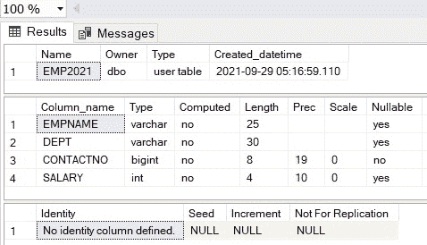
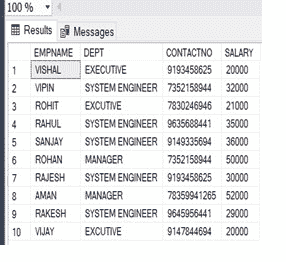
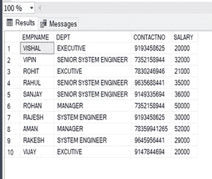

# 如何向 SQL 列追加数据？

> 原文:[https://www . geesforgeks . org/如何将数据追加到 sql 列/](https://www.geeksforgeeks.org/how-to-append-data-to-a-sql-column/)

在本文中，我们将更新记录，同时保留现有的记录值(如果存在的话)。每当我们需要在创建记录一段时间后更新记录时

我们将在 SQL 中使用**追加**查询。为了在 SQL 中实现追加查询，首先，我们将创建一个数据库，在数据库中，我们将创建一个包含一些记录的表。

**步骤 1:** 创建数据库

对于数据库创建，有一些查询我们会在 SQL Platform 中使用，比如 Mysql、oracle 等。

**查询:**

```sql
Create database Sample;
```

**步骤 2 :** 使用数据库

在创建数据库后，我们将使用另一个查询。

**查询:**

```sql
Use Sample;
```

**步骤 3:** 数据库中的创建表

用于在数据库中创建表。我们需要在 SQL 平台上执行一个查询。像 Mysql、Oracle 等。我们将使用这个查询-->

**查询:**

```sql
CREATE TABLE EMP1
( EMPNAME VARCHAR(25),
DEPT VARCHAR(20),
CONTACTNO BIGINT NOT NULL,
SALARY INT
); 
```

**第 4 步:**查看表的模式

**查询:**

```sql
EXEC sp_help EMP2021 
```

**输出:**



**步骤 5:** 将数据插入表格

要将数据插入表中，我们将在 SQL 中使用查询。

**查询:**

```sql
INSERT INTO EMP2021
VALUES ('VISHAL','EXECUTIVE',9193458625,20000),
('VIPIN','SYSTEM ENGINEER',7352158944,32000),
('ROHIT','EXECUTIVE',7830246946,21000),
('RAHUL','SYSTEM ENGINEER',9635688441,35000),
('SANJAY','SYSTEM ENGINEER',9149335694,36000),
('ROHAN','MANAGER',7352158944,50000),
('RAJESH','SYSTEM ENGINEER',9193458625,30000),
('AMAN','MANAGER',78359941265,52000),
('RAKESH','SYSTEM ENGINEER',9645956441,29000),
('VIJAY','EXECUTIVE',9147844694,20000);
```

**步骤 6 :** 验证插入的数据

在表中插入数据后，我们可以确认或证明我们插入的数据是否正确。借助下面给出的查询。

**查询:**

```sql
SELECT * FROM EMP2021;
```

**输出:**



**步骤 7:** 在 SQL 列中追加数据

现在在表中插入数据后，我们将进入在 SQL 列中追加数据的最后一步，这意味着在追加查询的帮助下更新现有列值的数据。这里我们将在列(DEPT)中追加数据。我们将添加高级系统工程师，其中工资大于 30000，小于 50000。

**查询:**

```sql
UPDATE EMP2021 SET DEPT = 'SENIOR '+ DEPT WHERE SALARY >30000 AND SALARY <50000; 
```

执行此查询后，列部门值将根据“薪资大于 30000 且小于 50000”的条件附加系统。我们可以在下面看到变化

**输出:**

