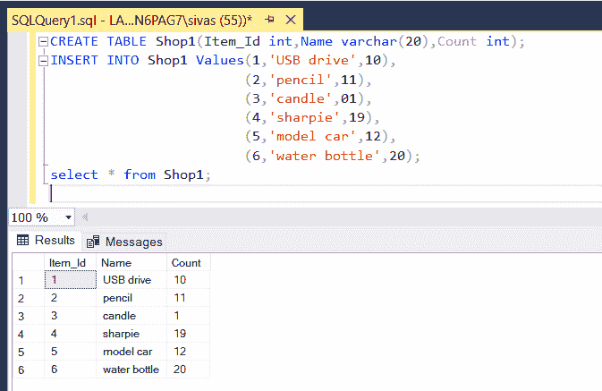
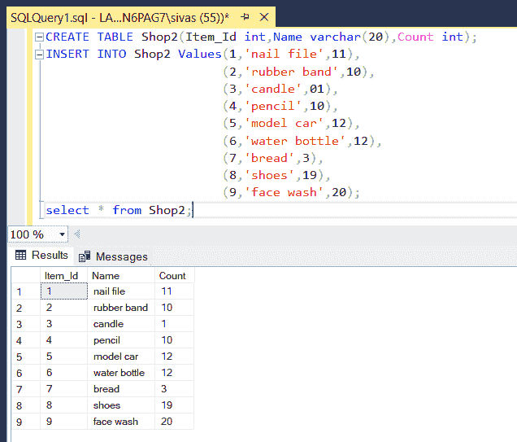
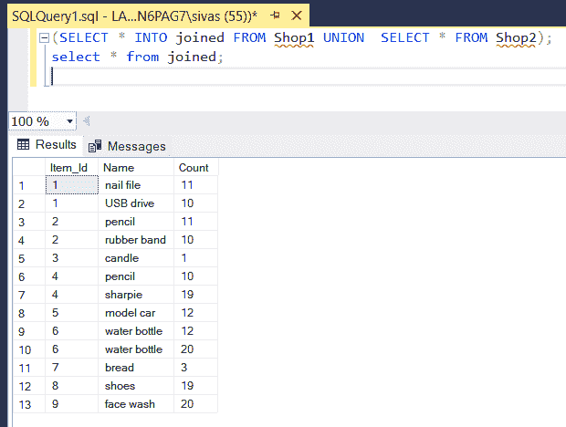
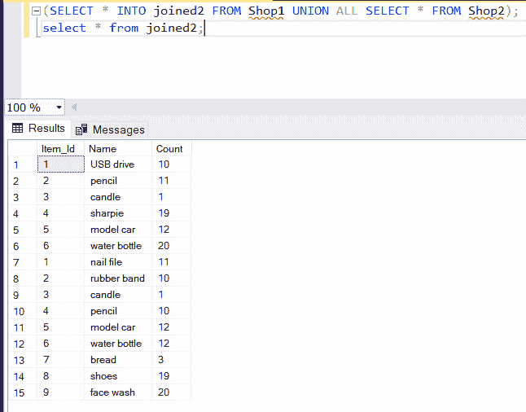

# 如何在 SQL 中追加两个表并将结果放入一个表中？

> 原文:[https://www . geeksforgeeks . org/如何追加两个表并将结果放入 sql 表中/](https://www.geeksforgeeks.org/how-to-append-two-tables-and-put-the-result-in-a-table-in-sql/)

结构化查询语言是一种标准的数据库语言，用于创建、维护和检索关系数据库中的数据，如 MySQL、Oracle、SQL Server、PostGre 等。在本文中，我们将学习如何使用 **UNION，UNION ALL** 追加两个表并将结果存储到一个新表中。

## **UNION:**

**语法:**

```
SELECT column_one, column_two,..column_N INTO Table_name FROM table_name
UNION  SELECT column_one,column_two,column_three,.. column_N FROM table_name;
```

## **联合所有**:

**语法:**

```
SELECT column_one, column_two,column_three,.. column_N INTO Table_name FROM
table_name UNION SELECT column_one, column_two, column_three,..column_N
 FROM table_name;
```

Union 和 UNION ALL 的区别在于 Union 不包含重复项，但是 Union All 也包含重复项。两者的语法相似。

考虑下面两个部门商店数据的表格

**数据库:shop 1**

<figure class="table">

| 【项目 _ id】 | 【名称】 | 【计数】 |
| --- | --- | --- |

</figure>

用于创建表的命令

**查询:**

```
CREATE TABLE Shop1(Item_Id int,Name varchar(20),Count int)
```

**输出:**



**数据库:shope 2**

<figure class="table">T70T72】8T74】鞋子 T76】19T78T80】9T82】洗脸

| 项目标识 | name | count |
| --- | --- | --- |
| one | nail file | Eleven |
| Two | Rubber band | Ten |
| three | water bottle | Twelve |
| seven | bread | three |

</figure>

用于创建表的命令

**查询:**

```
CREATE TABLE Shop2(Item_Id int,Name varchar(20),Count int)
```

**输出:**



**方法 1:** 使用 UNION 关键字

为了连接两个表，即商店 1 和商店 2，我们运行以下命令:

**查询:**

```
SELECT * INTO joined FROM Shop1 UNION SELECT * FROM Shop2;
```

上面的命令将 *Shop1* 和 *Shop2* 加入到一个新的表中*加入了*，如下所示，可以通过下面的命令查看:

**查询:**

```
SELECT * FROM joined;
```

<figure class="table">

| 项目标识 | 名字 | 数数 |
| --- | --- | --- |
| one | u 盘 | Ten |
| one | 指甲锉 | Eleven |
| Two | 铅笔 | Eleven |
| Two | 橡皮筋 | Ten |
| three | 蜡烛 | one |
| four | 铅笔 | Ten |
| four | 狡猾的人 | Nineteen |
| five | 模型汽车 | Twelve |
| six | 水瓶 | Twelve |
| six | 水瓶 | Twenty |
| seven | 面包 | three |
| eight | 鞋子 | Nineteen |
| nine | 洗脸 | Twenty |

</figure>

因此，连接的表不包括重复项，因为我们使用了 UNION 关键字

这是我们执行查询时的输出

**输出:**



**方法 2:** 使用 UNION ALL 关键字

**查询:**

```
SELECT * INTO joined2 FROM Shop1 UNION ALL SELECT * FROM Shop2;
```

上面的命令创建了一个新的表名 joined2，其中包含了 Shop1 和 Shop2 的所有值。

我们运行以下命令来查看该表

**查询:**

```
SELECT * FROM joined2;
```

<figure class="table">

| 项目标识 | 名字 | 数数 |
| --- | --- | --- |
| one | u 盘 | Ten |
| one | 指甲锉 | Eleven |
| Two | 铅笔 | Eleven |
| Two | 橡皮筋 | Ten |
| three | 蜡烛 | one |
| three | 蜡烛 | one |
| four | 狡猾的人 | Nineteen |
| four | 铅笔 | Ten |
| five | 模型汽车 | Twelve |
| five | 模型汽车 | Twelve |
| six | 水瓶 | Twenty |
| six | 水瓶 | Twelve |
| seven | 面包 | three |
| eight | 鞋子 | Nineteen |
| nine | 洗脸 | Twenty |

</figure>

这是我们执行查询时的输出。

**输出:**

