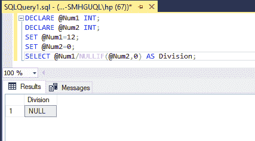

# 如何避免 SQL 中的“除零”错误？

> 原文:[https://www . geesforgeks . org/如何避免 sql 中的零除错误/](https://www.geeksforgeeks.org/how-to-avoid-the-divide-by-zero-error-in-sql/)

在本文中，我们将研究如何避免 SQL 中的“被零除”错误。如果我们用零除任何一个数，它会导致无穷大，我们会得到一个错误消息。我们可以使用以下三种方法来避免此错误消息:

*   使用 NULLIF()函数
*   使用案例语句
*   使用设置算术端口关闭

我们将首先创建一个数据库来执行 SQL 操作。

**查询:**

```sql
CREATE DATABASE Test;
```

**输出:**


成功完成的命令显示数据库“测试”已创建。

对于所有的方法，我们需要声明两个变量来存储分子和分母的值。

```sql
DECLARE @Num1 INT;
DECLARE @Num2 INT;
```

声明变量后，我们必须设置值。将第二个变量值设置为零。

```sql
SET @Num1=12;
SET @Num2=0;
```

**方法一:使用** [**NULLIF()功能**](https://www.geeksforgeeks.org/nullif-function-in-sql-server/)

如果两个参数相等，则返回空值。如果两个参数不相等，它将返回第一个参数的值。

**语法:**

```sql
NULLIF(exp1, exp2);
```

现在我们在分母中使用 NULLIF()函数，第二个参数值为零。

```sql
SELECT @Num1/NULLIF(@Num2,0) AS Division;
```

*   在 SQL server 中，如果我们用空值除任何数字，它的输出将为空。
*   如果第一个参数为零，这意味着如果 Num2 值为零，那么 NULLIF()函数返回空值。
*   如果第一个参数不为零，那么 NULLIF()函数返回该参数的值。分裂是定期发生的。

这是完整的查询。

**查询:**

```sql
DECLARE @Num1 INT;
DECLARE @Num2 INT;
SET @Num1=12;
SET @Num2=0;
SELECT @Num1/NULLIF(@Num2,0) AS Division;
```

**输出:**



**方法二:使用** [**CASE 语句**](https://www.geeksforgeeks.org/sql-case-statement/)

SQL CASE 语句用于检查条件并返回一个值。它检查条件，直到它为真，如果没有条件为真，它返回 else 部分的值。

我们必须检查分母的值，即 Num2 变量的值。如果为零，则返回空值，否则返回常规除法。

```sql
SELECT CASE
WHEN @Num2=0
THEN NULL
ELSE @Num1/@Num2
END AS Division;
```

以下是完整的查询:

**查询:**

```sql
DECLARE @Num1 INT;
DECLARE @Num2 INT;
SET @Num1=12;
SET @Num2=0;
SELECT CASE
    WHEN @Num2=0
    THEN NULL
    ELSE @Num1/@Num2
END AS Division;
```

**输出:**


**方法 3:关闭算术端口**

为了控制查询的行为，我们可以使用 SET 方法。默认情况下，算术端口设置为开。它终止查询并返回一条错误消息。如果我们将其设置为关闭，它将终止并返回空值。

像 ARITHBORT 一样，我们必须将 ANSI_WARNINGS 设置为 OFF，以避免出现错误消息。

```sql
SET ARITHABORT OFF;
SET ANSI_WARNINGS OFF;
```

以下是完整的查询:

**查询:**

```sql
SET ARITHABORT OFF;
SET ANSI_WARNINGS OFF;
DECLARE @Num1 INT;
DECLARE @Num2 INT;
SET @Num1=12;
SET @Num2=0;
Select @num1/@Num2;
```

**输出:**

