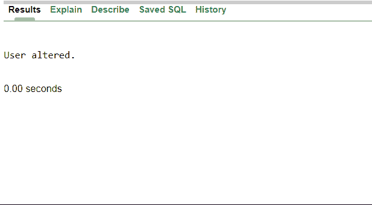

# 如何更改 Oracle 数据库密码？

> 原文:[https://www . geesforgeks . org/如何更改 oracle 数据库密码/](https://www.geeksforgeeks.org/how-to-change-the-oracle-database-password/)

选择安全的密码和实施复杂的密码策略是迄今为止在任何数据库中防范基于密码的安全威胁的最重要的防御措施。以下是更改或重置 Oracle 数据库密码的几种方法。我们可以使用两种不同的方法更改 Oracle 数据库密码:

*   通过在 oracle 数据库中使用 [ALTER USER](https://www.geeksforgeeks.org/mysql-change-user-password/) 命令。
*   通过在命令提示符下使用 PASSWORD 命令。

### 通过使用 ALTER USER 命令:

**1。**像平常一样登录 oracle 数据库。这里我们以[用户名系统](https://www.geeksforgeeks.org/mysql-rename-user/)和密码极客 123 登录。

**2。**使用 alter user 命令并为您的用户指定新密码

**语法:**

> 通过新密码更改用户用户名；

这里的“系统”是一个用户名，现在“系统”的新密码变成了“新极客 123”，这意味着“系统”现在由密码“新极客 123”标识。密码从极客 123 更改为新极客 123。

**输出:**

**3** 。您不需要任何其他权限来更改自己的密码。相同的命令可用于更改数据库中另一个用户的密码，该用户表现为代理用户。您可以使用该代理用户和新设置的密码登录数据库。

**4** 。现在，如果尝试使用旧密码登录(极客 123)，它将显示一个无效的凭据，如下所示，当使用新密码登录时，它将成功登录(极客 123。)

### 通过使用**命令提示符中的**密码命令。****

**1。**打开命令提示窗口，输入 sqlplus 命令登录 oracle 数据库。

**2。**输入您的用户名和密码。

**3。**它将显示一条消息，如连接到 oracle 数据库和您的版本名称，如下所示。

**4。**在 SQL 提示符下输入密码。系统将提示您输入旧密码和新密码。

**5。**输入您的旧密码，然后按回车键。现在输入新密码并按回车键。

**6。**再次输入新密码，然后按回车键。您将收到确认，您登录的数据库的密码已更改，如下所示。

